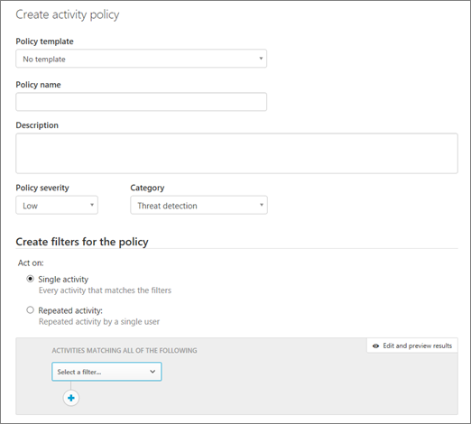

# Activity policies and alerts in Office 365 Cloud App Security

Office 365 Advanced Security Management is now Office 365 Cloud App Security.
  
|****Evaluation** \>**|****Planning** \>**|****Deployment** \>**|****Utilization****|
|:-----|:-----|:-----|:-----|
|[Start evaluating](office-365-cas-overview.md)   |[Start planning](get-ready-for-office-365-cas.md)   |You are here!    [Next step](anomaly-detection-policies-in-ocas.md)   |[Start utilizing](utilization-activities-for-ocas.md)   |
   
With Office 365 Cloud App Security, advanced cloud management policies trigger alerts for specific activities that happen or happen too frequently. For example, suppose a user tries to sign in to Office 365 and fails 70 times in one minute. Suppose that another user downloads 7,000 files, or appears to be signed in from Canada, when that user is supposed to be in another location. Or worse, suppose that someone's account has been compromised, and an attacker is using that account to access your organization's cloud apps and sensitive data.
  
If you are a [global administrator or security administrator](permissions-in-the-security-and-compliance-center.md), activity alerts notify you when events like these occur. You can then take specific actions, such as suspending a user account until you can investigate what happened.
  
> [!NOTE]
> Office 365 Cloud App Security policies are different from [alert policies in the Office 365 Security &amp; Compliance Center](alert-policies.md). The activity policies described in this article are defined in the Office 365 Cloud App Security portal, and can help you better manage your organization's cloud environment. 
  
## Before you begin

Make sure that:
  
- Your organization has [Office 365 Cloud App Security](office-365-cas-overview.md), and the service is [turned on](turn-on-office-365-cas.md).
    
- [Audit logging](turn-audit-log-search-on-or-off.md) is turned on for your Office 365 environment. 
    
- You are a global administrator or security administrator for Office 365.
    
## Create a new activity policy

1. As a global administrator or security administrator, go to the Cloud App Security portal ([https://portal.cloudappsecurity.com](https://portal.cloudappsecurity.com)) and sign in.  This takes you to the Office 365 Cloud App Security Policies page. 
  
2. Click **Create policy**, and then select **Activity policy**. 
  
3. On the **Create activity policy** page, specify the **Policy name** and **Description**. To base your policy on a default template, choose one in the **Policy template** list, or create your own policy without using a template. 
  
4. Choose a **Policy severity** (Low, Medium, or High) that measures how serious it is to you if this policy triggers an alert. This will help you filter alerts when you're reviewing them later. 
    
5. Choose a **Category** for this policy. This will help you filter and sort alerts that have been triggered, or to group policies when you're reviewing them to make changes. 
    
6. Choose **Activity filters** to set up other actions or metrics that will trigger an alert based on this policy. 
    
7. Under **Activity match parameters**, specify whether a policy violation will be triggered when a single activity matches the filters, or if a specified number of repeated activities is required before the alert triggers. If you select **Repeated activity**, specify the number of activities, the time frame, and whether a violation will count for a user within a specific app or for the same user with any app.
    
8. Optionally, you can select **Create alert** to create additional alerts to receive notifications from this policy (via email, text message, or both). **Make sure that your email provider doesn't block emails sent from `no-reply@cloudappsecurity.com`**. 
  
9. Choose the **Actions** that should be taken when an alert is triggered to suspend the user or require the user to sign in again to Office 365 apps. 
    
10. Choose **Create** to finish creating your policy. 
    
## Next steps

- [Anomaly detection policies](anomaly-detection-policies-in-ocas.md)
    
- [Integrate your SIEM server](integrate-your-siem-server-with-office-365-cas.md)
    
- [Review and take action on alerts](review-office-365-cas-alerts.md)
    
- [Group your IP addresses to simplify management](group-your-ip-addresses-in-ocas.md)
    

