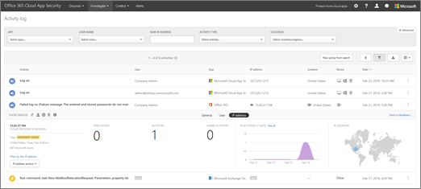
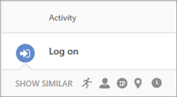

# Anomaly detection policies in Office 365 Cloud App Security

|****Evaluation** \>**|****Planning** \>**|****Deployment** \>**|****Utilization****|
|:-----|:-----|:-----|:-----|
|[Start evaluating](office-365-cas-overview.md)   |[Start planning](get-ready-for-office-365-cas.md)   |You are here!    [Next step](ocas-conditional-access-app-control.md)   |[Start utilizing](utilization-activities-for-ocas.md)   |
   
Beginning with [Microsoft Cloud App Security release 116](new-in-office-365-cas-2018.md#office-365-cloud-app-security-release-116), Office 365 Cloud App Security includes several predefined anomaly detection policies ("out of the box") that include user and entity behavioral analytics (UEBA) and machine learning (ML).
  

  
These anomaly detection policies provide immediate results by providing immediate detections, targeting numerous behavioral anomalies across your users and the machines and devices connected to your network. In addition, the new policies expose more data from the Cloud App Security detection engine to help you speed up the investigation process and contain ongoing threats.
  
As an Office 365 global administrator or security administrator, you can review, and if necessary, revise the default policies that are available with Office 365 Cloud App Security.
  
 > [!IMPORTANT]
> There is an initial learning period of seven (7) days during which anomalous behavior alerts are not triggered. The anomaly detection algorithm is optimized to reduce the number of false positive alerts. 
  
## Before you begin

Make sure that:
  
- Your organization has [Office 365 Cloud App Security](office-365-cas-overview.md), and the service is [turned on](turn-on-office-365-cas.md).
    
- [Audit logging](turn-audit-log-search-on-or-off.md) is turned on for your Office 365 environment. 
    
- You are a global administrator or security administrator for Office 365.
    
## View your anomaly detection policies

1. As a global administrator or security administrator, go to the Cloud App Security portal ([https://portal.cloudappsecurity.com](https://portal.cloudappsecurity.com)) and sign in. This takes you to the Office 365 Cloud App Security Policies page.
    
2. In the **TYPE** list, choose **Anomaly detection policy**. Your organization's default (or existing) anomaly detection policies are displayed. 
  
3. Select a policy to review or edit its settings.
    
4. Choose **Update** to save your changes. 
    
## Learn more about anomaly detection policies

Anomaly detection policies are automatically enabled; however, Office 365 Cloud App Security has an initial learning period of seven days during which not all anomaly detection alerts are raised. After that, each session is compared to the activity, when users were active, IP addresses, devices, etc. detected over the past month and the risk score of these activities. These detections are part of the heuristic anomaly detection engine that profiles your environment and triggers alerts with respect to a baseline that was learned on your organization's activity. These detections also leverage machine learning algorithms designed to profile the users and log-in patterns to reduce false positives.
  
Anomalies are detected by scanning user activity. The risk is evaluated by looking at over 30 different risk indicators, grouped into multiple risk factors, such as risky IP address, login failures, admin activity, inactive accounts, location, impossible travel, device and user agent, and activity rate.
  
Based on the policy results, security alerts are triggered. Office 365 Cloud App Security looks at every user session in Office 365, and alerts you whenever something happens that is different from the baseline of your organization or from a user's regular activity.
  
The following table describes the default anomaly detection policies, what they do, and how they work.
  
|**Anomaly detection policy name**|**How it works**|
|:-----|:-----|
|Impossible travel    |Identifies two user activities (is a single or multiple sessions) originating from geographically distant locations within a time period shorter than the time it would have taken the user to travel from the first location to the second, indicating that a different user is using the same credentials. This detection leverages a machine learning algorithm that ignores obvious "false positives" contributing to the impossible travel condition, such as VPNs and locations regularly used by other users in the organization. The detection has an initial learning period of seven days during which it learns a new user's activity pattern.    |
|Activity from infrequent country    |Considers past activity locations to determine new and infrequent locations. The anomaly detection engine stores information about previous locations used by users in the organization. An alert is triggered when an activity occurs from a location that was not recently or never visited by the user or by any user in the organization.    |
|Activity from anonymous IP addresses    |Identifies that users were active from an IP address that has been identified as an anonymous proxy IP address. These proxies are used by people who want to hide their device's IP address, and may be used for malicious intent. This detection leverages a machine learning algorithm that reduces "false positives", such as mis-tagged IP addresses that are widely used by users in the organization.    |
|Activity from suspicious IP addresses    |Identifies that users were active from an IP address that has been identified as risky by Microsoft Threat Intelligence. These IP addresses are involved in malicious activities, such as Botnet C&amp;C, and may indicate compromised account. This detection leverages a machine learning algorithm that reduces "false positives", such as mis-tagged IP addresses that are widely used by users in the organization.    |
|Unusual activities (by user)    | Identifies users who perform unusual activities, such as:     --Multiple file downloads     --File sharing activities     --File deletion activities     --Impersonation activities     --Administrative activities     These policies look for activities within a single session with respect to the baseline learned, which could indicate on a breach attempt. These detections leverage a machine learning algorithm that profiles the users log on pattern and reduces false positives. These detections are part of the heuristic anomaly detection engine that profiles your environment and triggers alerts with respect to a baseline that was learned on your organization's activity.    |
|Multiple failed login attempts    |Identifies users that failed multiple login attempts in a single session with respect to the baseline learned, which could indicate on a breach attempt.    |
   
## Triage anomaly detection alerts

As alerts come in, you can triage those alerts quickly and determine which ones to handle first. Having context for an alert enables you to see the bigger picture and determine whether something malicious is indeed happening. Use the following procedure to get started exploring an alert:
  
1. As a global administrator or security administrator, go to the Cloud App Security portal ([https://portal.cloudappsecurity.com](https://portal.cloudappsecurity.com)) and sign in. 
    
2. Choose **Alerts** to view your alerts. 
    
3. To get context for an alert, follow these steps:
    
4. Choose **Investigate** \> **Activity log**.
    
5. Select an item, such as a user or IP address. This opens the relevant insights drawer. 
  
6. In the relevant insights drawer, click an available command, such as an icon in the **SHOW SIMILAR** section.  
  
7. Gain insight about the selected item by continuing to explore details for that item.
    
An alert on multiple failed logins might indeed be suspicious, and can indicate a potential brute-force attack. However, such an alert can also be an application misconfiguration, causing the alert to be a benign true positive. If you see a multiple-failed-logins alert with additional suspicious activities, then there is a higher probability that an account is compromised. For example, suppose that a multiple-failed-login alert is followed by activity from a TOR IP address and impossible travel activity, both strong indicators of compromise. You might even see that the same user performed a mass download activity, which is often an indicator of the attacker performing exfiltration of data. It's things like that that you can explore in Office 365 Cloud App Security to view and triage your alerts, and take action where needed.
  
## Next steps

- [Deploy Conditional Access App Control for Office 365 apps](ocas-deploy-conditional-access-app-control.md)

- [Group your IP addresses to simplify management](group-your-ip-addresses-in-ocas.md)

- [Integrate your SIEM server](integrate-your-siem-server-with-office-365-cas.md)
    
- [Review and take action on alerts](review-office-365-cas-alerts.md)
    
    

