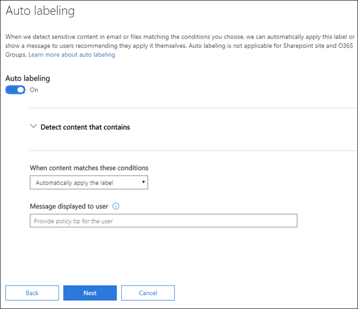
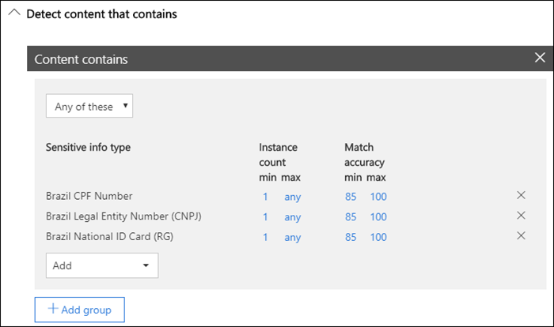
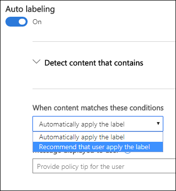

# Apply a sensitivity label to content automatically

When you create a sensitivity label, you can automatically assign that label to content containing sensitive information, or you can prompt users to apply the label that you recommend.

The ability to apply sensitivity labels to content automatically is important because:

- You don't need to train your users on all of your classifications.

- You don't need to rely on users to classify all content correctly.

- Users no longer need to know about your policies - they can instead focus on their work.

> [!NOTE]
> The capability to apply labels automatically requires an Office 365 Enterprise E5 license for each user who has permissions to edit content that's been automatically labeled in a site or mailbox. Users who simply have read-only access do not require a license.

Note that currently, automatic and recommended labeling is available only in Office apps on Windows. To use this feature, you must [Download and install the Azure Information Protection unified labeling client](https://docs.microsoft.com/en-us/azure/information-protection/rms-client/install-unifiedlabelingclient-app).

# Apply a sensitivity label automatically based on conditions

One of the most powerful features of sensitivity labels is the ability to apply them automatically to content that matches certain conditions. In this case, people in your organization don't need to apply the sensitivity labels - Office 365 does the work for them.
   
You can choose to apply sensitivity labels to content automatically when that content contains specific types of sensitive information. When you configure a sensitivity label to be applied automatically, you see the same list of sensitive information types as when you create a data loss prevention (DLP) policy. 

After you choose your sensitive informaton types, you can refine your condition by changing the instance count or match accuracy. For more information, see [Tuning rules to make them easier or harder to match](data-loss-prevention-policies.md#tuning-rules-to-make-them-easier-or-harder-to-match).

Further, you can choose whether a condition must detect all of the sensitive infromation types, or just one of them. And to make your conditions more flexible or complex, you can addd groups and use logical operators between the groups. For more information, see [Grouping and logical operators](data-loss-prevention-policies.md#grouping-and-logical-operators).

When a sensitivity label is automatically applied, the user sees a notification in their Office app. They can choose **OK** to dismiss the notificaiton.

NEED IMAGE OF OK NOTIFICATION AFTER AUTO LABEL

# Recommend that the user apply a sensitivity label

If you prefer, instead of applying a sensitivity label automatically to content, you can recommend to your users that they apply the label. This option provides your users the flexibility of accepting the classification and any associated protection, or dismissing the recommendation if the label is not suitable for their document or email.

Here's an example of a prompt when you configure a condition to apply a label as a recommended action, with a custom policy tip. You can choose what text is displayed in the policy tip.

# How automatic or recommended labels are applied

- Automatic labeling applies to Word, Excel, and PowerPoint when documents are saved, and to Outlook when emails are sent. These conditions detect sensitive information in the body text in documents and emails, and to headers and footers. DOES THIS STILL APPLY? I THINK DLP SCANS ATTACHMENTS TOO?

- You cannot use automatic classification for documents and emails that were previously manually labeled, or previously automatically labeled with a higher classification. Remember, a document or email can have only a single sensitivity label applied to it (in addition to a single retention label).

- Recommended classification applies to Word, Excel, and PowerPoint when documents are saved. You cannot use recommended classification for Outlook unless you configure an advanced client setting that is currently in preview. STILL RELEVENT

- You cannot use recommended classification for documents that were previously labeled with a higher classification. In this case, when the content's already labeled with a higher classification, the user won't see the prompt with the recommendation and policy tip.

- You can change this behavior so that the Azure Information Protection client periodically checks documents for the condition rules that you specify. This configuration requires an advanced client setting that is currently in preview. RELEVANT HERE??

# How multiple conditions are evaluated when they apply to more than one label

1. The labels are ordered for evaluation, according to their position that you specify in the policy: The label positioned first has the lowest position (least sensitive) and the label positioned last has the highest position (most sensitive). For more information on priority, see [Label priority (order matters)](sensitivity-labels.md#label-priority-order-matters).

1. The most sensitive label is applied. WHAT DOES THIS MEAN? HOW DIFFERENT FROM PRIORITY??

1. The last sublabel is applied.