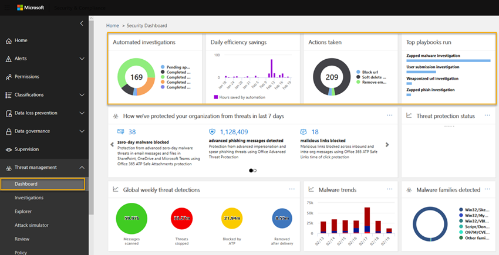

# Automated Investigation and Response (AIR) with Office 365 Threat Intelligence

Automated Investigation and Response (AIR) within [Office 365 Threat Intelligence](office-365-ti.md) capabilities allows you to run automated investigation and remediation to well-known threats that exist today. Read this article to get an overview of AIR and how it can help your organization more effectively mitigate threats.

## Security playbooks

Security playbooks are back-end policies that admins can select as part of security policies. At the heart of automation in Microsoft Threat Protection, the security playbooks provided in [Office 365 Advanced Threat Protection](office-365-atp.md) are based on common real-world security scenarios. 

A Security playbook is kicks off when an alert is triggered within your organization. Once the alert triggers, the associated playbook is run automatically. The playbook runs an investigation, looking at all the associated metadata (including email messages, users, subjects, senders, etc.) and, based on its findings, recommends a set of actions the security team can take to control and mitigate the threat. 

Based on extensive experience, the security playbooks are designed to tackle the most frequent threats our customers face.

### Security playbooks are rolling out in phases

- **Phase 1**: Playbooks include recommendations that security administrators review and approve. 

- **Phase 2**: Security administrators will have the option to allow security playbooks to take action automatically, without administrative interaction.

### Five playbooks will be offered

At initial release, three playbooks will be available. Two more will follow soon after.

|Initial release  |Following soon |
|---------|---------|
|User-submitted message URL verdict change Manual investigation |Zapped malware Zapped phish|

Each playbook includes: 
- a root investigation, 
- steps to hunt down other potential threats, and 
- threat remediation.

Each high-level step includes many sub-steps that are executed to provide a deep, detailed, and exhaustive response to threats.

### Example: User-submitted message playbook

Suppose that a user submits an email message by using the [Report Message add-in for Outlook](enable-the-report-message-add-in.md). This triggers the **User-submitted message** playbook.

During the root investigation phase, various aspects of the email are assessed. These include:
- A determination about what type of threat it might be,
- Who sent it,
- Whether other instances of the email were removed by the [ZAP feature](zero-hour-auto-purge.md),
- An assessment from our analysts,
- Whether the email is associated with any known campaigns,
- ... and more.

After the root investigation is complete, the playbook provides a list of recommended actions to take.
  
Next, several hunting steps are executed:

- Similar email messages in other email clusters are searched.
- The signal is shared with other platforms, such as [WDATP](https://docs.microsoft.com/windows/security/threat-protection/windows-defender-atp/windows-defender-advanced-threat-protection).
- A determination on whether any users have clicked-through on the suspicious email message.
- A check is done to see if [Office 365 ATP Safe Links](atp-safe-links.md) may have missed any instance of the email which was submitted.
- A check is done to see if the user has been compromised.  

During the hunting phase, risks and threats are assigned to various hunting steps.  

Remediation is the final phase of the playbook. During this phase, remediation steps are carried out, based on the results from the investigation and hunting phases.  

## Getting started

To access your investigations, as an Office 365 global administrator or security administrator, go to the Office 365 Security & Compliance Center ([https://protection.office.com](https://protection.office.com)) and sign in. Then, in the left navigation, go to **Threat management** > **Investigations**.

Alternately, you can visit the Threat management dashboard (In the Security & Compliance Center, go to **Threat management** > **Dashboard**).

Your AIR widgets will appear across the top of the [Security Dashboard](security-dashboard.md).

### The main investigation page

The Investigation main page shows an overview view of your organization's investigations and their current states.

 
  
On this page, you have several options:
- Navigate directly to an investigation by clicking an Investigation ID.
- Apply filters to the Investigation State, Status and Time. Or a combination of all, to show you a filtered list of your choosing.
- Export the data to a CSV file.

### The investigation graph page

When you open a specific investigation, you see the investigation graph page. This page shows all the different entities: email messages, users (and their activities), and devices that have been automatically investigated as part of the alert that was triggered.

On this page, you have several options:
- Get a visual overview of the current investigation.
- View a summary of the investigation timings.
- Click a node in the graph visualization to view details for that node.
- Click a tab across the top to view details for that tab.

### The investigation alerts page

By clicking the Alerts node or Alerts tab, we are taken to a view that shows ALL alerts relevant to the investigation – these include the alert triggering the investigation as well as other alerts (in this case, risky sign-in, mass download, etc.) that were correlated to the investigation. From this page, a security analyst can also view additional details on the alerts themselves.

On this page, you have several options.
- Get a visual overview of the current triggering alert and associated (if any) alerts.
- Click an alert in the list to activate a fly-out page that shows full alert details.

### Investigation email messages page

### Investigation users page

### Investigation machines page

### Investigation entities page

### Investigation log page

### Investigation actions page

## How do I get AIR?

## Related topics

[Permissions in the Office 365 Security &amp; Compliance Center](permissions-in-the-security-and-compliance-center.md)

[Reports and insights in the Office 365 Security &amp; Compliance Center](reports-and-insights-in-security-and-compliance.md)
  
[Use Explorer in the Security &amp; Compliance Center](use-explorer-in-security-and-compliance.md)

