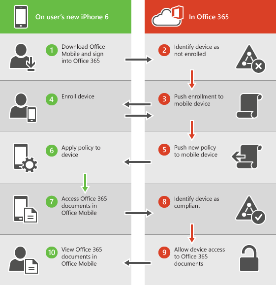
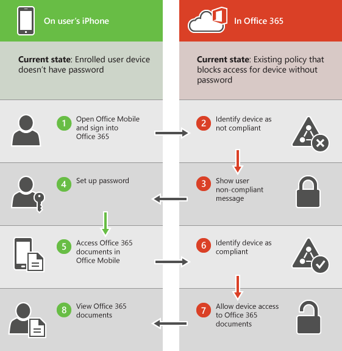

# Capabilities of built-in Mobile Device Management for Office 365

Mobile Device Management for Office 365 can help you secure and manage mobile devices like iPhones, iPads, Androids, and Windows Phones used by licensed Office 365 users in your organization. You can create mobile device management policies with settings that can help control access to your organization's Office 365 email and documents for supported mobile devices and apps. If a device is lost or stolen, you can remotely wipe the device to remove sensitive organizational information.
    
Need more functionality than is included in MDM for Office 365? See if Microsoft Intune has what you need: [Choose between MDM for Office 365 and Microsoft Intune](choose-between-mdm-and-intune.md).
  
## Supported devices

You can use MDM for Office 365 to secure and manage the following types of devices.
  
- Windows Phone 8.1+
    
- iOS 7.1 or later versions
    
- Android 4 or later versions
    
- Windows 8.1\*
    
- Windows 8.1 RT\*
    
- Windows 10\*\*
    
- Windows 10 Mobile\*\*
    
\* Access control for Windows 8.1 and Windows 8.1 RT devices is limited to Exchange ActiveSync.
  
\*\* Requires the device to be joined to Azure Active Directory and be enrolled in the mobile device management service of your organization.
  
If people in your organization use mobile devices that aren't supported by Mobile Device Management for Office 365, you might want to block Exchange ActiveSync app access to Office 365 email for those devices, to help make your organization's data more secure. Steps for blocking Exchange ActiveSync: See [Manage device access settings](manage-device-access-settings.md).
  
## Access control for Office 365 email and documents

The supported apps for the different types of mobile devices in the following table will prompt users to enroll in MDM for Office 365 where there is a new mobile device management policy that applies to a user's device and the user hasn't previously enrolled the device. If a user's device doesn't comply with a policy, depending on how you set the policy up, a user might be blocked from accessing Office 365 resources in these apps, or they might have access but Office 365 will report a policy violation.
  
||**Windows Phone 8.1+**|**iOS 7.1+**|**Android 4+**|
|:-----|:-----|:-----|:-----|
|**Exchange**   Exchange ActiveSync includes built-in email and third-party apps, like TouchDown, that use Exchange ActiveSync Version 14.1 or later.    |Exchange ActiveSync    Exchange Mail    |Exchange ActiveSync    Mail    |Exchange ActiveSync    Email    |
|**Office** and **OneDrive for Business**   |No supported apps    |Outlook    OneDrive    Word    Excel    PowerPoint    |**On phones and tablets:**   Outlook    OneDrive    Word    Excel    PowerPoint    **On phones only:**   Office Mobile    |
   
> [!NOTE]
>  Support for iOS 7.1 and later versions includes iPhone and iPad devices. >  Management of BlackBerry devices isn't supported by Mobile Device Management for Office 365. Use BlackBerry Business Cloud Services (BBCS) from BlackBerry to manage BlackBerry devices. >  Users won't be prompted to enroll and won't be blocked or reported for policy violation if they use the mobile browser to access Office 365 SharePoint sites, documents in Office Online, or email in Outlook Web App. 
  
The following diagram shows what happens when a user with a new device signs in to an app that supports access control with MDM for Office 365. The user is blocked from accessing Office 365 resources in the app until they enroll their device.
  

  
> [!NOTE]
> Policies and access rules created in MDM for Office 365 will override Exchange ActiveSync mobile device mailbox policies and device access rules created in the Exchange admin center. After a device is enrolled in MDM for Office 365, any Exchange ActiveSync mobile device mailbox policy or device access rule applied to the device will be ignored. To learn more about Exchange ActiveSync, see [Exchange ActiveSync in Exchange Online](https://go.microsoft.com/fwlink/p/?LinkId=524380). 
  
## Policy settings for mobile devices

If you create a policy to block access with certain settings turned on, users will be blocked from accessing Office 365 resources when using a supported app that is listed in [Access control for Office 365 email and documents](#access-control-for-office-365-email-and-documents). The settings that can block users from accessing Office 365 resources are in these sections:
  
- Security
    
- Encryption
    
- Jail broken
    
- Managed email profile
    
For example, the following diagram shows what happens when a user with an enrolled device isn't compliant with a security setting in a mobile device management policy that applies to their device. The user signs in to an app that supports access control with MDM for Office 365. They are blocked from accessing Office 365 resources in the app until their device complies with the security setting.
  

  
The following sections list the policy settings you can use to help secure and manage mobile devices that connect to your organization's Office 365 resources. 
  
### Security settings

|**Setting name**|**Windows Phone 8.1+**|**iOS 7.1+**|**Android 4+**|**Samsung Knox**|
|:-----|:-----|:-----|:-----|:-----|
|Require a password    |✔    |✔    |✔    |✔    |
|Prevent simple password    |✔    |✔    |✖    |✖    |
|Require an alphanumeric password    |✔    |✔    |✖    |✖    |
|Minimum password length    |✔    |✔    |✔    |✔    |
|Number of sign-in failures before device is wiped    |✔    |✔    |✔    |✔    |
|Minutes of inactivity before device is locked    |✔    |✔    |✔    |✔    |
|Password expiration (days)    |✔    |✔    |✔    |✔    |
|Remember password history and prevent reuse    |✔    |✔    |✔    |✔    |
   
### Encryption settings

|**Setting name**|**Windows Phone 8.1+**|**iOS 7.1+**|**Android 4+**|**Samsung Knox**|
|:-----|:-----|:-----|:-----|:-----|
|Require data encryption on devices    |Windows Phone 8.1 is already encrypted and cannot be unencrypted    |✖    |✔    |✔\*    |
   
\* With Samsung Knox, you can also require encryption on storage cards.
  
### Jail broken setting

|**Setting name**|**Windows Phone 8.1+**|**iOS 7.1+**|**Android 4+**|**Samsung Knox**|
|:-----|:-----|:-----|:-----|:-----|
|Device cannot be jail broken or rooted    |✖    |✔    |✔    |✔    |
   
### Managed email profile option

The following option can block users from accessing their Office 365 email if they're using a manually created email profile. Users on iOS devices must delete their manually created email profile before they can access their email. After they delete the profile, a new profile will be automatically created on the device.
  
|**Setting name**|**Windows Phone 8.1+**|**iOS 7.1+**|**Android 4+**|**Samsung Knox**|
|:-----|:-----|:-----|:-----|:-----|
|Email profile is managed    |✖    |✔    |✖    |✖    |
   
### Cloud settings

|**Setting name**|**Windows Phone 8.1+**|**iOS 7.1+**|**Android 4+**|**Samsung Knox**|
|:-----|:-----|:-----|:-----|:-----|
|Require encrypted backup    |✖    |✔    |✖    |✖    |
|Block cloud backup    |✖    |✔    |✖    |✖    |
|Block document synchronization    |✖    |✔    |✖    |✖    |
|Block photo synchronization    |✖    |✔    |✖    |✖    |
|Allow Google backup    |N/A    |N/A    |✖    |✔    |
|Allow Google account auto sync    |N/A    |N/A    |✖    |✔    |
   
### System settings

|**Setting name**|**Windows Phone 8.1+**|**iOS 7.1+**|**Android 4+**|**Samsung Knox**|
|:-----|:-----|:-----|:-----|:-----|
|Block screen capture    |✔    |✔    |✖    |✔    |
|Block sending diagnostic data from device    |✔    |✔    |✖    |✔    |
   
### Application settings

|**Setting name**|**Windows Phone 8.1+**|**iOS 7.1+**|**Android 4+**|**Samsung Knox**|
|:-----|:-----|:-----|:-----|:-----|
|Block video conferences on device    |✖    |✔    |✖    |✖    |
|Block access to application store    |✔    |✔    |✖    |✔    |
|Require password when accessing application store    |✖    |✔    |✖    |✖    |
   
### Device capabilities settings

|**Setting name**|**Windows Phone 8.1+**|**iOS 7.1+**|**Android 4+**|**Samsung Knox**|
|:-----|:-----|:-----|:-----|:-----|
|Block connection with removable storage    |✔    |✖    |✖    |✔    |
|Block Bluetooth connection    |✔    |✖    |✖    |✔    |
   
### Additional settings

You can set the following additional policy settings by using PowerShell cmdlets. For more information, see [Office 365 Security &amp; Compliance Center cmdlets](https://go.microsoft.com/fwlink/p/?LinkId=827804).
  
|**Setting name**|**Windows Phone 8.1+**|**iOS 7.1+**|**Android 4+ (including Samsung Knox)**|
|:-----|:-----|:-----|:-----|
|CameraEnabled    |✔    |✔    |✔    |
|RegionRatings    |✖    |✔    |✖    |
|MoviesRatings    |✖    |✔    |✖    |
|TVShowsRating    |✖    |✔    |✖    |
|AppsRatings    |✖    |✔    |✖    |
|AllowVoiceDialing    |✖    |✔    |✖    |
|AllowVoiceAssistant    |✖    |✔    |✖    |
|AllowAssistantWhileLocked    |✖    |✔    |✖    |
|AllowPassbookWhileLocked    |✖    |✔    |✖    |
|MaxPasswordGracePeriod    |✖    |✔    |✖    |
|PasswordQuality    |✖    |✖    |✔    |
|SystemSecurityTLS    |✖    |✔    |✖    |
|WLANEnabled    |✔    |✖    |✖    |
   
### Settings supported by Windows

You can manage Windows 8.1 and Windows 10 devices by enrolling them as mobile devices. After an applicable policy is deployed, users with Windows 8.1 RT and Windows 10 RT devices will be required to enroll in MDM for Office 365 the first time they use the built-in email app to access their Office 365 email. 
  
The following settings are supported for Windows 8.1 and Windows 10 devices that are enrolled as mobile devices. These setting won't block users from accessing Office 365 resources.
  
 **Security settings**
  
- Require an alphanumeric password
    
- Minimum password length
    
- Number of sign-in failures before device is wiped
    
- Minutes of inactivity before device is locked
    
- Password expiration (days)
    
- Remember password history and prevent reuse
    
 **System settings**
  
Block sending diagnostic data from device
  
 **Additional settings**
  
You can set the following additional policy settings by using PowerShell cmdlets:
  
- AllowConvenienceLogon
    
- UserAccountControlStatus
    
- FirewallStatus
    
- AutoUpdateStatus
    
- AntiVirusStatus
    
- AntiVirusSignatureStatus
    
- SmartScreenEnabled
    
- WorkFoldersSyncUrl
    
## Remotely wipe a mobile device

 If a device is lost or stolen, you can remove sensitive organizational data and help prevent access to your organization's Office 365 resources by doing a wipe from **Security &amp; Compliance center\>Data loss prevention\>Device management**. You can do a selective wipe to remove only organizational data or a full wipe to delete all information from a device and restore it to its factory settings.
  
For more information, see [Wipe a mobile device in Office 365](https://go.microsoft.com/fwlink/p/?LinkId=518157).
  
## See also

[Overview of Mobile Device Management for Office 365](overview-of-mdm.md)
  
[Create and deploy device security policies](create-device-security-policies.md)

