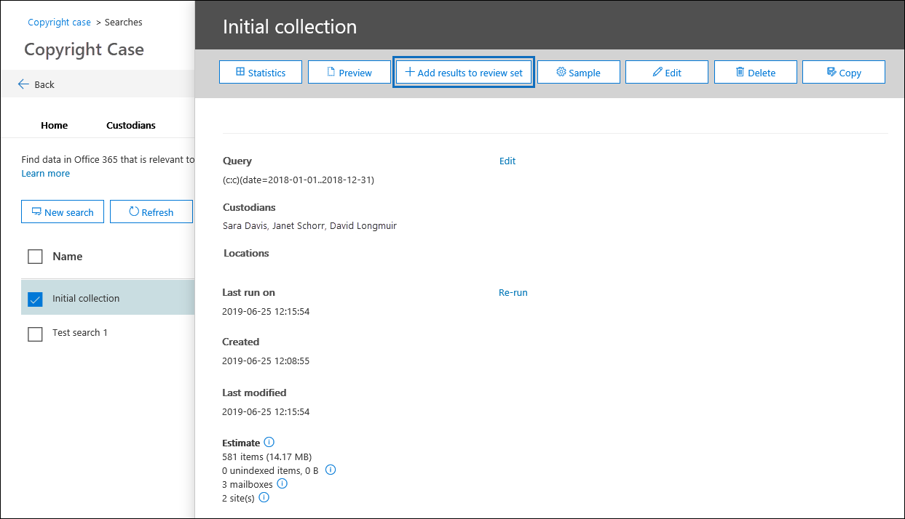
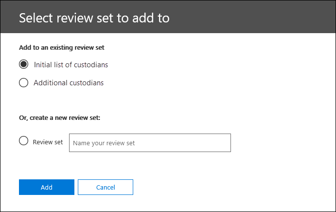

# Add search results to a review set

After you've identified and culled with searches against Exchange, SharePoint and OneDrive for business, you can add the results to a review set. review sets represent a static set of documents that we will index for lightning fast search results, analyze for email thread identification, near duplicate detection and themes.  You can also add data from Non-Office 365 data sources to live side by side with the data you collect from Office 365.

To add data to a review set, start by selecting a search, in the search results fly out, click the *+ Add results to review set* button.

You can then choose to add to an existing review set or a *New review set*.  If adding to a new review set, specify the name and finally click the *Add* button.

Adding data to a review set is a long running process, you can either track the progress in the Jobs tab or in the *review set status* column in the *Searches* tab.  The process includes gathering items from Office 365 and finally Ingestion & Indexing.  Once review set processing is completed, you can navigate to the review set by clicking on the *review sets* tab and then clicking on the review set.  You can then move on to searching, reviewing, tagging and exporting any relevant data.

## Adding a sample to a review set

If you would like to validate your search results more thorougly before collecting all documents that were retrieved by your search, you can add a random sample of the search results to a review set instead of adding everything.

To add a sample to a review set, start by selecting a search, in the search results flyout, click *Sample* button.

You can then choose the parameter of your sampling. There are two options:
- Confidence level and interval: sample size will be chosen to satisfy the given statistical parameters.
- Percentage: sample size will be determined based on the number of items that was returned by the search, and the chosen parameter.

Finally, choose the review set to add the sample to. From there, you can check the status of the process just as you would for adding a whole search into a review set. 