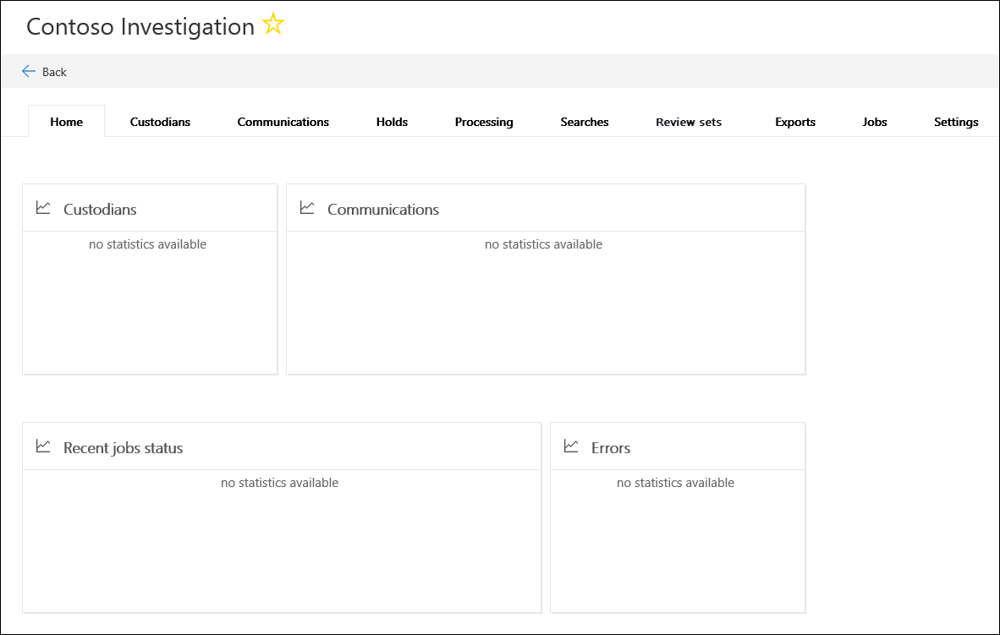

# Create a new case in Advanced eDiscovery (Preview)

1. Go to [https://protection.office.com](https://protection.office.com).
    
2. Sign in to Office 365 using your work or school account.
    
3. In the Security & Compliance Center, click **eDiscovery > Advanced eDiscovery**.
 
4. On the **Advanced eDiscovery (Preview)** page, click **Create a case**.
    
5. On the **New eDiscovery case** flyout page, give the case a name (required), and then type an optional case number and description. Note that the case name must be unique in your organization.

6. Under Do you want to configure additional settings after creating this case, do one of the following:

    - Click **Yes** to create the case, and display the **Settings** page in the new case. This allows you to add members to the case.
    
    - Click **No** to just create case and display it in the list of cases on the **Advanced eDiscovery (Preview)** page. If you choose this option, you will be added as the only member of the case and the default search and analytics settings will be used. You can add members or change settings any time after the case is created.

7. Click **Save** to create the case.

    The new case is displayed in the list of cases on the **Advanced eDiscovery (Preview)** page. 

8. To open a case, click the name of the case. 

    The **Home** tab for the case is displayed. For example, here's a new case named *Contoso Investigation*.

    