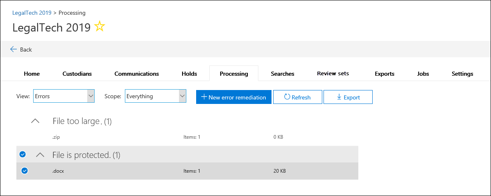

# Error remediation when processing data

Error remediation allows eDiscovery administrators the ability to rectify data issues which prevent Microsoft 365 Advanced eDiscovery (Preview) from properly processing the content. For example, files that are password protected cannot be processed since the files are locked or encrypted. Using error remediation, eDiscovery administrators can download files with such errors, remove the password protection and upload the remediated files.

Use the following workflow to remediate files with errors in Advanced eDiscovery cases within the Security and Compliance Center.

## Creating an error remediation session to remediate files with processing errors
       >[!NOTE]
       >If at any time during this process, the error remediation wizard is closed, you can return to the error remediation session from the **Processing** tab by selecting **Error remediations** in the **View** drop down menu.

1. From the Processing tab inside of an Advanced eDiscovery case, select **Errors** in the **View** drop down menu.
1. Select the errors you wish to remediate by clicking the radio button next to either the error type or file type.  In the example, we are going to remediate a password protected file.
1. Click the **+ New error remediation** button

1. Your error remediation session will begin, starting with a preparation stage where the errored files are moved to a secure Azure location to be downloaded.

1. Once the preparation is completed, click the **Next: Download files** button to proceed with download.

1. To download files, specify the **Destination path for download** this is a path on your local computer where the file should be downloaded.  The default path, %USERPROFILE%\Downloads\errors, points to the logged in users downloads folder, this can be changed as needed.

       >[!NOTE]
       >It is recommend that you use a local file path instead of a remote network path for optimal performance.

       > [!NOTE]
       > If you have not already installed AzCopy, you can do this from here: https://docs.microsoft.com/en-us/azure/storage/common/storage-use-azcopy

1. Copy the predefined command by clicking the **Copy to clipboard** link. Start a windows command prompt, paste the command and press enter.  The files will download

       > [!NOTE]
       > If you have issues running this command, see https://go.microsoft.com/fwlink/?linkid=2038117 for troubleshooting tips.

1. After downloading the files, you can remediate them with your favorite tool. For password protected files, there are a number of password cracking tools you can take advantage of. If you know the passwords for the files, you can open them and removed the password protection.
       > [!NOTE]
       > IT is important that you retain the directory structure and file names of the remediated files in tact.  All naming conventions used in the downloaded files and folders make it possible to associate the remdiated files back to the original.

1. Now, return to Advanced eDiscovery and click the **Next: Upload files** button.  This will move to the next step where you can now upload the files.

1. Specifiy the location of the remediated files in the **Path to location of files** text box, then click the **Copy to clibpboard link**.
1. Paste the command into a Windows Command Prompt and press the Enter key to upload the files.

1. Finally, return to Advanced eDiscovery and click the **Next: Process files** button.

1. When processing is complete.  You can return to the working set and see the remediated file.

## What happens when files are remediated
When remediated files are uploaded, the original metadata is preserved with the exception of the following fields. For a definition of all Advanced eDiscovery metadata fields, click here.

- Text
- HasText
- ExtractedTextSize
- DocumentExtractedUrl
- ItemExtractedUrl
- IsParentExtractedUrl
- LoadId
- ProcessingStatus
- ProcessingErrorMessage
- IsErrorRemediate
- WordCount
- WorkingsetId