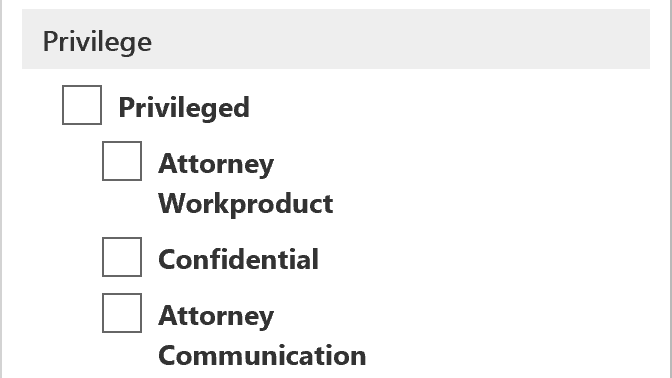

# Tag documents in a working set

Organizing content in a working set is important to complete various workflows in the eDiscovery process. This includes:

-  Culling unnecessary content.

- Identifying relevant content.
 
-  Identifying content that must be reviewed by an expert or an attorney.

When experts, attorneys, or other users review content in a working set, their opinions related to the content can be captured by using tags. For example, if the intent is to cull unnecessary content, a user can tag documents with a tag such as “non-responsive”. After content has been reviewed and tagged, a working set search can be created to exclude any content tagged as “non-responsive”, which eliminates this content from the next steps in the eDiscovery workflow. The tag panel can be customized for every case so that the tags can support the intended review workflow.

## Tag types

Advanced eDiscovery (Preview) provides two types of tags:

- **Single choice tags** - Restricts users to select a single tag within a group. This can be useful to ensure users don’t select conflicting tags such as “responsive” and “non-responsive”. 

- **Multiple choice tags** - Allow users to select multiple tags within a group.

## Tag structure

In addition to the tag types, the structure of how tags are organization in the tag panel can be used to make tagging documents more intuitive. Tags are grouped by sections. Working set search supports the ability to search by tag and by tag section. This means you can create a working set search to retrieve documents tagged with any tag in a section.

Tags can be further organized by nesting them within a section. For example, if the intent is to identify and tag privileged content, nesting can be used to make it clear that a user can tag a document as “Privileged” and select the type of privilege by checking the appropriate nested tag.

## Applying tags

There are several ways to apply a tag to content.

### Tagging a single document

When viewing a document in a working set, you can display the tags that a review can use by clicking **Coding panel**.

This will enable you to apply tags to the document displayed in the viewer.

### Bulk tagging

Bulk tagging can be done by selecting multiple files in the results grid and then using the tags in the **Coding panel** similar to tagging single documents. Bulk un-tagging can be done by selecting tags twice; the first click will apply the tag, and the second selection will ensure that tag is cleared for all selected files.

> [!NOTE]
> When bulk tagging, the tagging panel will display a count of files that are tagged for each tag in the panel.

### Tagging in the related panel

The **Document family** panel displays various types of related content including email family, email threading, near duplicates, and hash duplicates. Often times review time can be reduced significantly by bulk tagging related content. For example, an email has several attachments and you want to ensure that the entire family is tagged consistently.

1. With the related panel open displaying the list of related content, click the “Tag documents” button within the related panel.

2. This will generate a pop-up with the tag panel allowing you to tag the entire family at once.

