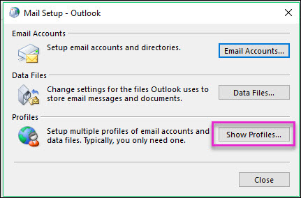
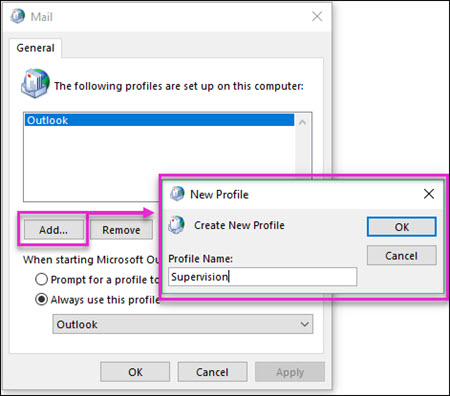
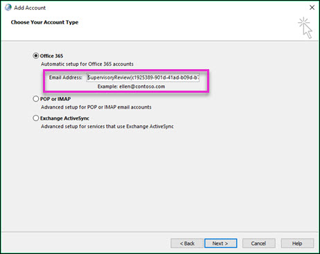

# Configure supervision policies for your organization

Use supervision policies to capture employee communications for examination by internal or external reviewers. For more information about how supervision policies can help you monitor communications in your organization, see [Supervision policies in Office 365](supervision-policies.md).

> [!NOTE]
> Users monitored by supervision policies must have either an Office 365 Enterprise E3 license with the Advanced Compliance add-on or be included in an Office 365 Enterprise E5 subscription.
If you don't have an existing Enterprise E5 plan and want to try supervision, you can [sign up for a trial of Office 365 Enterprise E5](https://go.microsoft.com/fwlink/p/?LinkID=698279).
  
Follow these steps to set up and use supervision in your Office 365 organization:
  
- **Step 1 (optional)** - [Set up groups for Supervision](configure-supervision-policies.md#exampledist)

    Before you start using supervision, determine who will have their communications reviewed and who will perform those reviews. If you want to get started with just a few users to see how supervision works, you can skip setting up groups for now.

- **Step 2 (required)** - [Make supervision available in your organization](configure-supervision-policies.md#MakeAvailable)

    Add yourself to the Supervisory Review role group so you can set up policies. Anyone who has this role assigned can access the **Supervision** page under **Data Governance** in the Security & Compliance Center. If email to be reviewed is hosted on Exchange Online, each reviewer must also have [remote PowerShell access to Exchange Online](https://docs.microsoft.com/powershell/exchange/exchange-online/disable-access-to-exchange-online-powershell).

- **Step 3 (optional)** - [Configure custom sensitive information types or custom keyword dictionaries/lexicons](configure-supervision-policies.md#sensitiveinfo)

    If you need to use a custom sensitive info type or a custom keyword dictionary for your supervision policy, you'll need to create it before starting the supervision wizard.

- **Step 4 (required)** - [Set up a supervision policy](configure-supervision-policies.md#setupsuper)

    You'll create supervision policies in the Security & Compliance Center. These policies define which communications are subject to review in your organization and specifies who should perform reviews. Communications include email and Microsoft Teams communications, as well as 3rd-party platform communications (such as Facebook, Twitter, etc.)

- **Step 5 - (optional)** [Test your new supervision policy](configure-supervision-policies.md#TestPolicy)

    Testing your supervision policy to make sure it is functioning as desired is an important part of ensuring that your compliance strategy is meeting your standards.

- **Step 6 - (optional)** [Set up Outlook add-in for reviewers who do not want to use Office 365 supervision dashboard or OWA to review supervised communications](configure-supervision-policies.md#UseOutlook)

    The Supervision add-in for Outlook gives reviewers access to the supervision functionality right within the Outlook client so they can assess and categorize each item.

<a name="exampledist"> </a>

## Step 1 - Set up groups for Supervision (optional)

 When you create a supervision policy, you'll determine who will have their communications reviewed and who will perform those reviews. In the policy, you'll use email addresses to identify individuals or groups of people. To simplify your setup, create groups for people who will have their communication reviewed and groups for people who will review those communications. If you're using groups, you might need several—for example, if you want to monitor communications between two distinct groups of people, or if you want to specify a group that isn't going to be supervised. See [Example distribution groups](configure-supervision-policies.md#GroupExample) for details about how this works.
  
To supervise communications between or within groups in your organization, set up distribution groups in the Exchange admin center (go to **recipients** \> **groups**). For more information about setting up distribution groups, see [Manage distribution groups](http://go.microsoft.com/fwlink/?LinkId=613635)
  
> [!NOTE]
> You can also use dynamic distribution groups or security groups for supervision if you prefer. To help you decide if these better fit your organization needs, see [Manage mail-enabled security groups](http://go.microsoft.com/fwlink/?LinkId=627033), and [Manage dynamic distribution groups](http://go.microsoft.com/fwlink/?LinkId=627058).
  
<a name="GroupExample"> </a>

### Example distribution groups

This example includes a distribution group that has been set up for a financial organization called Contoso Financial International.
  
In Contoso Financial International, a sampling of communications between brokers in the United States must be supervised. However, compliance officers within that group do not require supervision. For this example, we can create the following groups:
  
|**Set up this distribution group**|**Group address (alias)**|**Description**|
|:-----|:-----|:-----|
|All US brokers | US_Brokers@Contoso.com | This group includes email addresses for all US-based brokers who work for Contoso. |
| All US compliance officers | US_Compliance@Contoso.com  | This group includes email addresses for all US-based compliance officers who work for Contoso. Because this group is a subset of all US-based brokers, you can use this alias to exempt compliance officers from a supervision policy. |
  
<a name="MakeAvailable"> </a>

## Step 2 - Make supervision available in your organization (required)

To make **Supervision** available as a menu option in the Security & Compliance Center, you must be assigned the Supervisory Review Administrator role.
  
To do this, you can either add yourself as a member of the Supervisory Review role group, or you can create a new role group.
  
### Add members to the Supervisory Review role group

1. Sign into [https://protection.office.com](https://protection.office.com) using credentials for an admin account in your Office 365 organization.

2. In the Security & Compliance Center, go to **Permissions**.

3. Select the **Supervisory Review** role group and then click the Edit icon.

4. In the **Members** section, add the people who you want to manage supervision for your organization.

### Create a new role group

1. Sign into [https://protection.office.com](https://protection.office.com) using credentials for an admin account in your Office 365 organization.

2. In the Security & Compliance Center, go to **Permissions** and then click Add (**+**).

3. In the **Roles** section, click Add (**+**) and scroll down to **Supervisory Review Administrator**. Add this role to the role group.

4. In the **Members** section, add the people who you want to manage supervision for your organization.

For more information about role groups and permissions, see [Permissions in the Office 365 Security &amp; Compliance Center](permissions-in-the-security-and-compliance-center.md).

### Enable remote PowerShell access for reviewers (if email is hosted on Exchange Online)

1. Follow the guidance in [Enable or disable access to Exchange Online PowerShell](https://docs.microsoft.com/powershell/exchange/exchange-online/disable-access-to-exchange-online-powershell).

<a name="sensitiveinfo"> </a>
  
## Step 3 - Create custom sensitive information types or custom keyword dictionaries (optional)

In order to pick from existing custom sensitive information types or custom keyword dictionaries in the supervision policy wizard, you first need to create these items if needed.

### Create custom sensitive information types

1. Create a new sensitive information type in the Office 365 Security & Compliance Center. Navigate to **Classifications** \> **Sensitive info types** and follow the steps in the **New sensitive info type wizard**. Here you will:

    - Define a name and description for the sensitive info type
    - Define the proximity, confidence level, and primary pattern elements
    - Review your selections and create the sensitive info type

    For more detailed information, see [Create a custom sensitive information type](create-a-custom-sensitive-information-type.md).

### Create custom keyword dictionary/lexicon

1. Using a text editor (like Notepad), create a new file that includes the keyword terms you'd like to monitor in a supervision policy. Make sure each term is on a separate line and save the file in the **Unicode/UTF-16 (Little Endian)** format.
2. Import the keyword file into your Office 365 tenant using PowerShell. To connect to Office 365 with PowerShell, see [Connect to Office 365 Security & Compliance Center PowerShell](https://docs.microsoft.com/powershell/exchange/office-365-scc/connect-to-scc-powershell/connect-to-scc-powershell).

    After you've connected to Office 365 with PowerShell, run the following commands to import your keyword dictionary:

    ```
    $fileData = Get-Content "your keyword path and file name" -Encoding Byte -ReadCount 0

    New-DlpKeywordDictionary -Name "Name for your keyword dictionary" -Description "optional description for your keyword dictionary" -FileData $fileData
    ```
    For more detailed information, see [Create a keyword dictionary](create-a-keyword-dictionary.md).

3. Create a new sensitive information type in the Office 365 Security & Compliance Center. Navigate to **Classifications** \> **Sensitive info types** and follow the steps in the **New sensitive info type wizard**. Here you will:

    - Define a name and description for the sensitive info type
    - Add your custom dictionary as a requirement for the matching element
    - Review your selections and create the sensitive info type

    After the custom dictionary/lexicon is created, you can view the configured keywords using the [Get-DlpKeywordDictionary](https://docs.microsoft.com/powershell/module/exchange/policy-and-compliance-dlp/get-dlpkeyworddictionary) cmdlet or add and remove terms using the [Set-DlpKeywordDictionary](https://docs.microsoft.com/powershell/module/exchange/policy-and-compliance-dlp/set-dlpkeyworddictionary) cmdlet.

    For more detailed information, see [Create a custom sensitive information type](create-a-custom-sensitive-information-type.md).

<a name="setupsuper"> </a>

## Step 4 - Set up a supervision policy (required)
  
1. Sign into [https://protection.office.com](https://protection.office.com) using credentials for an admin account in your Office 365 organization.

2. In the Security & Compliance Center, select **Supervision**.
  
3. Select **Create** and then follow the wizard to set up the following pages of the policy. Using the wizard, you will:

    - Give the policy a name and description.
    - Choose the users or groups to supervise, including choosing users or groups you'd like to exclude.
    - Define the supervision policy conditions.
    - Choose if you'd like to include sensitive information types. This is where you can select default and custom sensitive info types.
    - Define the percentage of communications to review.
    - Choose the reviewers for the policy. Reviewers can be individual users or [mail-enabled security groups](https://docs.microsoft.com/Exchange/recipients-in-exchange-online/manage-mail-enabled-security-groups#create-a-mail-enabled-security-group).
    - Review your policy selections and create the policy.

<a name="TestPolicy"> </a>

## Step 5 - Test your supervision policy (optional)

After you create a supervision policy, it's a good idea to test to make sure that the conditions you defined are being properly enforced by the policy. You may also want to [test your data loss prevention (DLP) policies](create-test-tune-dlp-policy.md) if your supervision policies include sensitive information types. Follow the steps below to test your supervision policy:

1. Open an email client or Microsoft Teams logged in as a supervised user defined in the policy you want to test.
2. Send an email or Microsoft Teams chat that meets the criteria you've defined in the supervision policy. This can be a keyword, attachment size, domain, etc. Make sure you determine if your configured conditional settings in the policy is too restrictive or too lenient.

    > [!Note]
    > Emails subject to defined policies are processed in near real-time and can be tested immediately after the policy is configured. Chats in Microsoft Teams can take up to 24 hours to fully process in a policy. 

3. Log into your Office 365 tenant as a reviewer designated in the supervision policy. Navigate to **Supervision** > *Your Custom Policy* > **Open** to view the report for the policy.

<a name="UseOutlook"> </a>

## Step 6 - Set up Outlook add-in for reviewers (optional)

Reviewers that want to use Outlook instead of using the Supervision dashboard in Office 365 or Outlook on the web to review communications must install the Supervision add-in for their Outlook client.

### Step 1: Copy the address for the supervision mailbox

To install the add-in for Outlook desktop, you'll need the address for the supervision mailbox that was created as part of the supervision policy setup.
  
> [!NOTE]
> If someone else created the policy, you'll need to get this address from them to install the add-in.

 **To find the supervision mailbox address**
  
1. Sign into the [Security &amp; Compliance Center](https://protection.office.com) using credentials for an admin account in your Office 365 organization.

2. Go to **Supervision**.

3. Click the supervision policy that's gathering the communications you want to review.

4. In the policy details flyout, under **Supervision mailbox**, copy the address.<br/>
  
### Step 2: Configure the supervision mailbox for Outlook desktop access

Next, reviewers will need to run a couple Exchange Online PowerShell commands so they can connect Outlook to the supervision mailbox.
  
1. Connect to Exchange Online PowerShell. [How do I do this?](https://docs.microsoft.com/powershell/exchange/exchange-online/connect-to-exchange-online-powershell/connect-to-exchange-online-powershell)

2. Run the following commands, where  *SupervisoryReview{GUID}@domain.onmicrosoft.com*  is the address you copied in Step 1 above, and  *User*  is the name of the reviewer who will be connecting to the supervision mailbox in Step 3.
    - ```Add-MailboxPermission "SupervisoryReview{GUID}@domain.onmicrosoft.com" -User <alias or email address of the account that has reviewer permissions to the supervision mailbox> -AccessRights FullAccess```<br/>
    - ```Set-Mailbox "<SupervisoryReview{GUID}@domain.onmicrosoft.com>" -HiddenFromAddressListsEnabled: $false```

3. Wait at least an hour before moving on to Step 3 below.

### Step 3: Create an Outlook profile to connect to the supervision mailbox

For the final step, reviewers will need to create an Outlook profile to connect to the supervision mailbox.

> [!NOTE]
> To create a new Outlook profile, you'll use the Mail settings in the Windows Control Panel. The path you take to get to these settings might depend on which Windows operating system (Windows 7, Windows 8, or Windows 10) you're using, and which version of Outlook is installed.
  
1. Open the Control Panel, and in the **Search** box at the top of the window, type **Mail**.<br/>(Not sure how to get to the Control Panel? See [Where is Control Panel?](https://support.microsoft.com/help/13764/windows-where-is-control-panel))
  
2. Open the **Mail** app.

3. In **Mail Setup - Outlook**, click **Show Profiles**.<br/>
  
4. In **Mail**, click **Add**. Then, in **New Profile**, enter a name for the supervision mailbox (such as **Supervision**).<br/>
  
5. In **Connect Outlook to Office 365**, click **Connect to a different account**.<br/>
  
6. In **Auto Account Setup**, choose **Manual setup or additional server types**, and then click **Next**.

7. In **Choose Your Account Type**, choose **Office 365**. Then, in the **Email Address** box, enter the address of the supervision mailbox you copied previously.<br/>
  
8. When prompted, enter your Office 365 credentials.

9. If successful, you'll see the **Supervision - \<policy name\>** folder listed in the Folder List view in Outlook.

## PowerShell reference

If needed, you can create and manage supervision policies using the following PowerShell cmdlets:

- [New-SupervisoryReviewPolicyV2](https://docs.microsoft.com/powershell/module/exchange/policy-and-compliance/new-supervisoryreviewpolicyv2?view=exchange-ps)
- [Get-SupervisoryReviewPolicyV2](https://docs.microsoft.com/powershell/module/exchange/policy-and-compliance/get-supervisoryreviewpolicyv2?view=exchange-ps)
- [Set-SupervisoryReviewPolicyV2](https://docs.microsoft.com/powershell/module/exchange/policy-and-compliance/set-supervisoryreviewpolicyv2?view=exchange-ps)
- [Remove-SupervisoryReviewPolicyV2](https://docs.microsoft.com/powershell/module/exchange/policy-and-compliance/remove-supervisoryreviewpolicyv2?view=exchange-ps)
- [New-SupervisoryReviewRule](https://docs.microsoft.com/powershell/module/exchange/policy-and-compliance/new-supervisoryreviewrule?view=exchange-ps)
- [Set-SupervisoryReviewRule](https://docs.microsoft.com/powershell/module/exchange/policy-and-compliance/set-supervisoryreviewrule?view=exchange-ps)
- [Get-SupervisoryReviewActivity](https://docs.microsoft.com/powershell/module/exchange/policy-and-compliance/get-supervisoryreviewactivity?view=exchange-ps)
- [Get-SupervisoryReviewOverallProgressReport](https://docs.microsoft.com/powershell/module/exchange/policy-and-compliance/get-supervisoryreviewoverallprogressreport?view=exchange-ps)
- [Get-SupervisoryReviewTopCasesReport](https://docs.microsoft.com/powershell/module/exchange/policy-and-compliance/get-supervisoryreviewtopcasesreport?view=exchange-ps)