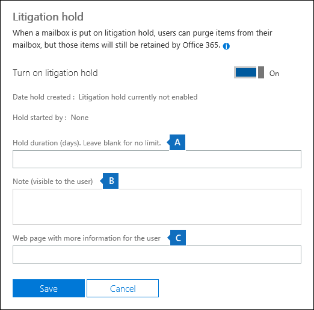
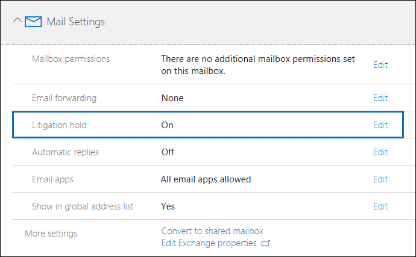

# Create a Litigation Hold in Office 365

You can place a mailbox on Litigation Hold to retain all mailbox content, including deleted items and the original versions of modified items. When you place a user mailbox on Litigation Hold, content in the user's archive mailbox (if it's enabled) is also retained. When you create a hold, you can specify a hold duration (also called a *time-based hold*) so that deleted and modified items are retained for a specified period and then permanently deleted from the mailbox. Or you can just retain content indefinitely (called an *infinite hold*) or until the Litigation Hold is removed. If you do specify a hold duration period, it's calculated from the date a message is received or a mailbox item is created. 
  
Here's what happens when you create a Litigation Hold.
  
- Items that are permanently deleted by the user are retained in the Recoverable Items folder in the user's mailbox for the duration of the hold.
    
- Items that are purged from the Recoverable Items folder by the user are retained for the duration of the hold.
    
- The storage quota for the Recoverable Items folder is increased from 30 GB to 110 GB.
    
- Items in the user's primary and the archive mailboxes are retained
    
## Before you begin

- To place an Exchange Online mailbox on Litigation Hold, it must be assigned an Exchange Online Plan 2 license. If a mailbox is assigned an Exchange Online Plan 1 license, you would have to assign it a separate Exchange Online Archiving license to place it on hold.
    

## Place a mailbox on Litigation Hold in the Office 365 admin center

Here are the steps to place a maibox on Litigation Hold using the Office 365 admin center.

1. Go to https://portal.office.com/adminportal/home and sign in using your global administrator account.
2. Click **Users** > **Active users** in the left navigation pane.
3. Select the user whose mailbox you want to place on Litigation Hold.
4. On the fly-out page, click **Mail settings**, and then click **Edit** next to **Litigation hold**.
5. On the **Litigation hold** page, click the toggle to turn on Litigation Hold and complete the following optional settings that are displayed:
 
    

    a. **Hold duration (days)** - Use this box to create a time-based hold and specify how long mailbox items are held when the mailbox is placed on Litigation Hold. The duration is calculated from the date a mailbox item is received or created. If you leave this box blank, items are held indefinitely or until the hold is removed. Use days to specify the duration.
    
    b. **Note** - Use this box to inform the user their mailbox is on Litigation Hold. The note will appear on the Account Information page in the user's mailbox if they're using Outlook 2010 or later. To access this page, users can click **File** in Outlook.
     
    c. **Web page** - Use this box to direct the user to a website for more information about Litigation Hold. This URL appears on the Account Information page in the user's mailbox if they are using Outlook 2010 or later. To access this page, users can click **File** in Outlook.
 
6. Click **Save** to create the Litigation Hold.

After you create the hold, the mail settings on the fly-out page shows that Litigation Hold is turned on for the selected user.

For more information about creating and managing Litigation Holds and using Exchange Online PowerShell to bulk-create Litigation Holds, see [Place a mailbox on Litigation Hold](https://docs.microsoft.com/office365/SecurityCompliance/place-a-mailbox-on-litigation-hold).
