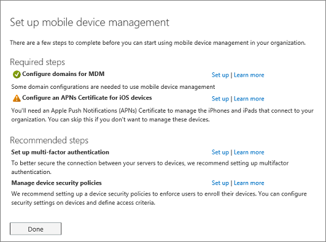
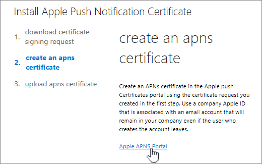

# Create an APNs Certificate for iOS devices

 To manage iOS devices like iPad and iPhones in Mobile Device Management for Office 365 you must create an APNs certificate. 
  
To do this, follow the steps from the **Set up** link on the portal page. (Go to **Security &amp; Compliance Center** \> **Security policies** \> **Device management** \> **Manage settings**.)
  

  
1. Next to **Configure a APNs Certificate for iOS devices**, select **Set up**.
    
2. Select **Download your CSR file** and save the Certificate signing request to a somewhere on your computer that you'll remember. 
    
    
  
3. Select **Next**.
    
4. Create an APN certificate.
    
  - Select **Apple APNS Portal** to open the Apple Push Certificates Portal. 
    
    
  
  - Sign in with an Apple ID.
    
    > [!IMPORTANT]
    > Use a company Apple ID associated with an email account that will remain with your organization even if the user who manages the account leaves. Save this ID because you'll need to use the same ID when it's time to renew the certificate. 
  
  - Select **Create a Certificate** and accept the **Terms of Use**.
    
  - **Browse** to the Certificate signing request you downloaded to your computer from Office 365 and select **Upload**.
    
  - **Download** the APN certificate created by the Apple Push Certificate Portal to your computer. 
    
    > [!TIP]
    > If you're having trouble downloading the certificate, refresh your browser. 
  
5. Go back to Office 365 and select **Next** to get to the **Upload APNS certificate** page. 
    
6. Browse to the APN certificate you downloaded from the Apple Push Certificates Portal.
    
    
  
7. Select **Finish**.
    
Go back to **Security &amp; Compliance Center** \> **Security policies** \> **Device management** \> **Manage settings** to complete setup. 
  

