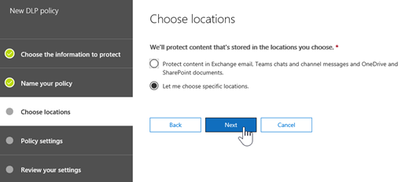
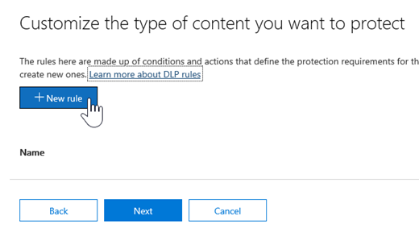

# Create custom sensitive information types with Exact Data Match (EDM) (Preview)

## Overview

With Office 365 for business, you can define [custom sensitive information types](custom-sensitive-info-types.md) that you can use to help prevent people from inadvertently or inappropriately sharing sensitive data within your organization. For example, you can [use the Security & Compliance Center](create-a-custom-sensitive-information-type.md) or [use PowerShell](create-a-custom-sensitive-information-type-in-scc-powershell.md) to define a custom sensitive information type based on patterns, evidence (evidence includes keywords like *employee*, *badge*, *ID*, and so on), character proximity (how close evidence is to characters in a particular pattern), and confidence levels. 

But what if you wanted to create a custom sensitive information type that is more dynamic, and more scalable? And what if you wanted a custom sensitive information type that uses specific data values, instead of patterns and proximity? With Exact Data Match (EDM) classification, you can! With EDM classification, you can create a custom sensitive information type that:
- is dynamic (refreshable weekly);
- results in fewer false-positives;
- is more scalable;
- handles sensitive information more securely; and
- can be used with several Microsoft cloud capabilities.

Now in preview, EDM classification enables you to create custom sensitive information types that refer to specific values in a secure database. The database can be refreshed weekly, and it can contain up to ten million rows of data. So as employees, patients, or clients come and go, and records change, your custom sensitive information types remain current and applicable. And, you can use EDM classification with policies, such as [data loss prevention policies](data-loss-prevention-policies.md) or [Microsoft Cloud App Security file policies](https://docs.microsoft.com/cloud-app-security/data-protection-policies).

> [!NOTE]
> **EDM classification features are currently in preview**. These features are currently supported for Exchange Online and Microsoft Cloud App Security. 

## Required licenses and permissions

- During the preview program, if your organization has [DLP](https://docs.microsoft.com/office365/servicedescriptions/exchange-online-protection-service-description/messaging-policy-and-compliance-servicedesc#data-loss-prevention-dlp), you can try EDM. 

- You must be a global admin, compliance administrator, or Exchange Online administrator to perform the tasks described in this article. To learn more about DLP permissions, see [Permissions](data-loss-prevention-policies.md#permissions).

## The work flow at a glance


|Phase  |What's needed  |
|---------|---------|
|[Part 1: Set up your sensitive information database and rule package for EDM](#part-1-set-up-your-sensitive-information-database-and-rule-package-for-edm)     |- Access to the sensitive information<br/>- Ability to save the data in .csv format<br/>- Ability to create a rule package in .xml format<br/>- Admin permissions to upload database schema information and a rule package to the Security & Compliance Center (using PowerShell)         |
|[Part 2: Install and use the EDM Upload Agent tool](#part-2-install-and-use-the-edm-upload-agent-tool)     |         |- Dedicated user account for the tool
|     |         |


## Part 1: Set up your sensitive information database and rule package for EDM

Setting up and configuring EDM involves first setting up a secure, refreshable database that contains the sensitive information you'll use for EDM classification, and then creating a rule package that will be used with an upload agent and with policies, such as data loss prevention (DLP) policies.

### Set up your secure database of sensitive information

1. Identify the sensitive information you want to use. Export the data to a tool, such as Excel, that can be saved as a .csv file).

2. Structure the sensitive data in the .csv file. Make sure the first row of the .csv file includes the names of the fields you'll use for EDM. For example, you might have field names, such as `id`, `firstname`, `lastname`, and so on. Keep the following limits in mind:

    - The data file can include up to ten million rows of sensitive data across all data sources.
    - The data file can include up to 32 fields per data source.
    - The data file can include up to five indexed columns per data source.
    - Data refresh for each data source can occur weekly (but not more often during preview).
    
    As an example, we our .csv file is called *SampleDataStore.csv*. It includes columns, such as *id*, *firstname*, *lastname*, *title*, and so on.

3. Set up a file in .xml format that represents the schema for your data file. Name this schema file `edm.xml`. As an example, the following .xml file defines the schema for our example *SampleDataStore* database.
    
    ```
    <?xml version="1.0" encoding="utf-8"?>
    <EdmSchema xmlns="http://schemas.microsoft.com/office/2018/edm">
      <DataStore name="SampleDataStore" description="Sample Datastore" version="1">
        <Field name="id" unique="true" searchable="true" />
        <Field name="firstname" unique="false" searchable="true" />
        <Field name="lastname" unique="false" searchable="false" />
        <Field name="title" unique="false" searchable="false" />
        <Field name="dob" unique="false" searchable="false" />
        <Field name="creditcard" unique="false" searchable="true" />
        <Field name="ssn" unique="false" searchable="true" />
      </DataStore>
    </EdmSchema>
    ```
    For each column in the database, indicate its field name, whether that column contains unique values (social security numbers are unique, but dates of birth are not), and whether that column should be searchable (a value of *true* indicates it should be searchable). Select up to five columns per database to be searchable. These are the columns that will be used with EDM classification.

4. [Connect to Office 365 Security & Compliance Center PowerShell](https://docs.microsoft.com/powershell/exchange/office-365-scc/connect-to-scc-powershell/connect-to-scc-powershell?view=exchange-ps).

5. To upload the database schema, run the following cmdlets, one at a time:

    `$edmSchemaXml=Get-Content .\edm.xml -Encoding Byte -ReadCount 0`

    `New-DlpEdmSchema -FileData $edmSchemaXml`

Now that your sensitive data file is set up, the next step is to set up a rule package for EDM.

### Set up a rule package for EDM

1. Create a rule package in .xml format (with Unicode encoding), similar to the following example. (You can copy and modify our code to suit your organization's needs.)

    ```
    <?xml version="1.0" encoding="utf-8"?>
    <RulePackage xmlns="http://schemas.microsoft.com/office/2018/edm">
      <RulePack id="fd098e03-1796-41a5-8ab6-198c93c62b11">
        <Version build="0" major="2" minor="0" revision="0" />
        <Publisher id="eb553734-8306-44b4-9ad5-c388ad970528" />
        <Details defaultLangCode="en-us">
          <LocalizedDetails langcode="en-us">
            <PublisherName>Microsoft EDM</PublisherName>
            <Name>Health care EDM Rulepack</Name>
            <Description> This rule package contains the EDM sensitive types for health care.</Description>
          </LocalizedDetails>
        </Details>
      </RulePack>
      <Rules>
        <ExactMatch id = "E1CC861E-3FE9-4A58-82DF-4BD259EAB371" patternsProximity = "300" dataStore ="SampleSchema" recommendedConfidence = "65" >
          <Pattern confidenceLevel="65">
            <idMatch matches="MRN" classification="MRN" />
            <match matches="LastName" />
          </Pattern>
        </ExactMatch>
        <ExactMatch id = "E1CC861E-3FE9-4A58-82DF-4BD259EAB372" patternsProximity = "300" dataStore ="SampleSchema" recommendedConfidence = "65" >
          <Pattern confidenceLevel="65">
            <idMatch matches="SSN" classification="U.S. Social Security Number (SSN)" />
          </Pattern>
        </ExactMatch>
        <LocalizedStrings>
          <Resource idRef="E1CC861E-3FE9-4A58-82DF-4BD259EAB371">
            <Name default="true" langcode="en-us">Patient MRN exact match</Name>
            <Description default="true" langcode="en-us">EDM Sensitive type for detecting Patient MRN.</Description>
          </Resource>
          <Resource idRef="E1CC861E-3FE9-4A58-82DF-4BD259EAB372">
            <Name default="true" langcode="en-us">Patient SSN Exact Match.</Name>
            <Description default="true" langcode="en-us">EDM Sensitive type for detecting Patient SSN.</Description>
          </Resource>
        </LocalizedStrings>
      </Rules>
    </RulePackage>
    ```
    
2. Upload the rule package by running the following PowerShell cmdlets, one at a time:

    `$rulepack=Get-Content .\rulepack.xml -Encoding Byte -ReadCount 0`

    `New-DlpSensitiveInformationTypeRulePackage -FileData $rulepack`

    To learn more about uploading rule packages, see [Upload your rule package](create-a-custom-sensitive-information-type-in-scc-powershell.md#upload-your-rule-package).


## Part 2: Install and use the EDM Upload Agent tool

During this phase, you set up a dedicated user account for Office 365, install the EDM Upload Agent tool, use the tool to index your sensitive data, and then upload the indexed data.

1. Set up a user account with limited permissions for the EDM Upload Agent. (See [Add users to Office 365](https://docs.microsoft.com/office365/admin/add-users/add-users?view=o365-worldwide).) The user account you create should have:

    - Read access to your data file (This is the .csv you created in [Part 1](#part-1-set-up-your-tabular-data-source-for-edm).)
    - Write access to the location you'll use for storing hashed data (this can be a folder on a local drive of the user's machine)

2. Download and install the EDM Upload Agent at [https://go.microsoft.com/fwlink/?linkid=2088639](https://go.microsoft.com/fwlink/?linkid=2088639). Make sure to note the installation location (such as `C:\`). 

3. To authorize the EDM Upload Agent, run the following command in Windows Command Prompt:

    `EdmUploadAgent.exe /Authorize`

4. When prompted, log in using the account credentials you created in step 1 of this procedure. 

5. To index your sensitive data, run the following command in Windows Command Prompt:

    `EdmUploadAgent.exe /CreateHash /DataStoreName <DataStoreName> /DataFile <DataFilePath> /HashLocation <HashedFileLocation>`

    Example: `EdmUploadAgent.exe /CreateHash /DataStoreName EmployeeDB /DataFile C:\Edm\Data\EmployeeData.csv /HashLocation C:\Edm\Hash` 

6. To upload the indexed data, run the following command in Windows Command Prompt:

    `EdmUploadAgent.exe /UploadHash /DataStoreName <DataStoreName> /HashFile <HashedSourceFilePath>`

    Example: `EdmUploadAgent.exe /UploadHash /DataStoreName EmployeeDB /HashFile C:\Edm\Hash\EmployeeData.EdmHash` 

7. To verify your sensitive data has been uploaded, run the following command in Windows Command Prompt:

    `EdmUploadAgent.exe /GetDataStore`

    You'll see a list of data stores and when they were last updated. Here's an example:

    

Now that you have set up your custom sensitive information type with EDM, you can use it with your Microsoft cloud services. 

## Part 3: Use EDM classification with your Microsoft cloud services (Example: DLP policy)

EDM can be used with information protection features, such as [Office 365 DLP policies](data-loss-prevention-policies.md) and [Microsoft Cloud App Security file policies](https://docs.microsoft.com/cloud-app-security/data-protection-policies). As an example, the following procedure describes how to use EDM with a DLP policy that is created in the Office 365 Security & Compliance Center.

### To create a new DLP policy with EDM

1. Go to the Security & Compliance Center ([https://protection.office.com](https://protection.office.com)).

2. Choose **Data loss prevention** > **Policy**.

3. Choose **Create a policy** > **Custom** > **Next**.

4. On the **Name your policy** tab, specify a name and description, and then choose **Next**.

5. On the **Choose locations** tab, select **Let me choose specific locations**, and then choose **Next**.<br/><br/>

6. In the **Status** column, select **Exchange email** only, and then choose **Next**. <br/><br/>

7. On the **Policy settings** tab, choose **Use advanced settings**, and then choose **Next**.<br/><br/>

8. Choose **+ New rule**.<br/><br/>

9. In the **Name** section, specify a name and description for the rule.<br/><br/>

10. In the **Conditions** section, in the **+ Add a condition** list, choose **Content contains sensitive type**.<br/><br/>

11. Search for the sensitive information type you created when you defined a rule package in [Part 4](#part-4-create-a-rule-package-with-exact-matching), and then choose **+ Add**.<br/><br/>Then choose **Done**.

12. Finish selecting options for your rule, such as **User notifications**, **User overrides**, **Incident reports**, and so on, and then choose **Save**.

13. On the **Policy settings** tab, review your rule(s), and then choose **Next**.

14. Specify whether to turn on the policy right away, test it out, or keep it turned off. Then choose **Next**.

15. On the **Review your settings** tab, review your policy. Make any needed changes. When you're ready, choose **Create**.

> [!TIP]
> Allow approximately one hour for your new DLP policy to work its way through your data center.

## Refreshing your sensitive information database

You can refresh your sensitive information database weekly. You can either refresh your .csv file manually, or use [Windows Task Scheduler](https://docs.microsoft.com/windows/desktop/TaskSchd/task-scheduler-start-page) to schedule a weekly refresh. The following procedure describes how to refresh the data manually.

1.  

## Related articles

[Built-in sensitive information types and what they look for](what-the-sensitive-information-types-look-for.md)

[Custom sensitive information types](custom-sensitive-info-types.md)

[Overview of data loss prevention policies](data-loss-prevention-policies.md)

[https://docs.microsoft.com/cloud-app-security](https://docs.microsoft.com/cloud-app-security)