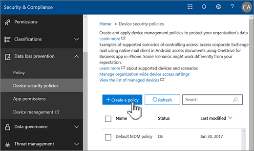
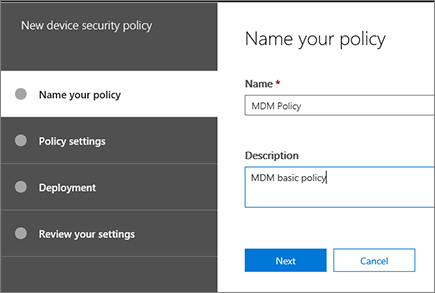
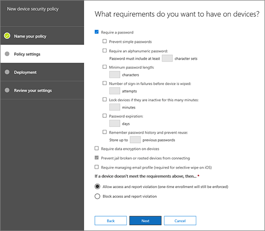
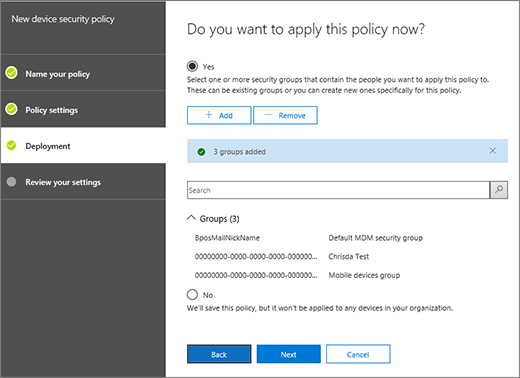
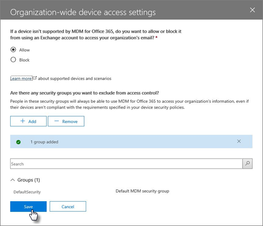

# Create and deploy device security policies

You can use Mobile Device Management for Office 365 to create security policies that help protect your organization's information on Office 365 from unauthorized access. You can apply policies to any mobile device in your organization where the user of the device has an applicable Office 365 license and has enrolled the device in MDM for Office 365.
  
## Before you begin

- Learn about the devices, mobile device apps, and security settings that MDM for Office 365 supports. See [Capabilities of Mobile Device Management for Office 365](capabilities-of-mobile-device-management.md).
    
- Create security groups that include Office 365 users that you want to deploy policies to and for users that you might want to exclude from being blocked access to Office 365. We recommend that before you deploy a new policy to your organization, you test the policy by deploying it to a small number of users. You can create and use a security group that includes just yourself or a small number Office 365 users that can test the policy for you. To learn more about security groups, see [Create, edit, or delete a security group](https://go.microsoft.com/fwlink/p/?LinkId=518555).
    
- **Important:** Before you can create a mobile device policy, you must activate and set up MDM for Office 365. See [Overview of Mobile Device Management for Office 365](overview-of-mdm.md).
    
- To create and deploy mobile device management policies in Office 365, you need to be an Office 365 global admin. See [Permissions in the Office 365 Security &amp; Compliance Center](https://support.office.com/article/d10608af-7934-490a-818e-e68f17d0e9c1).
    
- Before you deploy policies, let your organization know the potential impacts of enrolling a device in MDM for Office 365. Depending on how you set up the policies, noncompliant devices can be blocked from accessing Office 365 and data, including installed applications, photos, and personal information on an enrolled device, can be deleted.
    
> [!NOTE]
> Policies and access rules created in MDM for Office 365 will override Exchange ActiveSync mobile device mailbox policies and device access rules created in the Exchange admin center. After a device is enrolled in MDM for Office 365, any Exchange ActiveSync mobile device mailbox policy or device access rule applied to the device will be ignored. To learn more about Exchange ActiveSync, see [Exchange ActiveSync in Exchange Online](https://go.microsoft.com/fwlink/p/?LinkId=524380). 
  
## Step 1: Create a security policy and deploy to a test group

Before you can start, make sure you have activated and set up MDM for Office 365. See [Overview of Mobile Device Management for Office 365](overview-of-mdm.md) for instructions. 
  
1. In Office 365, in the Security &amp; Compliance Center, go to **Data loss prevention** \> **Device security policies**.
    
    > [!NOTE]
    > The **Device security policies** will appear in the menu only after you have activated Mobile device management. 
  
2. Choose **+ Create a policy**.
    
    
  
3. Specify a **Name** and **Description** for the new policy, and then choose **Next**.
    
    
  
4. On the **What requirements do you want to have on devices?** page, specify the requirements you want applied to mobile devices in your organization, and then choose **Next**.
    
    
  
5. On the **What do you want to configure?** page, specify any additional requirements you want applied to mobile devices in your organization, and then choose **Next**.
    
6. On the **Do you want to apply this policy now?** page, choose **Yes**, and then choose **+ Add**. 
    
    
  
7. Select the group(s) who will test the policy before you deploy it to your organization, and then choose **Add**.
    
8. Choose **Next**.
    
9. Review and confirm the details of the new device policy, and then choose **Create this policy**.
    
    
  
10. Click **Close**.
    
Each user that the policy applies to will have the policy pushed to their device the next time they sign in to Office 365 using their mobile device. If users haven't had a policy applied to their mobile device before, then after you deploy the policy, they'll get a notification on their device that includes the [steps to enroll and activate MDM for Office 365](https://go.microsoft.com/fwlink/?LinkId=615272). Until they complete enrollment, access to email, OneDrive, and other services will be restricted. After they complete enrollment using the Intune Company Portal app, they'll be able to use the services and the policy will be applied to their device.
  
## Step 2: Verify your policy works

After you've created a security policy, you should check that the policy works as you expect before you deploy it to your organization.
  
1. In Office 365, go to **Security &amp; Compliance Center** \> **Data loss prevention** \> **Device management**.
    
2. On the **Mobile Device Management for Office 365** page, Check the status of user devices that have the policy applied. You can filter or sort by **All** to view all devices, or **Blocked** to view blocked devices. 
    
    
  
3. You can also do a full or selective wipe on the device. For instructions, see [Wipe a mobile device in Office 365](wipe-a-mobile-device.md).
    
## Step 3: Deploy a policy to your organization

After you've created a mobile device policy and verified that it works as expected, deploy it to your organization.
  
1. In Office 365, go to **Security &amp; Compliance Center** \> **Data loss prevention**\> **Device security policies**.
    
2. Select the policy you want to deploy, and choose **Edit policy** in the \<  _policy name_\> panel.
    
3. Select the **Deployment** tab. 
    
4. In the **Deployment** tab, choose **Yes** above **Select one or more security groups that contain the people you want to apply this policy to** and then **Add**.
    
  - On the **Select Group** panel, you can search for a group to add, you can filter either by alias or by display name. You can also add an existing group from the **Groups** list. 
    
    You can add multiple groups to apply the policy to.
    
    Choose **Add** on the bottom of the panel. 
    
5. Choose **Save** on the **Deployment** tab. 
    
    
  
Each user that the policy applies to will have the policy pushed to their device the next time they sign in to Office 365 from their mobile device. If users haven't had a policy applied to their mobile device, they'll [get a notification on their device](https://go.microsoft.com/fwlink/?LinkId=615272) with steps to enroll and activate it for MDM for Office 365. After they've completed the enrollment, the policy will be applied to their device. 
  
## Step 4: Block email access for unsupported devices

To help secure your organization's information, you should block app access to Office 365 email for mobile devices that are not supported by MDM for Office 365. See [Supported devices](capabilities-of-mobile-device-management.md#BKMK_SupportedDevices) for a list of devices that are supported. To do this: 
  
1. Go to Security &amp; Compliance Center\> **Data loss prevention**\> **Device security policies**.
    
2. Select **Manage organization-wide device access settings**.
    
    
  
3. To block unsupported devices, choose **Block** under **If a device isn't supported by MDM for Office 365, do you want to allow or block it from using an Exchange account to access your organization's email** \> **Save**.
    
    
  
## Step 5: Choose security groups to be excluded from conditional access checks

If you want to exclude some people from conditional access checks on their mobile devices and you've created one or more security groups for those people, add the security groups here. The people in these groups will not have any policies enforced for their supported mobile devices.
  
1. Go to Security &amp; Compliance Center\> **Data loss prevention**\> **Device security policies**.
    
2. Select **Manage organization-wide device access settings**.
    
    
  
3. Select **Add** to add the security group that has users that you'd like to exclude from being blocked access to Office 365. When a user has been added to this list, they'll be able to access Office 365 email when using an unsupported device. 
    
4. Select the security group you want to use in the **Select group** panel. 
    
5. Select the name, and then **Add** \> **Save**.
    
6. On the **Organization-wide device access settings** panel, choose **Save**.
    
    
  
## What is the impact of security policies on different device types?

When you apply a policy to user devices, the impact on each device varies somewhat between different device types. See the following table for examples of the impact of policies on different devices.
  

|**Security Policy**|**Windows Phone 8.1+**|**Android 4+**|**Samsung Knox**|**IOS 6+**|**Notes**|
|:-----|:-----|:-----|:-----|:-----|:-----|
|Require encrypted backup    |✖    |✖    |✔    |✔    |IOS encrypted backup required.    |
|Block cloud backup    |✖    |✔    |✔    |✔    |Block Google backup on Android (grayed out), cloud backup on iOS.    |
|Block document synchronization    |✖    |✖    |✖    |✔    |iOS: Block documents in the cloud.    |
|Block photo synchronization    |✖    |✖    |✖    |✔    |iOS (native): Block Photo Stream.    |
|Block screen capture    |✔    |X    |✔    |✔    |Blocked when attempted.    |
|Block video conference    |✖    |✖    |✖    |✔    |FaceTime blocked on iOS, not Skype or others.    |
|Block sending diagnostic data    |✖    |X    |✔    |✔    |Block sending Google crash report on Android.    |
|Block access to app store    |✔    |X    |✔    |✔    |App store icon missing on Android home page, disabled on Windows, missing on iOS.    |
|Require password for app store    |✖    |✖    |✖    |✔    |iOS: Password required for iTunes purchases.    |
|Block connection to removable storage    |✔    |X    |✔    |NA    |Android: SD card will be grayed out in settings, Windows notifies user, apps installed there are not available    |
|Block Bluetooth connection    |✔    |\*\*\*    |\*\*\*    |✖    |\*\*\*We can't disable BlueTooth as a setting on Android. Instead, we disable all the transactions that require BlueTooth: Advanced Audio Distribution, Audio/Video Remote Control, hands-free devices, headset, Phone Book Access, and Serial Port. A small toast message appears at the bottom of the page when any of these are used.    |
   
## What happens when you delete a policy or remove a user from the policy?

When you delete a policy or remove a user from a group to which the policy was deployed to, the policy settings, Office 365 email profile and cached emails may be removed from the user's device. See the following table to see what is removed for the different device types:
  
|**What's removed**|**Windows Phone 8.1+**|**iOS 6+**|**Android 4+ (including Samsung Knox)**|
|:-----|:-----|:-----|:-----|
|Managed email profiles\*    |✖    |✔    |✖    |
|Policy settings    |✔              Except for **Block sending diagnostic data from device.**   |✔    |✖    |
   
> [!NOTE]
> \*If the policy was deployed with the option **Email profile is managed** selected, then the managed email profile and cached emails in that profile will be deleted from the user's device. 
  
Each user that the removed policy applied to will have the policy removed from their device the next time their mobile device checks in with MDM for Office 365 . If you deploy a new policy that applies to these users' devices, they'll be prompted to re-enroll in MDM for Office 365.
  
You can also [wipe a device](wipe-a-mobile-device.md), either completely, or selectively wipe organizational information from the device.
  
## Related Topics

[Overview of Mobile Device Management for Office 365](overview-of-mdm.md)
  
[Capabilities of Mobile Device Management for Office 365](capabilities-of-mobile-device-management.md)
  

