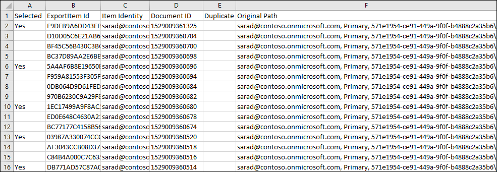
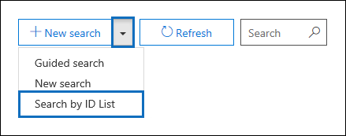
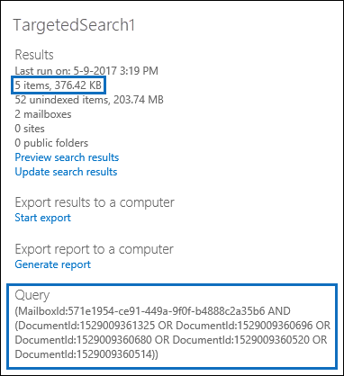

# Prepare a CSV file for an ID list Content Search in Office 365

You can search for specific mailbox email messages and other mailbox items using a list of Exchange IDs. To create an ID list search (formally called a targeted search), you submit a comma separated value (CSV) file that identifies the specific mailbox items to search for. For this CSV file you use the **Results.csv** file or the **Unindexed Items.csv** file that are included when you export the Content Search results or export a Content Search report from and existing Content Search. Then you edit one of these files to indicate the specific items to search for, and then create a new ID list search and submit the CSV file. 
  
Here's a quick overview of the process for creating an ID list search.
  
1. Create and run a new or guided Content Search in the Security &amp; Compliance Center.
    
2. Export the content search results or export the content search report. For more information, see:
    
    - [Export Content Search results from the Office 365 Security &amp; Compliance Center](export-search-results.md)
    
    - [Export a Content Search report](export-a-content-search-report.md)
    
3. Edit the **Results.csv** file or the **Unindexed Items.csv** and identify the specific mailbox items that you want to include in the ID list search. See the [instructions](#prepare-the-csv-file-for-an-id-list-search) for preparing a CSV file for an ID list search. 
    
4. Create a new ID list search (see the [instructions](#create-an-id-list-search)) and submit the CSV file that you prepared. The search query that's created will only search for the items selected in the CSV file.
    
> [!NOTE]
> ID list searches are only supported for mailbox items. You can't search for SharePoint and OneDrive documents in an ID list search. 
  
 **Why create an ID list search?** If you're unable to determine if an item is responsive to an eDiscovery request based on the metadata in the **Results.csv** or **Unindexed Items.csv** files, you can use an ID list search to find, preview, and then export that item to determine if it's responsive to the case you're investigating. ID list searches are typically used to search for and return a specific set of unindexed items. 
  
## Prepare the CSV file for an ID list search

After you export the search results or report for a content search, you can perform the following steps to prepare the CSV file for an ID list search. This CSV file will identify every item in the ID list search.
  
Note that you can use a CSV file from a search that included SharePoint sites and OneDrive accounts, but you can select  *only*  mailbox items for an ID list search. If you select a document in SharePoint or OneDrive, the CSV file will fail validation when you create an ID list search. 
  
1. Open the **Results.csv** or **Unindexed Items.csv** file in Excel. 
    
2. Insert a new column and name it **Selected**. It doesn't matter where you insert the column. For convenience, consider inserting it to the left of the first column.
    
3. In the **Selected** column, type **Yes** in the cell that corresponds to the item that you want to search for. Repeat this step for every item that you want to search for. 
    
    > [!IMPORTANT]
    > When you open the CSV file in Excel, the data format for the **Document ID** column is changed to **General**. This results in displaying the document ID for an item in scientific notation. For example, the document ID of "481037338205" is displayed as "4.81037E+11" You have to perform the next steps to change the data format of the **Document ID** column to **Number** to restore the correct format for the document ID. If you don't do this, the ID list search that uses the CSV file will fail. 
  
4. Right-click the entire **Document ID** column and select **Format Cells**.
    
5. In the **Category** box, click **Number**.
    
6. Change the number of decimal places to **0**, and then click **OK** to save your changes. Notice that the values in the Document ID column are changed to numbers. 
    
    Here's an example of the a CSV file that's ready to be submitted for a ID list content search.
    
    
  
7. Save the CSV file or use **Save As** to the save the file with different file name. In both cases, be sure to save the file with the CSV format. 
  
## Create an ID list search

The next step is to create a new ID list Content Search and submit the CSV file that you prepared in the previous step.
  
> [!IMPORTANT]
> You should create an ID list search no more than 2 days after exporting the results or report from a Content Search. If the search results or report where exported more than 2 days ago, you should re-export the search results or report to generate updated CSV files. Then you can prepare one of the updated CSV files and use it to create an ID list search. 
  
1. In the Security &amp; Compliance Center, go to **Search &amp; investigation** \> **Content search**.
    
2. On the **Search** page, click the arrow next to  **New search**, and then click **Search by ID List**.
    
    
  
3. On the **Search by ID List** flyout, name the search (and optionally describe it) and then click **Browse** and select the CSV file that you prepared in the previous step. 
    
    Office 365 attempts to validate the CSV file. If the validation is unsuccessful, an error message is displayed that might help you troubleshoot the validation errors. The CSV file has to be successfully validated to create an ID list search.
    
4. After the CSV file is successfully validated, click **Search** to create the ID list search. 
    
    Here's an example of the estimated search results and the query that's generated for an ID list search.
    
    
  
    Note that the number of estimated items displayed in statistics for the ID search should match the number of items that you selected in the CSV file.
    
5. Preview or export the items returned by the ID list search.
    
> [!NOTE]
> If you move a mailbox after creating an ID list search, the query for the search won't return the specified items. That's because the **DocumentId** property for mailbox items are changed when a mailbox is moved. In the rare instance when a mailbox is moved after you create an ID list search, you should create a new content search (or update the search results for the existing content search) and then export the search results or report to generate updated CSV files that can be used to create a new ID list search. 
