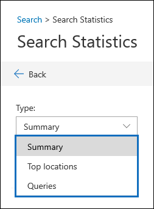

# Search statistics

An effective way to validate your search results when investigation a data incident is to view the statistics about your search results to make sure they align with your expectations. When a search as finished running, the following high-level statistics are displayed under **Status** on the search details flyout page:

- The estimated number and size of items that matched the search criteria.

- The number and size of partially indexed items (also called *unindexed items*) that aren't searchable but that were found in the content locations that were included in the search.

- The number of mailboxes and sites that were searched.

To view more detailed statistics, click **Statistics** on the search details flyout page. On the **Search statistics** page, you can view the search summary, the top location that contained items that matched the search results, and detailed statistics about the search query.

## Summary

In the **Summary** view, you can see the search results broken down by location type (for example, locations include Exchange mailboxes and SharePoint sites). The following information is displayed for each location type:

- The number of locations that had items that matched the search criteria.

- The total number of items from each location type that matched the search criteria.

- The total size of items from each location type that matched the search criteria.

## Top locations

In the **Top locations** view, you see the individual content locations with the most items that matched the search criteria. For each content location, the following information is displayed:

- The name of the location; the email address for mailboxes and the URL for SharePoint sites

- The location type

- Number of items that matched the search criteria

- The total size of all items that matched the search criteria.

## Queries

In the **Queries** view, you can see detailed statistics for each component of the search query. If you used the keyword list in the search query, you can view enhanced statistics in the **Queries** view  that show how many items match each keyword or keyword phrase. This can help you quickly identify which parts of the query are the most (and least) effective. 

The following information is displayed in the **Queries** view:

 - **Location type** - The type of content location for the statistics displayed in the row.

- **Part** - This column will display one of the following values: **Primary** or **Keyword**. **Primary** means the row presents statistics on the entire query; **Keyword** means the statistics in the row are for one of the query components.

- **Condition** - The actual query component of the search query the row refers to. If the value in the **Part** column is **Primary**, then the statistics for the entire search query are displayed; if the value is **Keyword**, then the statistics for the component of the query shown in the **Query** column are displayed. For example, if the keyword list was used, then the statistics one of the keywords are displayed.

  Here are some other things to know about the statistics displayed in the **Queries** column:
  
  - When you search for all content in mailboxes (by not specifying any keywords), the actual query is **(size >= 0)** so that all items are returned
  
  - When you search SharePoint and OneDrive sites, the two following components are added to the search query:
    
    **NOT IsExternalContent:1** - This excludes any content from an on-premises SharePoint organization
    
    **NOT isOneNotePage:1** - This excludes all OneNote files because these would be duplicates of any document that matches the search query.

- **Locations in search** The number of content locations that had items that matched the search query for the part/condition displayed in the row. Note that archive mailboxes are counted as a separate location if they contain items that match the search criteria.

- **Items** - The total number of items that matched the search criteria for the part/condition displayed in the row.

- **Size** - The total number of items that matched the search criteria for the part/condition displayed in the row.