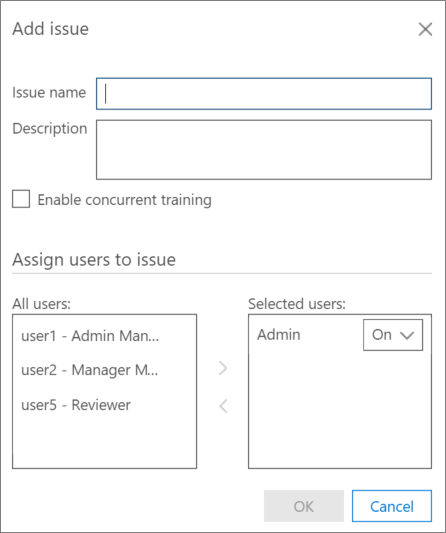

# Define issues and assign users in Office 365 Advanced eDiscovery

> [!NOTE]
> Advanced eDiscovery requires an Office 365 E3 with the Advanced Compliance add-on or an E5 subscription for your organization. If you don't have that plan and want to try Advanced eDiscovery, you can [sign up for a trial of Office 365 Enterprise E5](https://go.microsoft.com/fwlink/p/?LinkID=698279). 
  
In Advanced eDiscovery, one or more issues can be defined within a case. Defining issues allows further categorization of topics. When connecting to a new case, a single default issue is provided. You can edit the default issue name and assign users to the issue. 
  
## Adding or editing an issue and assigning users

1. In the **Relevance \> Relevance setup** tab \> select **Issues**.
    
    
  
2. To add an issue, click the ** + ** icon. The **Add issue** dialog is displayed. 
    
    
  
    To edit an issue, click the **Edit** icon. 
    
3. In **Issue name**, type a name that is descriptive and significant to the case. 
    
4. In **Description**, type information about the issue.
    
5. Select the **Enable concurrent training** check box to enable the option. This setting enables multiple reviewers to work on the same issue simultaneously (in separate samples). 
    
6. In **Assign users to issue**, in the **All users** list, select a user to be assigned to the issue and then click the right-facing arrow to add the user to the **Selected users** list. Repeat as necessary. In the window shown above, "Admin" is shown as a selected user. 
    
    > [!NOTE]
    > User assignment to issues can be modified before or after a Relevance training cycle. 
  
7. In **Selected users**, from the drop-down list next to the name of the selected user, select one of the following Sampling modes: 
    
  - **On**: The files can be viewed and tagged. This is the default setting.
    
  - **Idle**: The files can be viewed; tagged is optional.
    
  - **Off**: The files cannot be viewed or tagged.
    
8. When done adding issues, click **OK**.
    
## Deleting issues

Issues may be deleted (meaning, removed from the database) only immediately after they were defined and no actual work has been done for that issue. 
  
1. In the **Relevance \> Relevance setup** tab, select **Issues**.
    
2. Select the issue to delete from the database, and then click **Delete**.
    
3. A confirmation message is displayed. Click **Yes** to confirm. 
    
4. Click **OK**.
    
## See also

[Office 365 Advanced eDiscovery](office-365-advanced-ediscovery.md)
  
[Setting up loads to add imported files](set-up-loads-to-add-imported-files.md)
  
[Defining highlighted keywords and advanced options](define-highlighted-keywords-and-advanced-options.md)

