# Deploy a connector to archive Facebook data in Office 365

## Prerequisites

1.  You need to have a Facebook account for your company pages. (This sample connector currently only allows importing data on your company’s Facebook business pages and not individual Facebook profiles.

2.  You should have a valid Azure Subscription
    
    1.  If you don’t have an existing Azure Subscription, you can either get
        
        1.  Free subscription (valid for 1 year) [here](https://azure.microsoft.com/en-us/free/)
        
        2.  Pay as you go subscription [here](https://azure.microsoft.com/en-us/pricing/purchase-options/pay-as-you-go/)

## Set up

1.  Make sure the user who is setting up connector has Mailbox Import Export role.

> For more information see the "Add a role in a role group" or the "Create a role group" sections in [Manage role groups](https://docs.microsoft.com/en-us/exchange/manage-role-groups-exchange-2013-help)

2.  Ensure that you have accepted the consent by following the steps in the below link. Tenant admin has to click below link and log in with their credential.
    
    1.  [https://login.microsoftonline.com/common/oauth2/authorize?client\_id=570d0bec-d001-4c4e-985e-3ab17fdc3073\&response\_type=code\&redirect\_uri=https://portal.azure.com/\&nonce=1234\&prompt=admin\_consent](https://login.microsoftonline.com/common/oauth2/authorize?client_id=570d0bec-d001-4c4e-985e-3ab17fdc3073&response_type=code&redirect_uri=https://portal.azure.com/&nonce=1234&prompt=admin_consent)

3.  Ensure that you have an active Azure subscription as mentioned in Prerequisites point \#2

4.  Create AAD app using [Azure portal](https://portal.azure.com). Follow the below steps or refer [Create AAD App](#step-2-create-an-app-in-azure-active-directory) with screen shots
    
    2.  Azure Active Directory -\> App Registrations -\> New Application Registration Name of App : - i.e. FacebookConnector or any preferable name

> Application type : - Web app / API
> 
> Sign on URL : - [https://portal.azure.com](https://portal.azure.com)

3.  Register App and note **AAD APP ID **

4.  Go to app -\> Settings -\> Keys -\> Fill Passwords details -\> Save keys -\> Copy **Password** value and save it to your secret location. This will be used when configuring the Connector.

<!-- end list -->

5.  Create storage account using [Azure portal](https://portal.azure.com). Follow the below steps or refer [Storage account creation](#step-3-create-an-azure-storage-account) with screen shots
    
    5.  Create a new Storage Account (Create a resource -\> Storage -\> Storage Account) -\> Fill details -\> Review & Create -\>It will take some time)
    
    6.  Go to Storage account created above -\> Copy primary **connection string** and save it to a secret location. This will be used during deployment.

6.  Create a Facebook developer App
    
    7.  Refer screenshot [Facebook App Registration](#step-5-register-the-facebook-app) or follow documentation on [Facebook developer portal](https://developers.facebook.com/docs/pages/getting-started/).

## Finalize

1.  Download the builds of connector code and unzip it. It would have a single file
    
      - SampleConnector.zip

2.  Deploy the web app in Azure
    
      - Follow the steps in [Step 4: Create a new web app resource in Azure](#step-4-create-a-new-web-app-resource-in-azure).
    
      - Note your App Service URL required for Facebook App creation and Connector setup in SCC

3.  Configure Login and Webhook products on Facebook developer portal
    
      - LoginUrl
        
          - \<App Service URL\>
    
      - RedirectUrl in Settings of Login product should be
        
          - \<App Service URL\>/Views/FacebookOAuth
    
      - SubscriptionUrl while setting up Webhooks product should be
        
          - \<App Service URL\>/api/FbPageWebhook

4.  Go to Security & Compliance Center <https://protection.office.com> and then go to Data Governance \> Import. Follow the steps in [Step 7: Set up a custom connector in the Security & Compliance Center](#step-7-set-up-a-custom-connector-in-the-security--compliance-center).

## Step 1: Download the package

Download the prebuilt package from repository’s Release section at <https://github.com/Microsoft/m365-sample-connector-csharp-aspnet/releases>. Under the latest release, download the zip file named **SampleConnector.zip**. You will upload this zip file to Azure in Step 4.

## Step 2: Create an app in Azure Active Directory

1. Go to <https://portal.azure.com> and sign in using the credentials of an Office 365 global admin account.

    

2. In the left navigation pane, click **Azure Active Directory**.

    

3. In the left navigation pane, click **App registrations (Preview)** and then click **New registration**.

    

4. Register the application. Under Redirect URI, select Web in the application type dropdown list and then type <https://portal.azure.com> in the box for the URI.

   

5. Copy the **Application (client) ID** and **Directory (tenant) ID** and save them to a text file or other safe location. You’ll use these IDs in later steps.

   

6. Go to **Certificates & secrets for the new app.**

   

7. Click **New client secret**

   

8. Create a new secret. In the description box, type **APISecretKey** and then choose an expiration period.

    

9. Copy the value of the APISecretKey secret and save it to a text file or other storage location. You’ll use this secret in later steps.

   

10. Go to **Manifest** and copy the identifierUris (which is also called the app id uri) as highlighted in the following screenshot. Copy the app id url to a text file or other storage location. You’ll use it in a later step.

   

## Step 3: Create an Azure storage account

1. Go to the Azure home page for your organization.

    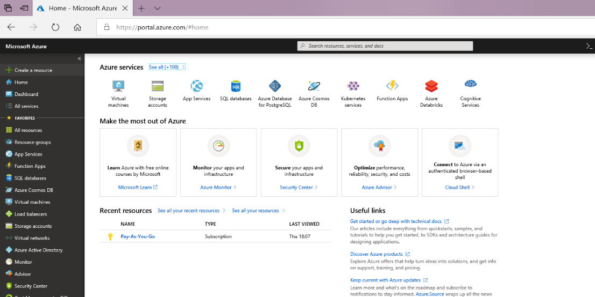

2. Click **Create a resource** and they type **storage account** in the search box.

    

3. Click **Storage**, and then click **Storage account**.

    

4. On the **Create storage account** page, in the Subscription box, select **Pay-As-You-Go** or **Free Trial** depending on which type of Azure subscription you have. Then select or create a resource group.

    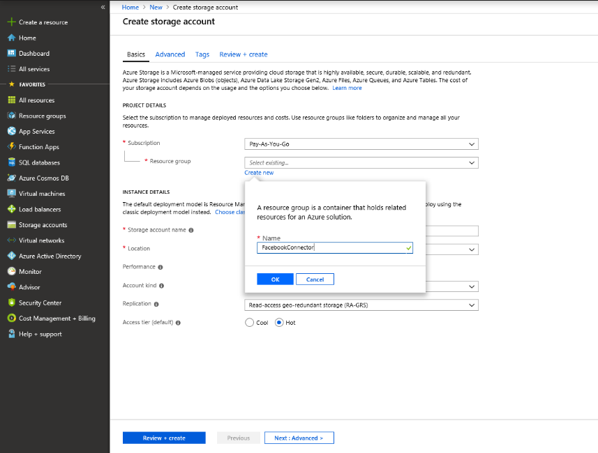

5. Type a name for the storage account.

    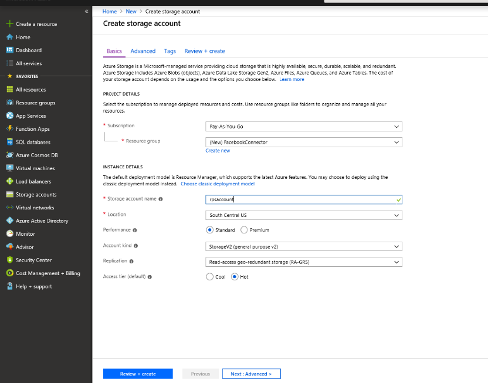

6. Review and then click **Create** to create the storage account.

    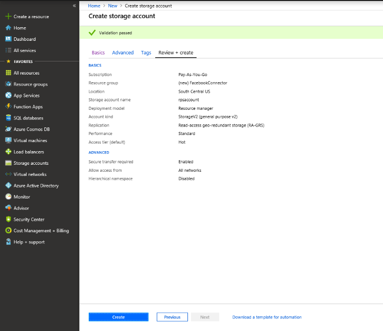

7. After a few moments, click **Refresh** and then click **Go to resource** to navigate to the storage account.

    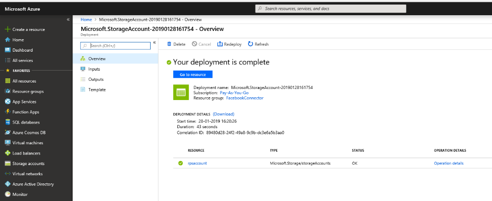

8. Click **Access keys** in the left navigation pane.

    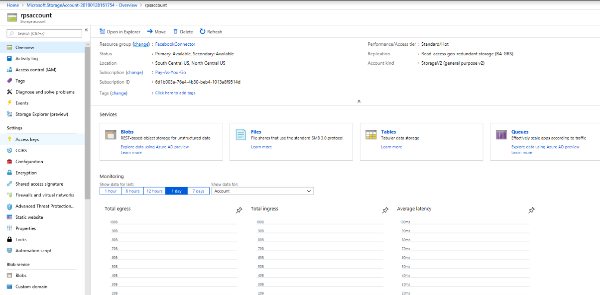

9. Copy a **Connection string** and save it to a text file or other storage location. You’ll use this when creating a web app resource.

    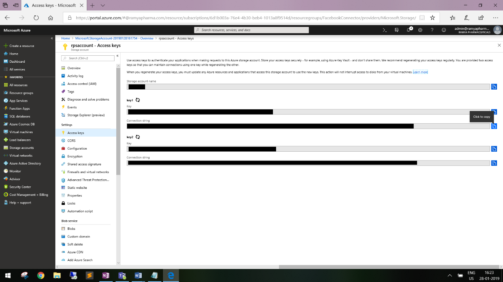

## Step 4: Create a new web app resource in Azure

1. On the **Home** page in the Azure portal, click **Create a resource \> Everything \> Web app**. On the **Web app** page, click **Create**. 

   

2. Fill in the details (as shown below) and then create the Web app. Note that the name that you enter in the **App name** box will be used to create the Azure app service URL; for example fbconnector.azurewebsites.net.

   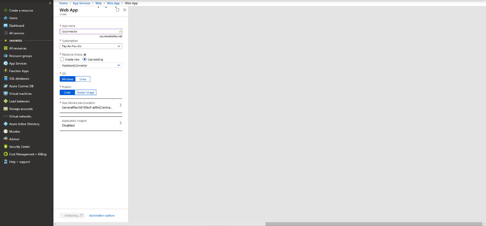

3. Go to the newly created web app resource, click **Application Settings** in the left navigation pane. Under Applicaiton settings, click Add new setting and add the following three settings. Use the values (that you copied to the text file from the previous steps): 

    - **APISecretKey** – The is the client secret value that you copied after creating the APISecretKey secret in Step 2.

    - **StorageAccountConnectionString** – The connection string Uri that you copied after creating the Azure storage account in Step 3.

    - **tenantId** – The tenant ID of your Office 365 organization that you copied after creating the Facebook connector app in Azure Active Directory in Step 2.

Additionally, copy the value in the App insights instrumentation key setting (APPINSIGHTS_INSTRUMENTATIONKEY) to a text file or other storage location.

    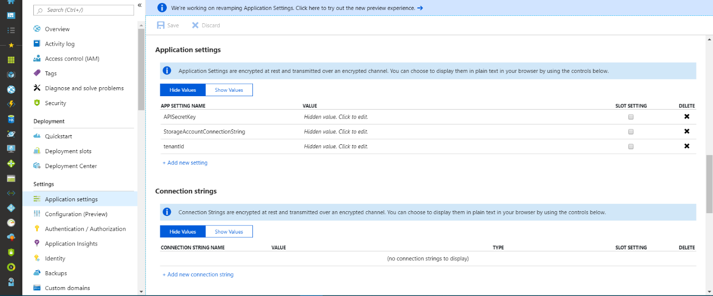

4. Under **General settings**, click **On** next to the **Always On**. Click **Save** at the top of the page to save applicaton settings.

   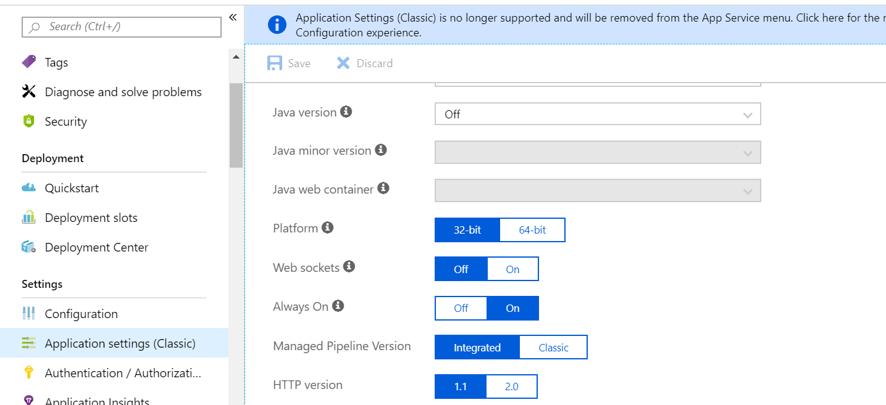

5. The final step is to upload the connector app source code to Azure that you downloaded in Step 1. In a web browser, go to https://<AzureAppResourceName>.scm.azurewebsites.net/ZipDeployUi. For example, if the name of your Azure app resource (which you named in step 2 in this section) is **fbconnector**, then you would go to https://fbconnector.scm.azurewebsites.net/ZipDeployUi. 

6. Drag and drop the SampleConnector.zip (that you downloaded in Step 1) to this page. After the files are uploaded and the deployment is successful, the page will look similar to the following screenshot.

   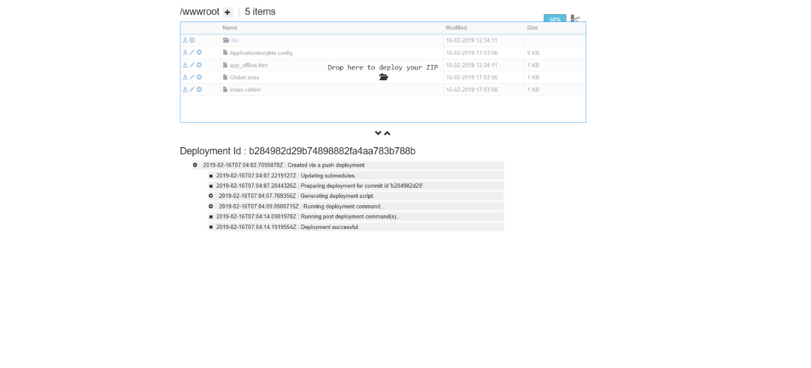

## Step 5: Register the Facebook app

1. Go to <https://developers.facebook.com> , log in using the credentials for the account for your organization’s Facebook Business pages, and then click **Add New App**.

   

2. Create a new app ID.

   

3. In the left navigation pane, click **Add Products** and then click **Set Up** in the **Facebook Login** tile.

   

4. On the Integrate Facebook Login page, click **Web**.

   

5. Add the Azure app service URL; for example https://fbconnector.azurewebsites.net.

   

6. Complete the QuickStart section of the Facebook Login setup.

   

7. In the left navigation pane under **Facebook Login**, click **Settings**, and add the OAuth redirect URI in the **Valid OAuth Redirect URIs** box; use the format **\<connectorserviceuri>/Views/FacebookOAuth,** where the value for connectorserviceuri is the Azure app service URL for your organization; for example https://fbconnector.azurewebsites.net.

   

8. In the left navigation pane, click **Add Products** and then click **Webhooks.** In the **Page** pull-down menu, click **Page**. 

   

9. Add Webhooks Callback URL and add a verify token. The verify token should similar to a strong password. Copy the verify token to a text file or other storage location.

     

10. Test and subscribe to the endpoint for feed.

    

11. Add a privacy URL, app icon, and business use. Also, copy the app ID and app secret to a text file or other storage location.

    

12. Make the app public.

    

13. Add user to the admin or tester role.

    

14. Add the **Page Public Content Access** permission.

    

15. Add Manage Pages permission.

    

16. Get the application reviewed by Facebook.

    

## Step 6: Configure the connector app

1. Go to https://<AzureAppResourceName>.azurewebsites.net (when AzureAppResourceName is the name of your Azure app resource that you named in Step 4) For example, if the name is **fbconnector**, go to https://fbconnector.azurewebsites.net. The home page of the app will look like the following sceenshot.

  

2. Click **Configure**, type your tenant Id and the APISecretKey (that you copied after creating the app in Azure Active Directory in Step 2), and then click **Set Configuration Settings**.

   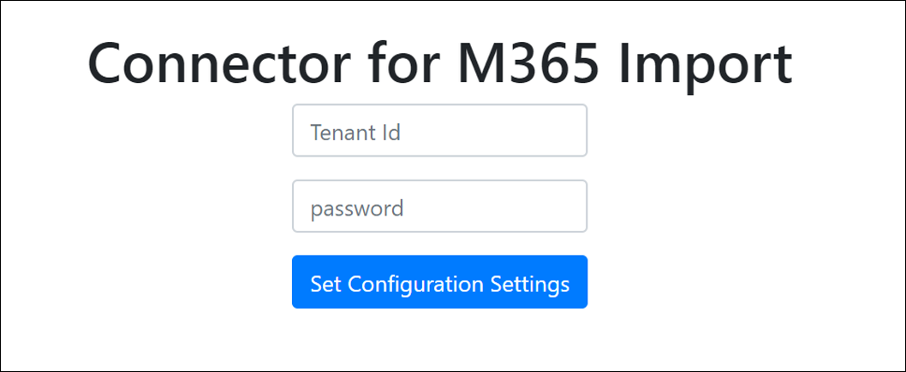

3. Enter the following configuration setting under **Configuration Details**:

   - **Facebook application ID** - 
   - **Facebook application secret** - 
   - **Facebook webhooks verify token** - 
   - **AAD application ID** - 
   - **AAD application secret** - 
   - **AAD application Uri** - 
   - **App insights instrumentation key** - 

    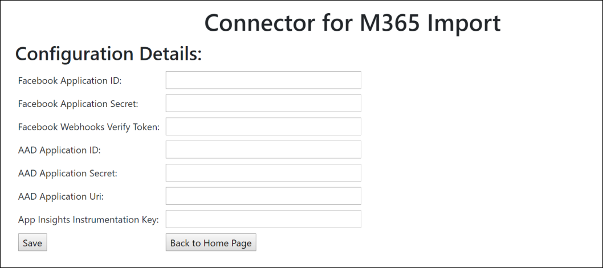

4. Click **Save** to save the connector settings.

## Step 7: Set up a custom connector in the Security & Compliance Center

1. Go to <https://protection.office.com> and then click **Data governance \> Import \> Archive third-party data**.

   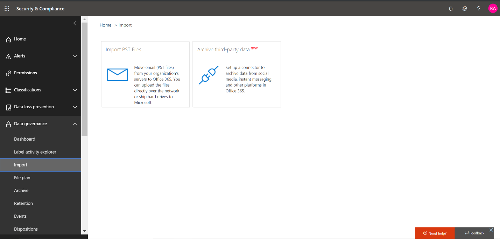

2.  Click **Add a connector** and then click **Custom**.

    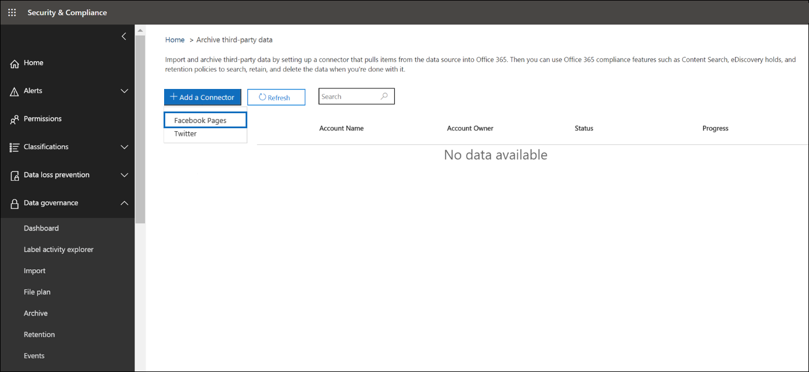

3.  Provide Connector App details and click Next

    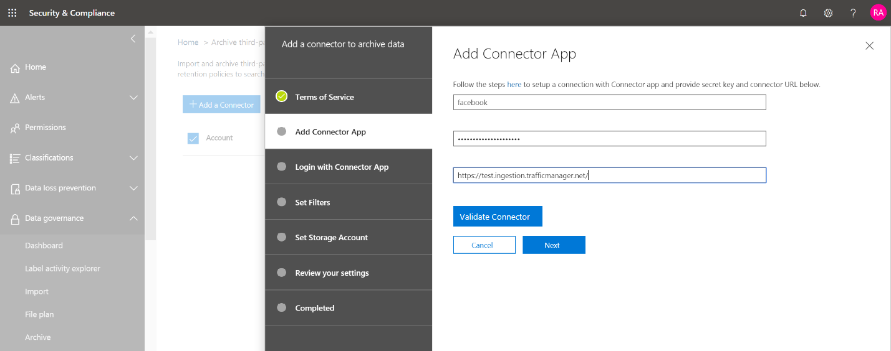

    Fill the name as Facebook

    Provide API secret key and Azure app service URL that you created (and saved to the text file) in Step 4.

4.  Click **Login with Connector App**.

    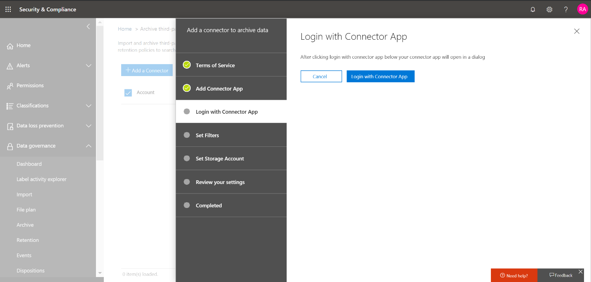

5. Provide secret and click login to connector service

   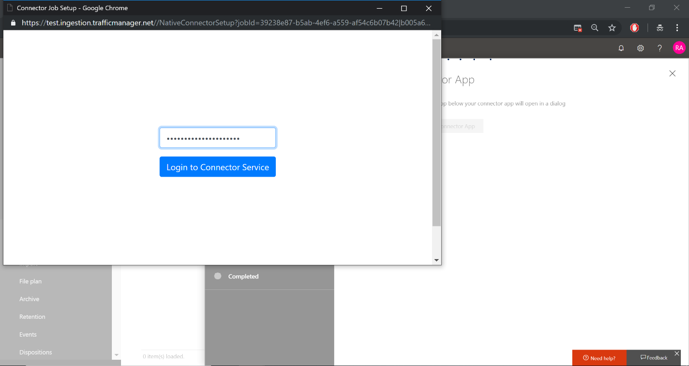

Secret key is same as the one entered in step above

6. Click **Continue with Facebook.**

   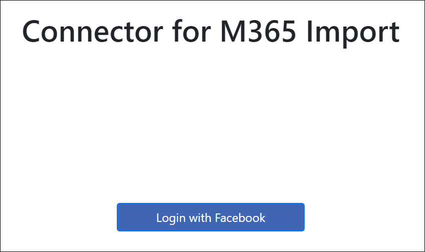

7. On the **Log in to Facebook** page, log in using the credentials for the account for your organization’s Facebook Business pages. Make sure the Facebook account you logged in to is assigned the admin role for your organization’s Business pages

   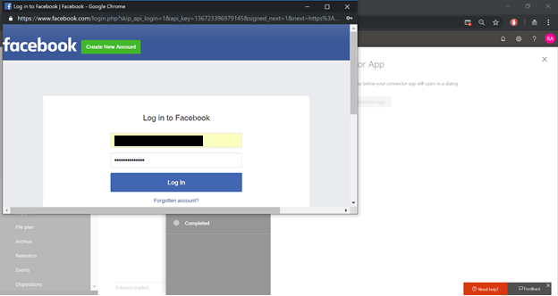

8. Click **Select Pages** to choose your organization’s business pages that you want to archive in Office 365.

   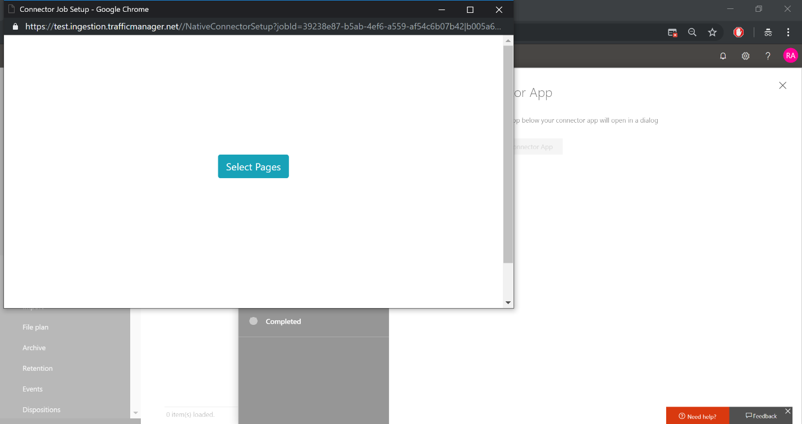

9. A list of Business pages managed by the Facebook account that your logged in to is displayed. Select the pages to archive and then click **Save**.

    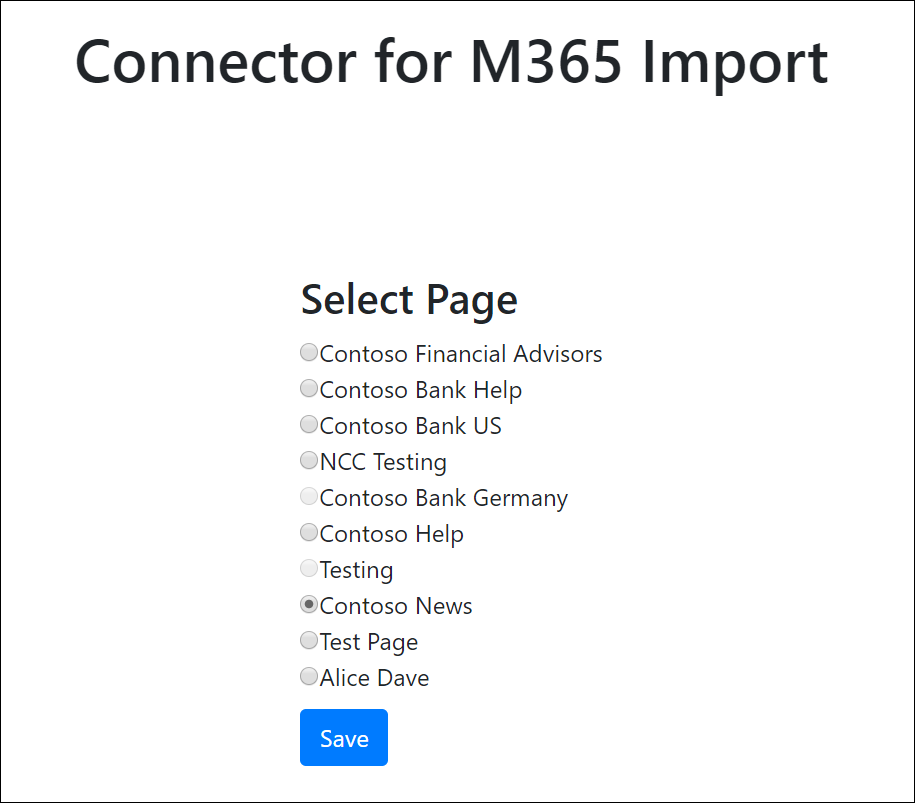

10. Click **Finish** to exit the setup of the connector service app.

    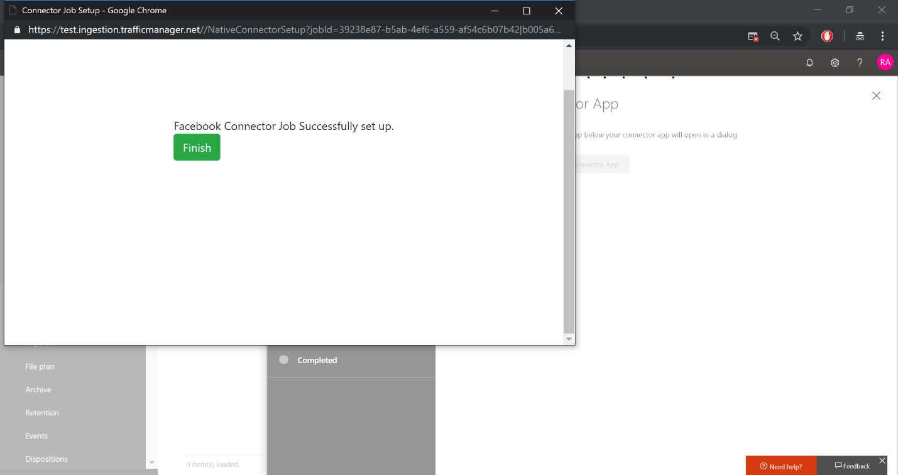

11. You can apply a filter to only import items (and archive) that are a certain age. 

    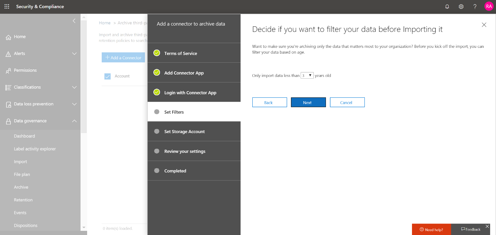

12. Specify the mailbox in Office 365 to import (and archive) the items from the Facebook Business pages that you previously selected.

    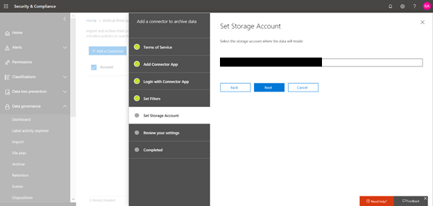

13. Review settings and then click **Finish** to complete the connector setup.

    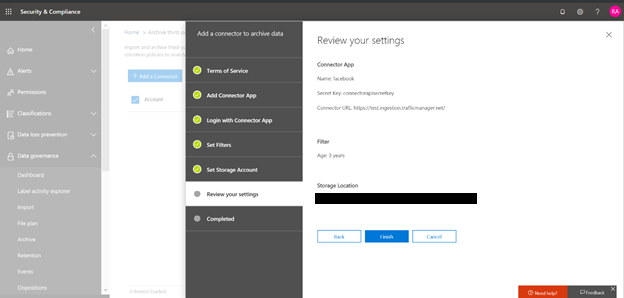

14. Go to the **Archive third-party data** page to see the progress of the import process.

    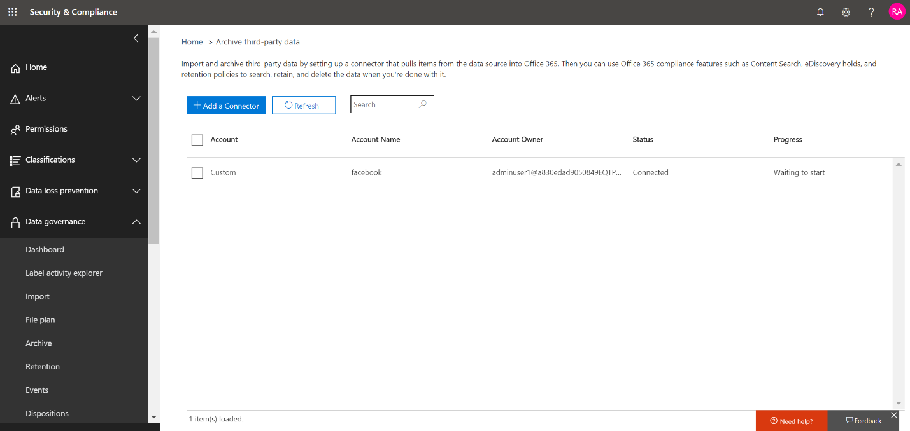
