# Deploy a connector to archive Twitter data in Office 365

This article contains the step-by-step process to deploy a connector that uses the Office 365 Import service to import data from your organization's Twitter account to Office 365. For a high-level overview of this process and a list of prerequisites required to deploy a Twitter connector, see [Use a sample connector to archive Twitter data in Office 365 (Preview)](archive-twitter-data-with-sample-connector.md). 

# Prerequisites

1.  You need to have a Twitter account. (This sample connector currently allow importing data on your company’s Official Twitter handles

2.  You should have a valid Azure Subscription
    
    1.  If you don’t have an existing Azure Subscription, you can either get
        
        1.  Free subscription (valid for 1 year) [here](https://azure.microsoft.com/en-us/free/)
        
        2.  Pay as you go subscription [here](https://azure.microsoft.com/en-us/pricing/purchase-options/pay-as-you-go/)

# Set up

1.  Make sure the user who is setting up connector has Mailbox Import Export role.

> For more information see the "Add a role in a role group" or the "Create a role group" sections in [Manage role groups](https://docs.microsoft.com/en-us/exchange/manage-role-groups-exchange-2013-help)

2.  Ensure that you have accepted the consent by following the steps in the below link. Tenant admin has to click below link and log in with their credential.
    
    1.  [https://login.microsoftonline.com/common/oauth2/authorize?client\_id=570d0bec-d001-4c4e-985e-3ab17fdc3073\&response\_type=code\&redirect\_uri=https://portal.azure.com/\&nonce=1234\&prompt=admin\_consent](https://login.microsoftonline.com/common/oauth2/authorize?client_id=570d0bec-d001-4c4e-985e-3ab17fdc3073&response_type=code&redirect_uri=https://portal.azure.com/&nonce=1234&prompt=admin_consent)

3.  Ensure that you have an active Azure subscription as mentioned in Prerequisites point \#2

4.  Create AAD app using [Azure portal](https://portal.azure.com). Follow the below steps or refer [Create AAD App](#step-2-create-aad-app) with screen shots
    
    2.  Azure Active Directory -\> App Registrations -\> New Application Registration Name of App : - i.e. TwitterConnector or any preferable name

> Application type : - Web app / API
> 
> Sign on URL : - [https://portal.azure.com](https://portal.azure.com)

3.  Register App and note **AAD APP ID **

4.  Go to app -\> Settings -\> Keys -\> Fill Passwords details -\> Save keys -\> Copy **Password** value and save it to your secret location. This will be used when configuring the Connector.

<!-- end list -->

5.  Create storage account using [Azure portal](https://portal.azure.com). Follow the below steps or refer [Storage account creation](#step-3-storage-account-creation) with screen shots
    
    5.  Create a new Storage Account (Create a resource -\> Storage -\> Storage Account) -\> Fill details -\> Review & Create -\>It will take some time)
    
    6.  Go to Storage account created above -\> Copy primary **connection string** and save it to a secret location. This will be used during deployment.

6.  Create a Twitter developer App
    
    7.  Refer screenshot [Twitter App Registration](#step-5-twitter-app-registration) or follow documentation on [Twitter developer portal](https://developers.facebook.com/docs/pages/getting-started/).

# Finalize

1.  Download the builds of connector code and unzip it. It would have a single file
    
      - SampleConnector.zip

2.  Deploy the web app in Azure
    
      - Follow the step as mentioned in [App Service creation](#step-4-app-service-creation)
    
      - Note your App Service URL required for Twitter App creation and Connector setup in SCC

3.  Configure Login and Webhook products on Twitter developer portal
    
      - RedirectUrl in Settings of Login product should be
        
          - \<App Service URL\>/Views/TwitterOAuth

4.  Go to SCC portal <https://protection.office.com>

5.  Go to Data Governance \> Import. and follow the onscreen steps. [\[Refer Screenshots here\]](#step-7-connector-setup-in-scc)

## Step 1: Download the package

Download the prebuilt package from the Release section in the GitHub repository at <TBD>. Under the latest release, download the zip file named **SampleConnector.zip**. You will upload this zip file to Azure in Step 4.

## Step 2: Create an app in Azure Active Directory

1. Go to <https://portal.azure.com> and sign in using the credentials of an Office 365 global admin account.

   

2. In the left navigation pane, click **Azure Active Directory**.

   

3. In the left navigation pane, click **App registrations (Preview)** and then click **New registration**.

   

4. Register the application. Under Redirect URI, select Web in the application type dropdown list and then type <https://portal.azure.com> in the box for the URI.

   

5. Copy the **Application (client) ID** and **Directory (tenant) ID** and save them to a text file or other safe location. You’ll use these IDs in later steps.

    

6. Go to **Certificates & secrets for the new app.**

   

7. Click **New client secret**

   

8. Create a new secret. In the description box, type the secret and then choose an expiration period. 

   

9. Copy the value of the secret and save it to a text file or other storage location. This is the AAD application secret that you will use in later steps.

   

10. Go to **Manifest** and copy the identifierUris (which is also called the AAD application Uri) as highlighted in the following screenshot. Copy the AAD application Uri to a text file or other storage location. You’ll use it in Step 6.

   

## Step 3: Create an Azure storage account

1.  Go to the Azure home page for your organization.

   

2. Click **Create a resource** and they type **storage account** in the search box.

   

3. Click **Storage**, and then click **Storage account**.

   

4. On the **Create storage account** page, in the Subscription box, select **Pay-As-You-Go** or **Free Trial** depending on which type of Azure subscription you have. 

   

5. Select or create a resource group.

   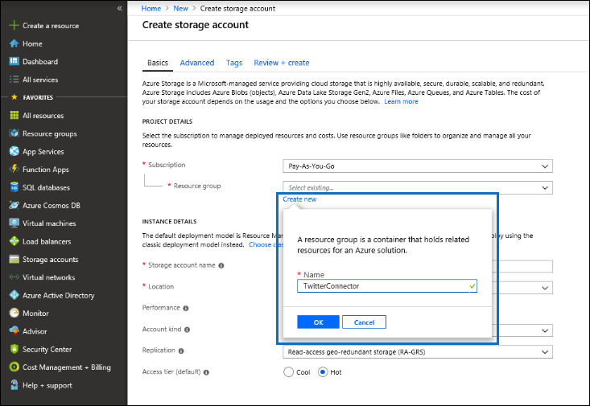

6. Type a name for the storage account.

   

7. Review and then click **Create** to create the storage account.

   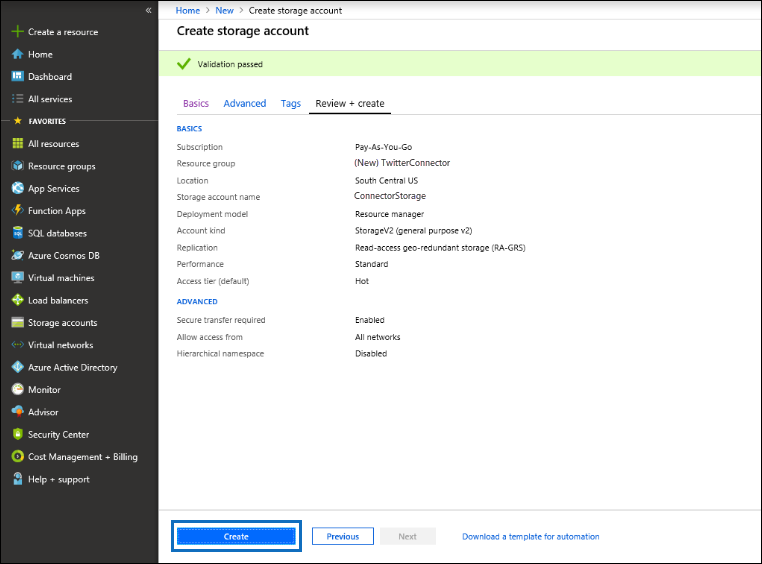

8. After a few moments, click **Refresh** and then click **Go to resource** to navigate to the storage account.

   

9. Click **Access keys** in the left navigation pane.

   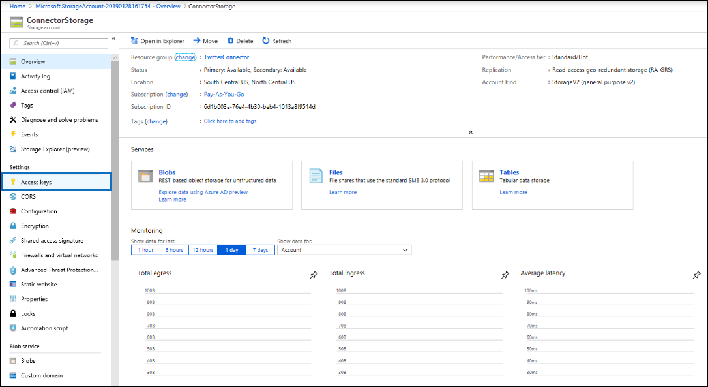

10. Copy a **Connection string** and save it to a text file or other storage location. You’ll use this when creating a web app resource in Step 4.

    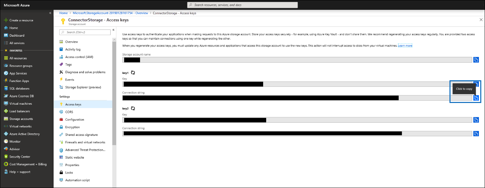

## Step 4: Create a new web app resource in Azure

1. On the **Home** page in the Azure portal, click **Create a resource \> Everything \> Web app**. On the **Web app** page, click **Create**.

   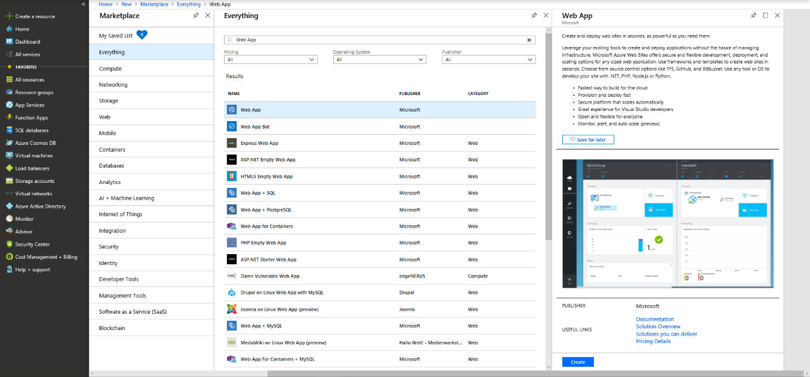

2. Fill in the details (as shown below) and then create the Web app. Note that the name that you enter in the **App name** box will be used to create the Azure app service URL; for example twitterconnector.azurewebsites.net.

   

3. Go to the newly created web app resource, click **Application Settings** in the left navigation pane. Under Application settings, click Add new setting and add the following three settings. Use the values (that you copied to the text file from the previous steps): 

    - **APISecretKey** – You can type any value as the secret. This will be used to access the connector web app in Step 7.

    - **StorageAccountConnectionString** – The connection string Uri that you copied after creating the Azure storage account in Step 3.

    - **tenantId** – The tenant ID of your Office 365 organization that you copied after creating the Facebook connector app in Azure Active Directory in Step 2.

    

4. Under **General settings**, click **On** next to the **Always On**. Click **Save** at the top of the page to save the application settings.

   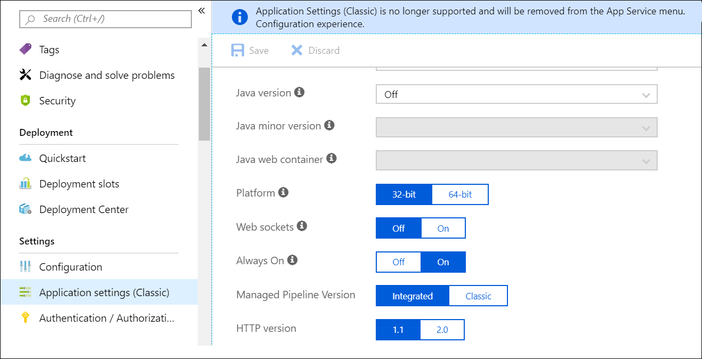

5. The final step is to upload the connector app source code to Azure that you downloaded in Step 1. In a web browser, go to https://<AzureAppResourceName>.scm.azurewebsites.net/ZipDeployUi. For example, if the name of your Azure app resource (which you named in step 2 in this section) is **fbconnector**, then you would go to https://fbconnector.scm.azurewebsites.net/ZipDeployUi.

6. Drag and drop the SampleConnector.zip (that you downloaded in Step 1) to this page. After the files are uploaded and the deployment is successful, the page will look similar to the following screenshot.

   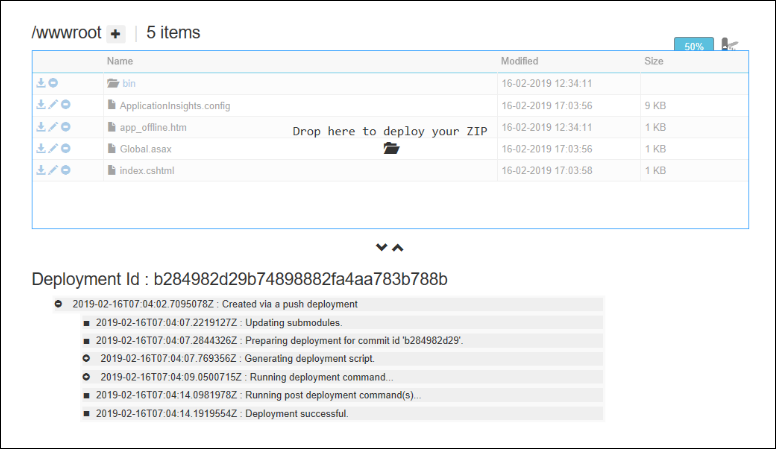

## Step 5: Create the Twitter app

1. Go to https://developer.twitter.com, log in using the credentials for the developer account for your organization, and then click **Create an app**.

2.  Add a new application.

   

3. Under **App details**, add information about the application.

   

4. On the Twitter developer dashboard, click **Details** for the app you just created.
   

5. On the **Keys and tokens** tab, under **Access token & access token secret**, click **Create** to generate Access Token

   

6. On the **Permissions** tab, configure the permissions as shown in the following screenshot. 

   

7. Add OAuth redirect URI \<connectorserviceuri/Views/TwitterOAuth\>

   

8. Select Edit Details. Update Callback Url in Callback URLs Section and Save

   

9. 
Your Developer App is now ready to use

## Step 6: Configure the connector web app

1. Go to https://\<AzureAppResourceName>.azurewebsites.net (where AzureAppResourceName is the name of your Azure app resource that you named in Step 4) For example, if the name is **twitterconnector**, go to https://twitterconnector.azurewebsites.net. The home page of the app will look like the following screenshot.

      

2. Click **Configure** to display a sign in page.

       

3. In the Tenant Id box, type or paste your tenant Id (that you obtained in Step 2). In the password box, type or paste the APISecretKey (that you obtained in Step 2), and then click **Set Configuration Settings** to display the **Configuration Details** page.

      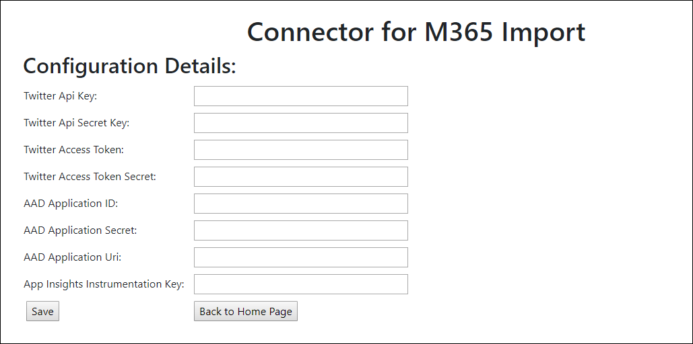

4. Under **Configuration Details**, enter the following configuration settings 

   - **Twitter application ID** - The app ID for the Twitter application that you obtained in Step 5.
   - **Twitter application secret** - The app secret for the Twitter application that you obtained in Step 5.
   - **Twitter client token** - The verify token that you created in Step 5.
   - **Twitter client token secret** - The application ID for the Azure Active Directory app that you created in Step 2
   - **AAD application ID** - The application ID for the Azure Active Directory app that you created in Step 2
   - **AAD application secret** - The value for the APISecretKey secret that you created in Step 4.
   - **AAD application Uri** - The AAD application Uri obtained in Step 2; for example, https://microsoft.onmicrosoft.com/2688yu6n-12q3-23we-e3ee-121111123213.
   - **App insights instrumentation key** - Leave this box blank.

5. Click **Save** to save the connector settings.

## Step 7: Set up a custom connector in the security and compliance center

1.  Go to Data Governance \> Import and click Archive third-party data

   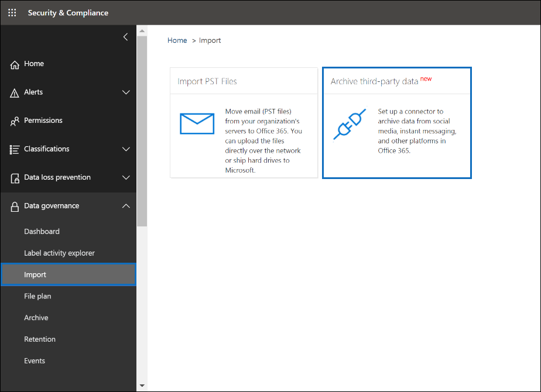
T
33. Click Add connector button and select custom

   

34. Provide Connector App details and click Next

   

Fill the name as Twitter

Provide API secret key and connector URL as created in Finalize step 4

35. Click Login with Connector App

   

36. Provide secret and click login to connector service

   

Secret key is same as the one entered in step above

37. *Login with Twitter*

>    

38. Twitter login dialog will open. Provide username, password and log in with Twitter.

   

39. Complete Job Setup

   

40. Apply filters. You can select the duration of data to bring in

   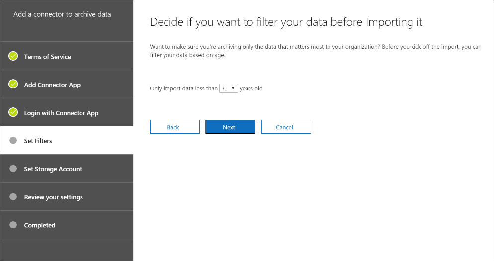

41. Specify user/mailbox to store Twitter data

   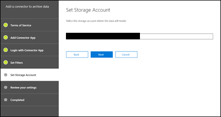

42. Review settings and finish connector setup

   

   

43. You can see the progress of import in the dashboard

   
