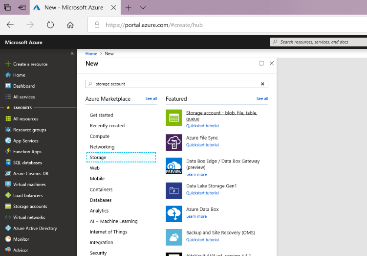
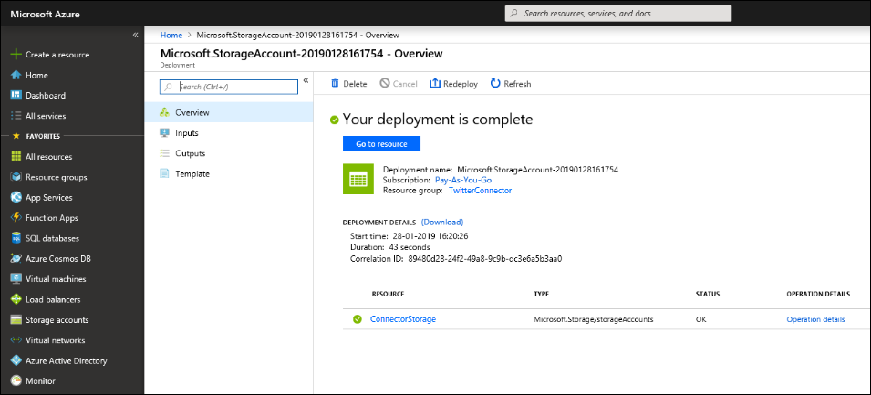
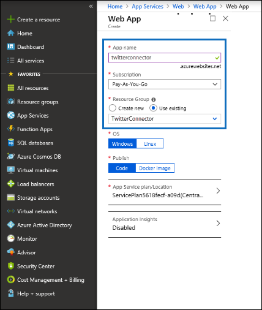
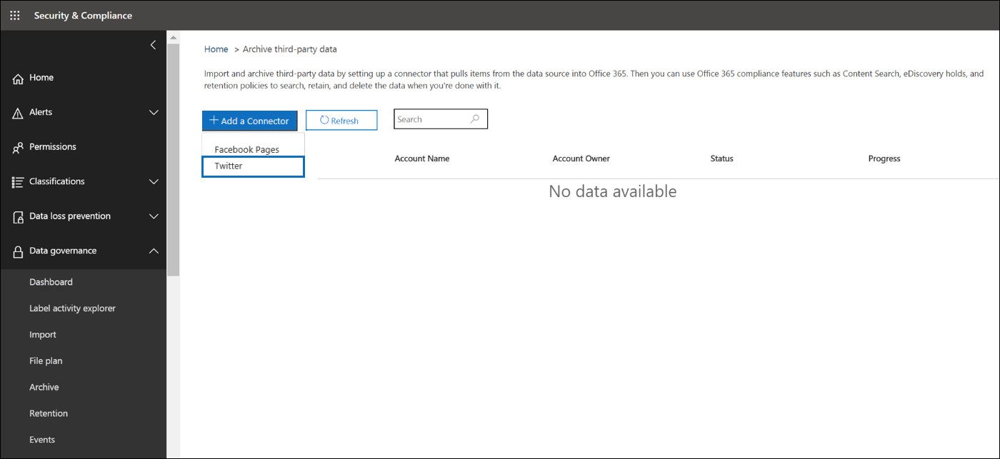
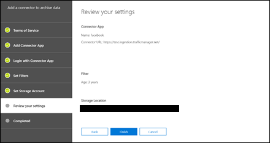

# Deploy a connector to archive Twitter data in Office 365

This article contains the step-by-step process to deploy a connector that uses the Office 365 Import service to import data from your organization's Twitter account to Office 365. For a high-level overview of this process and a list of prerequisites required to deploy a Twitter connector, see [Use a sample connector to archive Twitter data in Office 365 (Preview)](archive-twitter-data-with-sample-connector.md). 

## Step 1: Download the package

Download the prebuilt package from the Release section in the GitHub repository at [https://github.com/microsoft/m365-sample-twitter-connector-csharp-aspnet/releases](https://github.com/microsoft/m365-sample-twitter-connector-csharp-aspnet/releases). Under the latest release, download the zip file named **SampleConnector.zip**. You will upload this zip file to Azure in Step 4.

## Step 2: Create an app in Azure Active Directory

1. Go to <https://portal.azure.com> and sign in using the credentials of an Office 365 global admin account.

   

2. In the left navigation pane, click **Azure Active Directory**.

   

3. In the left navigation pane, click **App registrations (Preview)** and then click **New registration**.

   

4. Register the application. Under **Redirect URI (optional)**, select Web in the application type dropdown list and then type <https://portal.azure.com> in the box for the URI.

   

5. Copy the **Application (client) ID** and **Directory (tenant) ID** and save them to a text file or other safe location. You’ll use these IDs in later steps.

    

6. Go to **Certificates & secrets for the new app** and under **Client secrets** click **New client secret**.

   

7. Create a new secret. In the description box, type the secret and then choose an expiration period. 

   

8. Copy the value of the secret and save it to a text file or other storage location. This is the AAD application secret that you will use in later steps.

   

9. Go to **Manifest** and copy the identifierUris (which is also called the AAD application Uri) as highlighted in the following screenshot. Copy the AAD application Uri to a text file or other storage location. You’ll use it in Step 6.

    

## Step 3: Create an Azure storage account

1.  Go to the Azure home page for your organization.

    

2. Click **Create a resource** and they type **storage account** in the search box.

   

3. Click **Storage**, and then click **Storage account**.

   

4. On the **Create storage account** page, in the Subscription box, select **Pay-As-You-Go** or **Free Trial** depending on which type of Azure subscription you have. 

   

5. Select or create a resource group.

   

6. Type a name for the storage account.

   

7. Review and then click **Create** to create the storage account.

   

8. After a few moments, click **Refresh** and then click **Go to resource** to navigate to the storage account.

   

9. Click **Access keys** in the left navigation pane.

   

10. Copy a **Connection string** and save it to a text file or other storage location. You’ll use this when creating a web app resource in Step 4.

    

## Step 4: Create a new web app resource in Azure

1. On the **Home** page in the Azure portal, click **Create a resource \> Everything \> Web app**. On the **Web app** page, click **Create**.

   

2. Fill in the details (as shown below) and then create the Web app. Note that the name that you enter in the **App name** box will be used to create the Azure app service URL; for example twitterconnector.azurewebsites.net.

   

3. Go to the newly created web app resource, click **Application Settings** in the left navigation pane. Under **Application settings**, click **Add new setting** and add the following three settings. Use the values (that you copied to the text file from the previous steps): 

    - **APISecretKey** – You can type any value as the secret. This will be used to access the connector web app in Step 7.

    - **StorageAccountConnectionString** – The connection string Uri that you copied after creating the Azure storage account in Step 3.

    - **tenantId** – The tenant ID of your Office 365 organization that you copied after creating the Twitter connector app in Azure Active Directory in Step 2.

    

4. Under **General settings**, click **On** next to the **Always On**. Click **Save** at the top of the page to save the application settings.

   

5. The final step is to upload the connector app source code to Azure that you downloaded in Step 1. In a web browser, go to https://<AzureAppResourceName>.scm.azurewebsites.net/ZipDeployUi. For example, if the name of your Azure app resource (which you named in step 2 in this section) is **twitterconnector**, then you would go to https://twitterconnector.scm.azurewebsites.net/ZipDeployUi.

6. Drag and drop the SampleConnector.zip (that you downloaded in Step 1) to this page. After the files are uploaded and the deployment is successful, the page will look similar to the following screenshot.

   

## Step 5: Create the Twitter app

1. Go to https://developer.twitter.com, log in using the credentials for the developer account for your organization, and then click **Apps**.

   
2. Click **Create an app**.
   
   

3. Under **App details**, add information about the application.

   

4. On the Twitter developer dashboard, select the app that you just created and copy the App ID that's displayed  and save it to a text file or other storage location. Then click **Details**.
   
   

5. On the **Keys and tokens** tab, under **Consumer API keys** copy the API secret key and save it to a text file or other storage location. Then click **Create** to generate an access token and an access token secret, and copy these to a text file or other storage location.
   
   

   Then click **Create** to generate an access token and an access token secret, and copy these to a text file or other storage location.

6. Click the **Permissions** tab and configure the permissions as shown in the following screenshot:

   

7. After you save the permission settings, click the **App details** tab, and then click **Edit > Edit details**.

   

8. Do the following tasks:

   - Select the checkbox to allow the connector app to sign in to Twitter.
   
   - Add the OAuth redirect Uri using the following format: **\<connectorserviceuri>/Views/TwitterOAuth**, where the value of *connectorserviceuri* is the Azure app service URL for your organization; for example https://twitterconnector.azurewebsites.net/Views/TwitterOAuth.

   

The Twitter developer app is now ready to use.

## Step 6: Configure the connector web app 

1. Go to https://\<AzureAppResourceName>.azurewebsites.net (where **AzureAppResourceName** is the name of your Azure app resource that you named in Step 4) For example, if the name is **twitterconnector**, go to https://twitterconnector.azurewebsites.net. The home page of the app will look like the following screenshot.

   

2. Click **Configure** to display a sign in page.

   

3. In the Tenant Id box, type or paste your tenant Id (that you obtained in Step 2). In the password box, type or paste the APISecretKey (that you obtained in Step 2), and then click **Set Configuration Settings** to display the **Configuration Details** page.

   

4. Under **Configuration Details**, enter the following configuration settings 

   - **Twitter Api Key** - The app ID for the Twitter application that you created in Step 5.
   - **Twitter Api Secret Key** - The API secret key for the Twitter application that you created in Step 5.
   - **Twitter Access Token** - The access token that you created in Step 5.
   - **Twitter Access Token Secret** - The access token secret that you created in Step 5.
   - **AAD Application ID** - The application ID for the Azure Active Directory app that you created in Step 2
   - **AAD Application Secret** - The value for the APISecretKey secret that you created in Step 4.
   - **AAD Application Uri** - The AAD application Uri obtained in Step 2; for example, https://microsoft.onmicrosoft.com/2688yu6n-12q3-23we-e3ee-121111123213.
   - **App Insights Instrumentation Key** - Leave this box blank.

5. Click **Save** to save the connector settings.

## Step 7: Set up a custom connector in the security and compliance center

1.  Go to <https://protection.office.com> and then click **Data governance \> Import \> Archive third-party data**.

    

2. Click **Add a connector** and then click **Twitter**.

   

3. On the **Add Connector App** page, enter the following information and then click **Validate connector**.

    - In the first box, type a name for the connector, such as **Twitter**.
    - In the second box, type or paste the value of the APISecretKey that you added in Step 4.
    - In the third box, type or paste the Azure app service URL; for example **https://twitterconnector.azurewebsites.net**.

   After the connector is successfully validated, click **Next**.

   

4. Click **Login with Connector App**.

   

5. Type or paste the APISecretKey again and then click  **Login to Connector Service**.

   

6. Click **Continue with Twitter**.

7. On the Twitter sign in page, sign in using the credentials for the account for your organization’s Twitter account.

   

   After you sign in, the Twitter page will display the following message, "Twitter Connector Job Successfully set up."

8. Click **Finish** to complete setting up the Twitter connector.

9. On the **Set Filters** page, you can apply a filter to import (and archive) items that are a certain age. Click **Next**.

   

10. On the **Set Storage Account** page, select the Office 365 mailbox that the Twitter items will be imported to.

    

11. Review your settings and then click **Finish** to complete the connector setup in the Security & Compliance Center.

    

    

12. Go to the **Archive third-party data** page to see the progress of the import process.

    
