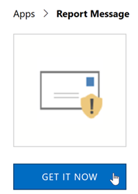
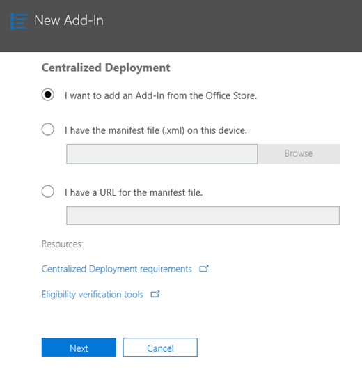
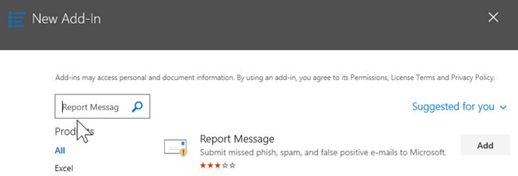
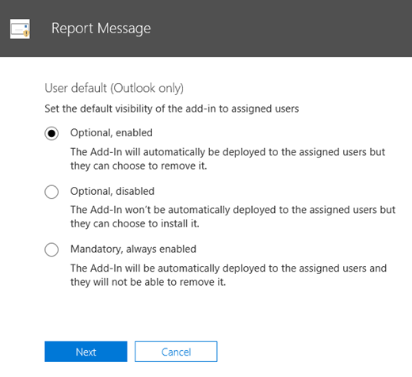
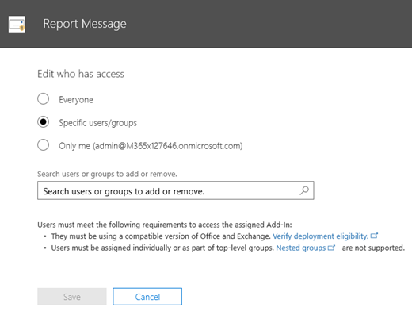
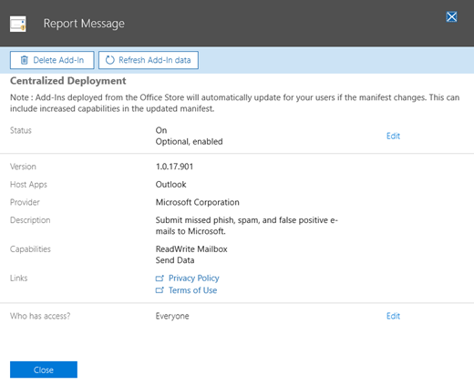

# Enable the Report Message add-in

> [!NOTE]
> The Report Message add-in for Outlook and Outlook on the web is not exactly the same thing as the [Outlook Junk Email Filter](https://support.office.com/article/Overview-of-the-Junk-Email-Filter-5ae3ea8e-cf41-4fa0-b02a-3b96e21de089), although both can be used to mark email as junk, not junk, or a phishing attempt. The difference is, the Report Message add-in for Outlook and Outlook on the web notifies Microsoft about misclassified email, whereas the Outlook Junk Email Filter is used to organize email messages in a user's mailbox. 

## Overview

The Report Message add-in for Outlook and Outlook on the web enables people to easily report misclassified email, whether safe or malicious, to Microsoft and its affiliates for analysis. Microsoft uses these submissions to improve the effectiveness of email protection technologies. In addition, if your organization is using [Office 365 Advanced Threat Protection Plan 1](office-365-atp.md) or [Plan 2](office-365-ti.md), the Report Message add-in provides your organization's security team with useful information they can use to review and update security policies. 

For example, suppose that people are reporting a lot of messages as phishing. This information surfaces in the [Security Dashboard](security-dashboard.md) and other reports. Your organization's security team can use this information as an indication that anti-phishing policies might need to be updated. Or, if people are reporting a lot of messages that were flagged as junk mail as Not Junk by using the Report Message add-in, your organization's security team might need to adjust [anti-spam policies](configure-the-anti-spam-policies.md). 

The Report Message add-in works with your Office 365 subscription and the following products:
 - Outlook on the web
 - Outlook 2013 SP1
 - Outlook 2016
 - Outlook 2016 for Mac
 - Outlook included with Office 365 ProPlus

Your existing web browser should suffice for the Report Message add-in to work; however, if you notice the add-in is not available or not working as expected, try a different browser.
  
If you're an individual user, you can [enable the Report Message add-in for yourself](#get-the-report-message-add-in-for-yourself). 
  
If you're an Office 365 global administrator or an Exchange Online administrator, and Exchange is configured to use OAuth authentication, you can [enable the Report Message add-in for your organization](#get-and-enable-the-report-message-add-in-for-your-organization). The Report Message Add-In is now available through [Centralized Deployment](https://docs.microsoft.com/office365/admin/manage/centralized-deployment-of-add-ins).
    
## Get the Report Message add-in for yourself

1. In [Microsoft AppSource](https://appsource.microsoft.com/marketplace/apps), search for the [Report Message add-in](https://appsource.microsoft.com/product/office/wa104381180).
    
2. Choose **GET IT NOW**.   
    
3. Review the terms of use and privacy policy. Then choose **Continue**. 
    
4. Sign in to Office 365 using your work or school account (for business use) or your Microsoft account (for personal use).
    
After the add-in is installed and enabled, you'll see the following icons: 

- In Outlook, the icon looks like this:    
- In Outlook on the web (formerly known as Outlook Web App), the icon looks like this:  

> [!TIP]
> As a next step, learn how to [Use the Report Message add-in](https://support.office.com/article/b5caa9f1-cdf3-4443-af8c-ff724ea719d2).
  
## Get and enable the Report Message add-in for your organization

> [!IMPORTANT]
> You must be an Office 365 global administrator or an Exchange Online Administrator to complete this task. In addition, Exchange must be configured to use OAuth authentication To learn more, see [Exchange requirements (Centralized Deployment of add-ins)](https://docs.microsoft.com/office365/admin/manage/centralized-deployment-of-add-ins&view=o365-worldwide#exchange-requirements). 

1. Go to the [Services & add-ins page](https://admin.microsoft.com/AdminPortal/Home#/Settings/ServicesAndAddIns) in the Microsoft 365 admin center.   
    
2. Choose **+ Deploy Add-in**.   
    
3. In the **New Add-In** screen, review the information, and then choose **Next**.  
    
4. Select **I want to add an Add-In from the Office Store**, and then choose **Next**.   
    
5. Search for **Report Message**, and in the list of results, next to the **Report Message Add-In**, choose **Add**.  
    
6. On the **Report Message** screen, review the information, and then choose **Next**.  

7. Specify the user default settings for Outlook, and  then choose **Next**.  

8. Specify who gets the Report Message Add-in, and then choose **Save**.   

> [!TIP]
> We recommend [setting up a rule to get a copy of email messages reported by your users](#set-up-a-rule-to-get-a-copy-of-email-messages-reported-by-your-users).

Depending on what you selected when you set up the add-in (steps 7-8 above), people in your organization will have the [Report Message add-in](https://support.office.com/article/b5caa9f1-cdf3-4443-af8c-ff724ea719d2) available. People in your organization will see the following icons: 

- In Outlook, the icon looks like this:    
- In Outlook on the web, the icon looks like this:  

> [!TIP]
> When you notify users about the Report Message add-in, include a link to [Use the Report Message add-in](https://support.office.com/article/b5caa9f1-cdf3-4443-af8c-ff724ea719d2).

## Set up a rule to get a copy of email messages reported by your users

> [!IMPORTANT]
> You must be an Exchange Online Administrator to perform this task.
  
You can set up a rule to get a copy of email messages reported by users in your organization. You do this after you have downloaded and enabled the Report Message add-in for your organization.
  
1. In the Exchange admin center, choose **mail flow** \> **rules**. 
    
2. Choose **+** \> **Create a new rule**. 
    
3. In the **Name** box, type a name, such as Submissions.
    
4. In the **Apply this rule if** list, choose **The recipient address includes...**. 
    
5. In the **specify words or phrases** screen, add `junk@office365.microsoft.com` and `phish@office365.microsoft.com`, and then choose **OK**.  
  
6. In the **Do the following...** list, choose **Bcc the message to...**. 
    
7. Add a global administrator, security administrator, and/or security reader who should receive a copy of each email message that people report to Microsoft, and then choose **OK**.  
  
8. Select **Audit this rule with severity level**, and choose **Medium**. 
    
9. Under **Choose a mode for this rule**, choose **Enforce**.  
  
10. Choose **Save**. 
    
With this rule in place, whenever someone in your organization reports an email message using the Report Message add-in, your global administrator, security administrator, and/or security reader will receive a copy of that message. This information can enable you to set up or adjust policies, such as [Office 365 ATP Safe Links](atp-safe-links.md) policies, or your [anti-spam](anti-spam-protection.md) settings. 

## Learn how to use the Report Message add-in

See [Use the Report Message add-in](https://support.office.com/article/b5caa9f1-cdf3-4443-af8c-ff724ea719d2).

## Review or edit settings for the Report Message add-in

You can review and edit the default settings for the Report Message add-in on the [Services & Add-Ins page](https://admin.microsoft.com/AdminPortal/Home#/Settings/ServicesAndAddIns). 

> [!IMPORTANT]
> You must be an Office 365 global administrator or an Exchange Online Administrator to complete this task.
    
1. Go to the [Services & add-ins page](https://admin.microsoft.com/AdminPortal/Home#/Settings/ServicesAndAddIns) in the Microsoft 365 admin center.  

2. Find and select the Report Message add-in.   
    
3. On the Report Message screen, review and edit settings as appropriate for your organization.   

## Related topics

[Use the Report Message add-in](https://support.office.com/article/b5caa9f1-cdf3-4443-af8c-ff724ea719d2)
  
[View email security reports in the Security &amp; Compliance Center](view-email-security-reports.md)

[View reports for Office 365 Advanced Threat Protection](view-reports-for-atp.md)

[Use Explorer in the Security &amp; Compliance Center](use-explorer-in-security-and-compliance.md)
  

