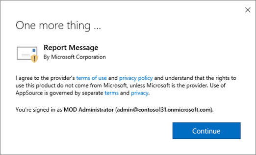
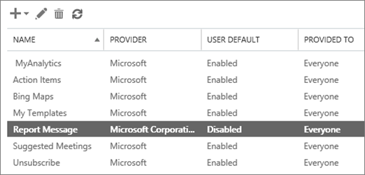
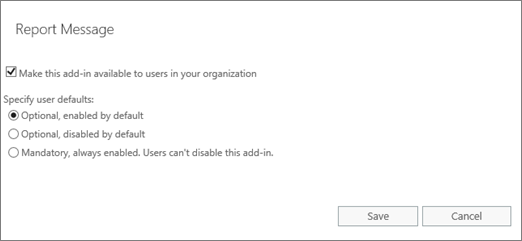

# Enable the Report Message add-in

The Report Message add-in for Outlook enables people to easily report misclassified email, whether safe or malicious, to Microsoft and its affiliates for analysis. Microsoft uses these submissions to improve the effectiveness of email protection technologies.
  
If you're an individual user, you can enable the Report Message add-in for yourself. 
  
If you're an Exchange Online administrator, you can enable the Report Message add-in for your organization.
    
## Get the Report Message add-in for yourself

1. Go to [https://store.office.com](https://store.office.com), and search for the Report Message add-in.
    
2. Choose **Get it now** (or **Add** ). 
    
3. Review the terms of use and privacy policy. Then choose **Continue**. 
    
4. Sign in to your Office 365 email using your work or school account (for business use) or your Microsoft account (for personal use).
    
> [!TIP]
> After the add-in is installed and enabled, you'll see the following icons: 
  
Next, learn how to [Use the Report Message add-in](https://support.office.com/article/b5caa9f1-cdf3-4443-af8c-ff724ea719d2).
  
## Get and enable the Report Message add-in for your organization

> [!IMPORTANT]
> You must be an Exchange Online Administrator to perform this task.
  
1. Go to [https://portal.office.com](https://portal.office.com) and sign in using your work or school account. 
    
2. Choose **Admin** to go to the Admin center. 
    
3. Choose **Admin centers** \> **Exchange** to go to the Exchange admin center (EAC). 
    
4. Choose **organization** \> **add-ins**. 
    
5. Choose **+** \> **Add from the Office Store**. 
    
6. Search for Report Message.
    
7. In the **App results** list, find **Report Message**, and then choose **Get it now** (or **Add** ). 
    
8. Review the terms of use and privacy policy. Then choose **Continue**. 
    
    
  
9. On the confirmation screen, choose **Yes**. 
    
10. After you have installed the Report Message add-in, you must enable it. To do that, follow these steps:
    
1. Return to the EAC, and refresh your browser window.
    
2. Choose **organization** \> **add-ins**. 
    
3. In the list of add-ins, select **Report Message**. 
    
    
  
4. Choose **Edit**, and select an option to enable the add-in. 
    
    
  
5. Choose **Save**. 
    
> [!TIP]
> After the add-in is installed and enabled, people in your organization will see the following icons: 
  
Next, learn how to [Use the Report Message add-in](https://support.office.com/article/b5caa9f1-cdf3-4443-af8c-ff724ea719d2), and set up a rule to see reported email messages.
  
### Set up a rule to get a copy of email messages reported by your users

> [!IMPORTANT]
> You must be an Exchange Online Administrator to perform this task.
  
You can set up a rule to get a copy of email messages reported by users in your organization. You do this after you have downloaded and enabled the Report Message add-in for your organization.
  
1. In the EAC, choose **mail flow** \> **rules**. 
    
2. Choose **+** \> **Create a new rule**. 
    
3. In the **Name** box, type a name, such as Submissions.
    
4. In the **Apply this rule if** list, choose **The recipient address includes...**. 
    
5. In the **specify words or phrases** screen, add junk@office365.microsoft.com and phish@office365.microsoft.com, and then choose **OK**. 
    
    
  
6. In the **Do the following...** list, choose **Bcc the message to...**. 
    
7. Add a global administrator, security administrator, and/or security reader who should receive a copy of each email message that people report to Microsoft, and then choose **OK**. 
    
    
  
8. Select **Audit this rule with severity level**, and choose **Medium**. 
    
9. Under **Choose a mode for this rule**, choose **Enforce**. 
    
    
  
10. Choose **Save**. 
    
With this rule in place, whenever someone in your organization reports an email message using the Report Message add-in, your global administrator, security administrator, and/or security reader will receive a copy of that message. This information can enable you to set up or adjust policies, such as [Office 365 ATP Safe Links](atp-safe-links.md) policies. 
  
## Related topics

[Use the Report Message add-in](https://support.office.com/article/b5caa9f1-cdf3-4443-af8c-ff724ea719d2)
  
[Office 365 Advanced Threat Protection](office-365-atp.md)
  

