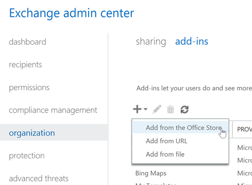
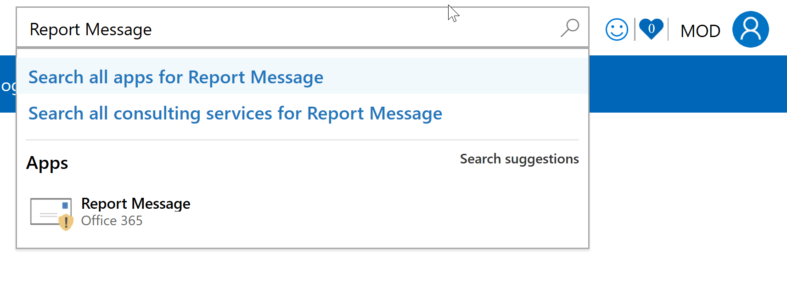
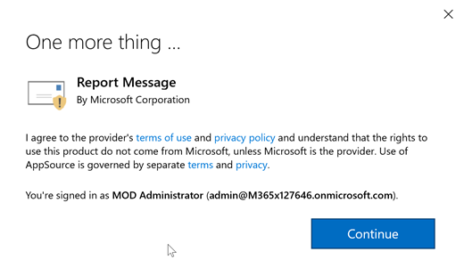
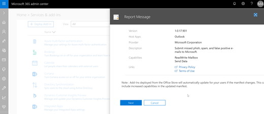
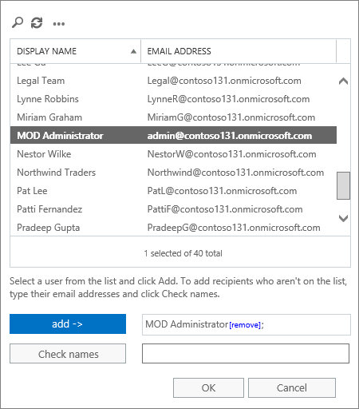

# Enable the Report Message add-in

The Report Message add-in for Outlook enables people to easily report misclassified email, whether safe or malicious, to Microsoft and its affiliates for analysis. Microsoft uses these submissions to improve the effectiveness of email protection technologies. In addition, if your organization is using Microsoft Cloud services that include [Office 365 Advanced Threat Protection](office-365-atp.md) or [Threat Intelligence](office-365-ti.md), the Report Message add-in provides your organization's security team with useful information they can use to review and update security policies. 

For example, suppose that people are reporting a lot of messages as phishing. This information surfaces in the [Security Dashboard](security-dashboard.md) and other reports. Your organization's security team can use this information as an indication that anti-phishing policies might need to be updated. Or, if people are reporting a lot of messages that were flagged as junk mail as Not Junk by using the Report Message add-in, your organization's security team might need to adjust [anti-spam policies](configure-the-anti-spam-policies.md).  
  
If you're an individual user, you can [enable the Report Message add-in for yourself](#get-the-report-message-add-in-for-yourself). 
  
If you're an Exchange Online administrator, you can [enable the Report Message add-in for your organization](#get-and-enable-the-report-message-add-in-for-your-organization).
    
## Get the Report Message add-in for yourself

1. In the [Office store](https://appsource.microsoft.com/product/office/WA104381180?src=office), get the Report Message add-in.
    
2. Choose **GET IT NOW**.   
    
3. Review the terms of use and privacy policy. Then choose **Continue**. 
    
4. Sign in to your Office 365 email using your work or school account (for business use) or your Microsoft account (for personal use).
    

After the add-in is installed and enabled, you'll see the following icons: 

- In Outlook the icon looks like this:    
- In Outlook Web App the icon looks like this:  

As a next step, learn how to [Use the Report Message add-in](https://support.office.com/article/b5caa9f1-cdf3-4443-af8c-ff724ea719d2).
  
## Get and enable the Report Message add-in for your organization

> [!IMPORTANT]
> You must be an Office 365 global administrator or an Exchange Online Administrator to complete this task.

1. Go to [https://portal.office.com](https://portal.office.com) and sign in using your work or school account. 
    
2. Choose **Admin** to go to the Admin center. 
    
3. Choose **Admin centers** \> **Exchange** to go to the Exchange admin center (EAC). 
    
4. Choose **organization** \> **add-ins**. 
    
5. Choose **+** > **Add from the Office Store**.  This opens the Office Store in your web browser.
    
6. Search for Report Message.  
    
7. In the **Apps** list, select **Report Message**, and then choose **GET IT NOW**.   
    
8. Review the terms of use and privacy policy. Then choose **Continue**. 
    
    
  
9. A wizard opens to help you configure the Report Message add-in. Review the information, and choose **Next** to continue.   

10. Specify the default setting you want users to have for the Report Message add-in.  
    
11. Specify who gets the Report Message add-in.   

12. Choose **Save**.

Depending on what you selected using the wizard, people in your organization will have the Report Message add-in available. People in your organization will see the following icons: 

- In Outlook the icon looks like this:    
- In Outlook Web App the icon looks like this:  

Next, learn how to [Use the Report Message add-in](https://support.office.com/article/b5caa9f1-cdf3-4443-af8c-ff724ea719d2), and set up a rule to see reported email messages.

## Review or edit the default settings for the Report Message add-in

You can review and edit the default settings for the Report Message add-in using the Admin Center. 

> [!IMPORTANT]
> You must be an Office 365 global administrator or an Exchange Online Administrator to complete this task.
    
1. If you've just installed the Report Message add-in for your organization, you'll already be on the Services & add-ins page. Otherwise, go [here](https://portal.office.com/adminportal/home#/Settings/ServicesAndAddIns) and sign in using your work or school account for Office 365.

2. Search for **Report Message**, and then select it.   
    
3. A pane opens that displays the settings that were selected for the Report Message add-in during deployment.   

4. Review and if needed, edit settings for the Report Message add-in, and then save your changes.
    
  
## Set up a rule to get a copy of email messages reported by your users

> [!IMPORTANT]
> You must be an Exchange Online Administrator to perform this task.
  
You can set up a rule to get a copy of email messages reported by users in your organization. You do this after you have downloaded and enabled the Report Message add-in for your organization.
  
1. In the EAC, choose **mail flow** \> **rules**. 
    
2. Choose **+** \> **Create a new rule**. 
    
3. In the **Name** box, type a name, such as Submissions.
    
4. In the **Apply this rule if** list, choose **The recipient address includes...**. 
    
5. In the **specify words or phrases** screen, add junk@office365.microsoft.com and phish@office365.microsoft.com, and then choose **OK**. 
    
    
  
6. In the **Do the following...** list, choose **Bcc the message to...**. 
    
7. Add a global administrator, security administrator, and/or security reader who should receive a copy of each email message that people report to Microsoft, and then choose **OK**. 
    
    
  
8. Select **Audit this rule with severity level**, and choose **Medium**. 
    
9. Under **Choose a mode for this rule**, choose **Enforce**. 
    
    
  
10. Choose **Save**. 
    
With this rule in place, whenever someone in your organization reports an email message using the Report Message add-in, your global administrator, security administrator, and/or security reader will receive a copy of that message. This information can enable you to set up or adjust policies, such as [Office 365 ATP Safe Links](atp-safe-links.md) policies. 
  
## Related topics

[Use the Report Message add-in](https://support.office.com/article/b5caa9f1-cdf3-4443-af8c-ff724ea719d2)
  
[View email security reports in the Security &amp; Compliance Center](view-email-security-reports.md)

[View reports for Office 365 Advanced Threat Protection](view-reports-for-atp.md)

[Use Explorer in the Security &amp; Compliance Center](use-explorer-in-security-and-compliance.md)
  

