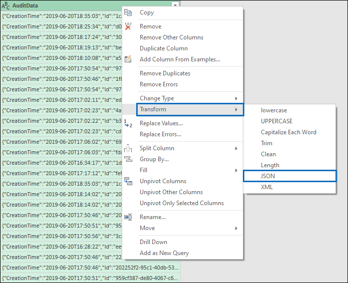
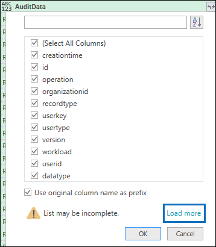

# Export and view audit log records

## Step 1: Export audit log search results

The first step is to search the audit log and then export the results to a comma separated value (CSV) file on your local computer.
  
1. Run an [audit log search](search-the-audit-log-in-security-and-compliance.md#search-the-audit-log) and revise the search criteria if necessary until you have the desired results.
    
2. Click **Export results** and select **Download all results**. 
    
   

   This option to exports all the audit records from the audit log search you ran in step 1, and downloads the raw data from the audit log to a CSV file. 

   A message is displayed at the bottom of the window that prompts you to open or save the CSV file. 

3. Click **Save > Save as** and save the CSV file to your local computer. It will take a while to download a large number of search results.

> [!IMPORTANT]
  > You can download a maximum of 50,000 entries to a CSV file from a single audit log search. If 50,000 entries are downloaded to the CSV file, you can probably assume there are more than 50,000 events that met the search criteria. To export more than this limit, try using a date range to reduce the number of audit log records. You might have to run multiple searches with smaller date ranges to export more than 50,000 entries.

## Step 2: Format the exported audit log using Power Query

1. In Excel 2016, open a blank workbook.
    
2. In the **Get & Transform Data** ribbon group on the **Data** tab, click **From Text/CSV**, and open the CSV file that you downloaded in Step 1.
    
3. In the window that's displayed, click **Transform Data**.

   The CSV file is opened in **Power Query Editor**. There are four columns: **CreationDate**, **UserIds**, **Operations**, and **AuditData**. The **AuditData** column is a JSON object that contains multiple properties. The next step is to create a new column for each of the properties in the JSON object. 
    
4. Right-click the title in the **AuditData** column, click **Transform** and then click **JSON**. 
 
   

5. In the upper-right corner of the **AuditData** column, click the expand icon.
    
   

   A partial list of the fields in the JSON object are displayed.

6. To display all fields in the JSON object, click **Load more**.

   

   You can unselect the checkbox next to any field that you don't want to include.

8. Do one of the following things to format the title of the columns that will be added for each JSON field that's selected.

    - Unselect the **Use original column name as prefix** checkbox to use the name of the JSON fields as the column names; for example, **RecordType** or **SourceFileName**.
    
   - Leave the **Use original column name as prefix** checkbox selected to add the AuditData prefix to the column names; for example, **AuditData.RecordType** or **AuditData.SourceFileName**.

7. Click **OK**.
    
    The **AuditData** column is split into multiple columns. Each new column corresponds to a property in the AuditData JSON object. Each row in the column contains the value for the property. If the property doesn't contain a value, the *null* value is displayed.
  
8. On the **Home** tab, click **Close & Load** to close the Power Query Editor and open the file in an Excel workbook. 
    
    

## More information

- The **Download all results** option downloads the raw data from the Office 365 audit log to a CSV file. This file contains different column names (CreationDate, UserIds, Operation, AuditData) than the file that's downloaded if you select the **Save loaded results** option. The values in the two different CSV files for the same activity may also be different. For example, the activity in the **Action** column in the CSV file and may have a different value than the "user-friendly" version that's displayed in the **Activity** column on the **Audit log search** page; for example, MailboxLogin vs. User signed in to mailbox.
    
- If you download all results, the CSV file contains a column named **AuditData**, which contains additional information about each event. As previously stated, this column contains a multi-value property for multiple properties from the audit log record. Each of the **property:value** pairs in this multi-value property are separated by a comma. You can use the Power Query in Excel to split this column into multiple columns so that each property will have its own column. This will let you sort and filter on one or more of these properties. To learn how to do this, see the "Split a column by delimiter" section in [Split a column of text (Power Query)](https://support.office.com/article/5282d425-6dd0-46ca-95bf-8e0da9539662).
    
    After you split the **AuditData** column, you can filter on the **Operations** column to display the detailed properties for a specific type of activity. 
    
- There's a 3,060-character limit for the data that's displayed in the **AuditData** field for an audit record. If the 3,060-character limit is exceeded, the data in this field is truncated. 
    
- When you download all results from a search query that contains events from different Office 365 services, the **AuditData** column in the CSV file contains different properties depending on which service the action was performed in. For example, entries from Exchange and Azure AD audit logs include a property named **ResultStatus** that indicates if the action was successful or not. This property isn't included for events in SharePoint. Similarly, SharePoint events have a property that identifies the site URL for file and folder related activities. To mitigate this behavior, consider using different searches to export the results for activities from a single service. 
    
    For a description of the properties that are listed in the **AuditData** column in the CSV file when you download all results, and the service each one applies to, see [Detailed properties in the Office 365 audit log](detailed-properties-in-the-office-365-audit-log.md).