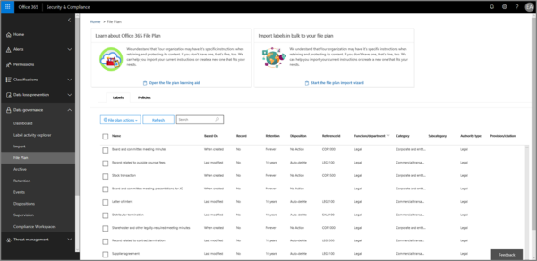
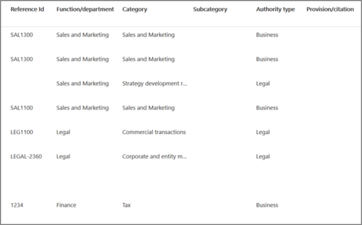
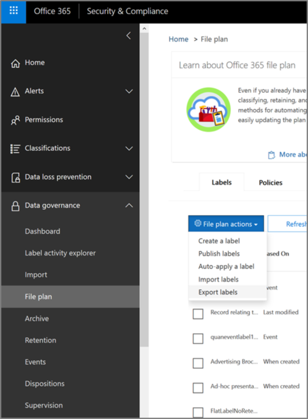
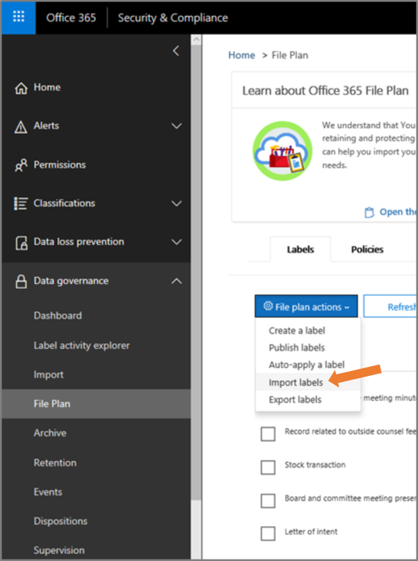
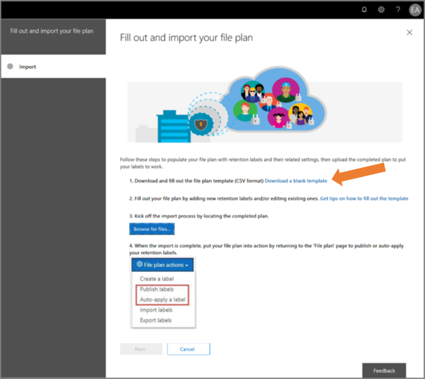
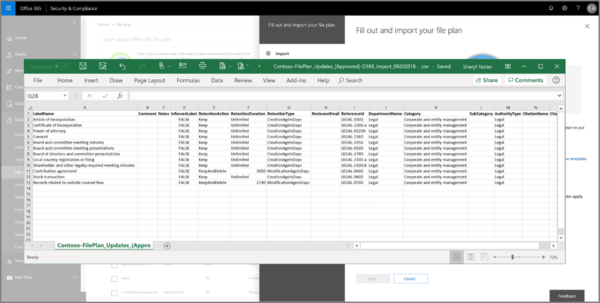
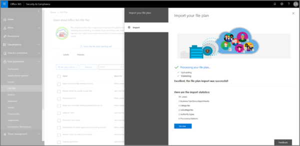
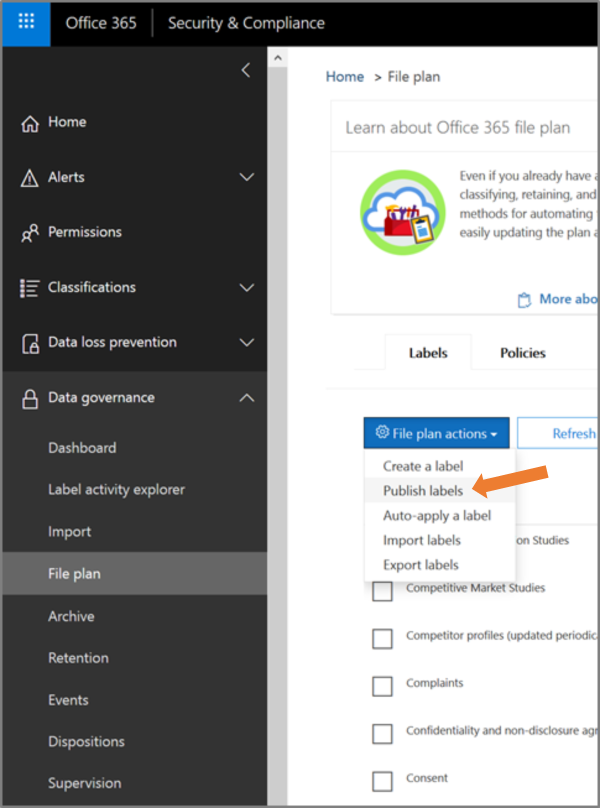

# Overview of file plan manager

File plan manager provides advanced management capabilities for retention labels and policies, and provides an integrated way to traverse label and label-to-content activity for your entire content lifecycle – from creation, through collaboration, record declaration, retention, and finally disposition.

## Accessing file plan manager

There are two requirements to access file plan manager, they are:
- An Office 365 Enterprise E5 subscription.
- The user has been in assigned one of the following roles of the Security &amp; Compliance Center:
    - Retention Manager
    - View-only Retention Manager

[!NOTE]
If you have no labels present inside of the compliance center when you click on File Plan it will create a policy called Default Data Governance Publishing Policy with three labels called Operational procedure, Business general, and Contract agreement. This policy will be published to the organization and can be disabled and or removed. If you review the audit log you can determine who opened File Plan and kicked off the first run experience by looking for the Activities Created retention policy and Created retention configuration for a retention policy.

## Navigating your file plan

File plan manager makes it easier see into and across the settings of all your retention labels and policies from one view.

Note that retention labels created outside of the file plan will be available in the file plan and vice versa.

On the **file plan labels** tab, the following additional information and capabilities are available:

### Label settings columns

- **Based on** identifies the type of trigger that will start the retention period. Valid values are:
    - Event
    - When created
    - When last modified
    - When labeled
- **Record** identifies if the item will become a declared record when the label is applied. Valid values are:
    - No
    - Yes
    - Yes(Regulatory)
- **Retention** identifies the retention type. Valid values are:
    - Keep
    - Keep and delete
    - Delete
- **Disposition** identifies what will happen to the content at the end of the retention period. Valid values are:
    - null
    - No action
    - Auto-delete
    - Review required (aka Disposition review)

### Label file plan descriptors columns

You can now include more information in the configuration of your retention labels. Inserting file plan descriptors into labels will improve the manageability and organization of your file plan.

To get you started, file plan manager provides some out-of-box values for: Function/department, Category, Authority type and Provision/citation. You can add new file plan descriptor values when creating or editing a retention label.

Here's a view of the file plan descriptors step when creating or editing a retention label.

Here's a view of the file plan descriptors columns on the labels tab of file plan manager.

## Export labels out of your file plan

From file plan manager, you can export the details of all retention labels into a .csv file to assist you in facilitating periodic compliance reviews with data governance stakeholders in your organization.

To export all retention labels, go to **file plan manager** \> **file plan actions** \> **export labels**.

A *.csv file containing all existing retention labels will open.

## Import labels into your file plan

From file plan manager, you can bulk import new labels as well as modify existing retention labels.

To import new retention labels and make updates existing retention labels, go to **file plan manager** \> **file plan actions** \> **import labels**.

Download a blank template (or start from an export of your current file plan).

Fill-out the template (coming soon is reference information about valid values for entries).

Upload the filled-out template, and file plan manager will validate the entries and display import statistics.

When the import is complete, return to file plan manager to assign new labels to new or existing policies.

