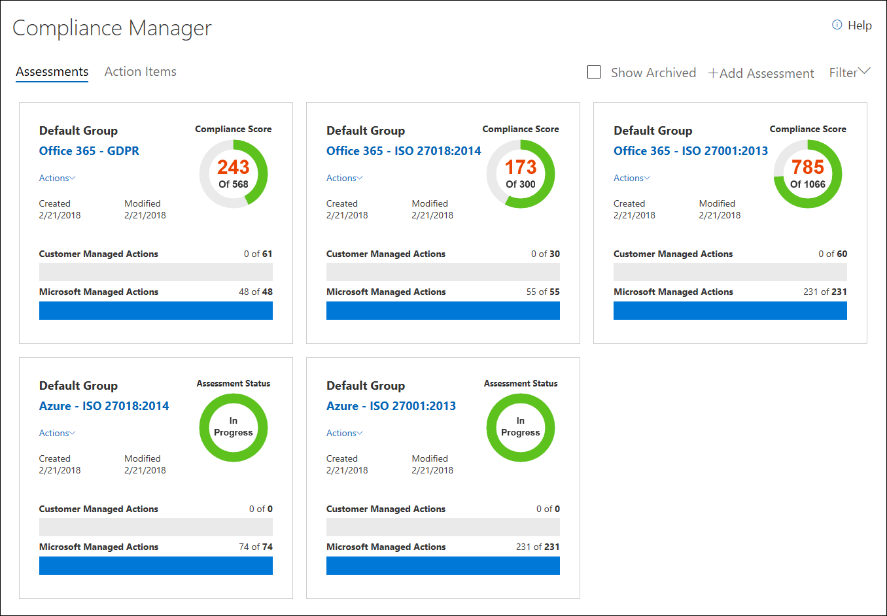
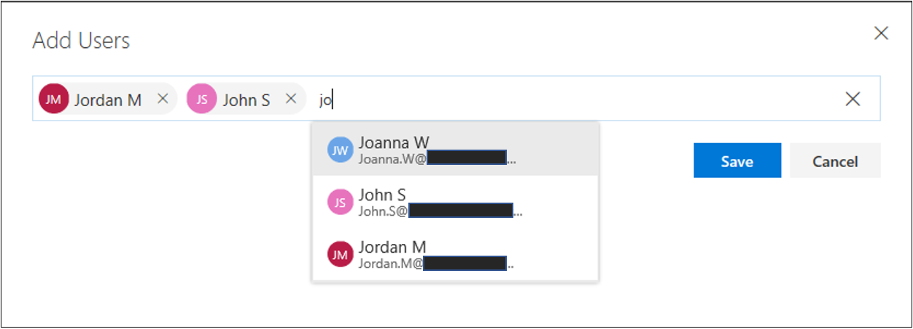
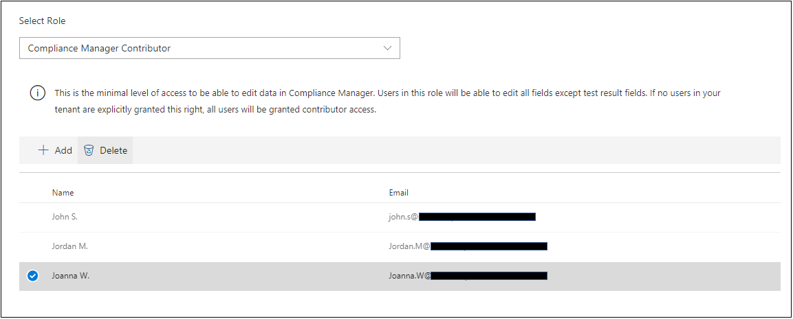
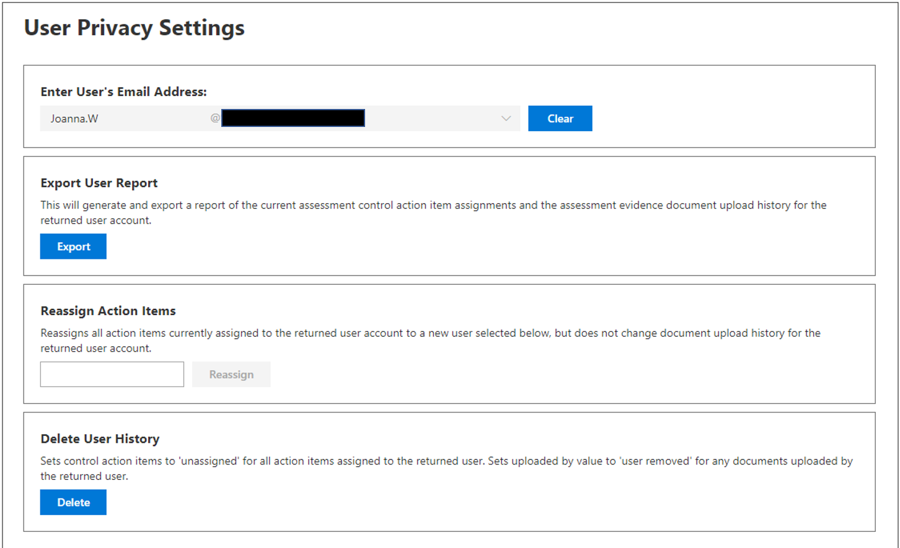
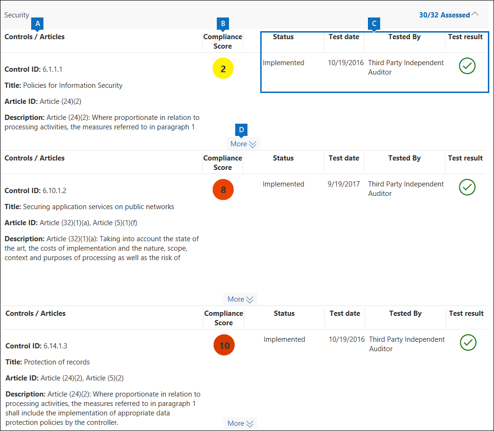

# Get started with Microsoft Compliance Manager

> [!IMPORTANT]
> Microsoft Compliance Manager is a dashboard and management tool that provides a summary of your data protection and compliance stature and recommendations to improve data protection and compliance. The customer actions provided in Compliance Manager are recommendations; it is up to your organization to evaluate the effectiveness of these recommendations in their respective regulatory environment prior to implementation. Recommendations found in Compliance Manager should not be interpreted as a guarantee of compliance.

## Access

You access Compliance Manager from the Service Trust Portal. Anyone with a Microsoft account or Azure Active Directory organizational account can access Compliance Manager.
  

  
1. Go to [https://servicetrust.microsoft.com](https://servicetrust.microsoft.com/).
    
2. Sign in with your Azure Active Directory (Azure AD) user account.
    
3. In the Service Trust Portal, click **Compliance Manager**. 
    
4. When the Non-Disclosure Agreement is displayed, read it, and then click **Agree** to continue. You'll only have to do this once, and then the Compliance Manager dashboard is displayed. 

    To get you started, we've added the following Assessments by default:
    
    
    
5. Click  **Help** to take a short tour of Compliance Manager. 

## Administration

There are specific administrative functions that are only available to the tenant administrator account, and will only be visible when logged in as a global administrator.
  
> [!NOTE]
> The Access to Restricted Documents permission in the drop-down list will allow administrators to give users access to restricted documents that Microsoft shares on the Service Trust Portal. The Restricted Documents feature isn't available, but is coming soon. 
  
### Assigning Compliance Manager roles to users

Each Compliance Manager role has slightly different permissions. You can view the permissions assigned to each role, see which users are in which roles, and add or remove users from that role through the Service Trust Portal by selecting the **Admin** menu item, and then choosing **Settings**. 
  

  
To add or remove users from Compliance Manager roles.
  
1. Go to [https://servicetrust.microsoft.com](https://servicetrust.microsoft.com).
    
2. Sign in with your Azure Active Directory global administrator account.
    
3. On the Service Trust Portal top menu bar, click **Admin** and then choose **Settings**. 
    
4. In the **Select Role** drop-down list, click the role that you want to manage. 
    
5. Users added to the each role are listed on the **Select Role** page. 
    
6. To add users to this role, click **Add**. In the **Add Users** dialog, click the user field. You can scroll through the list of available users or begin typing the user name to filter the list based on your search term. Click the user to add that account to the **Add Users** list to be provisioned with that role. If you would like to add multiple users concurrently, begin typing a user name to filter the list, and then click the user to add to the list. Click **Save** to provision the selected role to these users. 
    
    
  
7. To remove users from this role, select the user(s) and click **Delete**. 
    
    
 
## User Privacy settings

Certain regulations require that an organization must be able to delete user history data. To enable this, Compliance Manager provides the **User Privacy Settings** functions, that allow administrators to: 
  
- [Search for a user](#search-for-a-user)

- [Export a report of account data history](#export-a-report-of-account-data-history)

- [Reassign action items](#reassign-action-items)

- [Delete user data history](#delete-user-data-history)
    

  
### Search for a user

To search for a user account:
  
1. Enter the user email address by typing in the alias (the information to the left of the @ symbol) and choosing the domain name by clicking on the domain suffix list on the right. If this is tenant with multiple registered domains, you can double check the email address domain name suffix to ensure that it is correct.
    
2. When you have the username correctly entered, click **Search**. 
    
3. If the user account is not found, the error message 'User not found' will be displayed on the page. Check the user's email address information, make corrections as necessary and click **Search** to try again. 
    
4. If user account is found, the text of the button will change from **Search** to **Clear**, which indicates that the returned user account is the operating context for the additional functions that will be displayed below, that running those functions will apply to this user account. 
    
5. To clear search results and search for a different user, click **Clear**. 
    
### Export a report of account data history

Once the user account has been identified, you may wish to generate a report of dependencies that exist linked to this account. This information will allow you to reassign open action items or ensure access to previously uploaded evidence. 
  
 To generate and export a report:
  
1. Click **Export** to generate and download a report of the Compliance Manager control action items currently assigned to the returned user account, as well as the list of documents uploaded by that user. If there are no assigned actions or uploaded documents, an error message will state "No data for this user". 
    
2. The report downloads in the background of the active browser window - if you don't see a download popup you want to check your browser download history.
    
3. Open the document to review the report data.
    
> [!NOTE]
> This is not a historical report that retains and displays state changes to action item assignment history. The generated report is a snapshot of the control action items assigned at the time that the report is run (date and time stamp written into the report). For instance, any subsequent reassignment of action items will result in different snapshot report data if this report is generated again for the same user. 
  
### Reassign action items

This function enables an organization to remove any active or outstanding dependencies on the user account by reassigning all action item ownership (which includes both active and completed action items) from the returned user account to a new user selected below. This action does not change document upload history for the returned user account. 
  
 To reassign action items to another user:
  
1. Click the input box to browse for and select another user within the organization to whom the returned user's action items should be assigned.
    
2. Select **Replace** to reassign all control action items from the returned user to the newly selected user. 
    
3. A confirmation dialog box appear stating "This will reassign all control action items from the current user to the selected user. This action cannot be undone. Are you sure you want to continue?"
    
4. To continue click **OK**,, otherwise click **Cancel**. 
    
> [!NOTE]
> All action items (both active and completed) will be assigned to the newly selected user. However, this action does not affect the document upload history; any documents uploaded by the previously assigned user will still show the date/time and name of the previously assigned user. 
  
Changing the document upload history to remove the previously assigned user will have to be done as a manual process. In that case, the administrator will need to:
  
1. Open the previously downloaded Export report.
  
2. Identify and navigate to the desired control action item.
  
3. Click **Manage Documents** to navigate to the evidence repository for that control. 
  
4. Download the document.
  
5. Delete the document in the evidence repository.
  
6. Re-upload the document. The document will now have a new upload date, time and Uploaded By username. 
  
### Delete user data history

This sets control action items to 'unassigned' for all action items assigned to the returned user. This also sets uploaded by value to 'user removed' for any documents uploaded by the returned user
  
 To delete the user account action item and document upload history:
  
1. Click **Delete**. 

    A confirmation dialog will be displayed, stating "This will remove all control action item assignments and the document upload history for the selected user. This action cannot be undone. Are you sure you want to continue?"
    
3. To continue click **OK**, otherwise click **Cancel**. 

### Using search

  
Click the magnifying glass in the upper right-hand corner of the page by to expand the Search input field, enter your search terms and press Enter. The Search control will appear, with the search term in the search pane input field, and search results will appear beneath.
  
By default, Search returns Document results, and you can use the Filter By dropdown lists to refine the list of documents displayed, to add or remove search results from view. You can use multiple filter attributes at the same time to narrow the returned documents to specific cloud services, categories of compliance or security practices, regions of the world, or industries. Click the document name link to download the document.
  

  
Click on the Compliance Manager link to display Search results for Compliance Manager assessment controls. The listed search results show the date the assessment was created, the name of the assessment grouping, the applicable cloud service, and whether the controls is Microsoft or Customer Managed.
  

  
> [!NOTE]
> Service Trust Portal reports and documents are available to download for at least twelve months after publishing or until a new version of document becomes available. 

## Permissions

## Group configuration

## Creating an assessment

### Assessments in Compliance Manager

The core component of Compliance Manager is called an *Assessment*. An Assessment is an assessment of a Microsoft service against a certification standard or data protection regulation (such as ISO 27001:2013, and the GDPR). Assessments help you to discern your organization's data protection and compliance posture against the selected industry standard for the selected Microsoft cloud service. Assessments are completed by the implementation of the controls that map to the certification standard being assessed. 
  
The structure of an Assessment is based on the responsibility that is shared between Microsoft and your organization for assessing security and compliance risks in the cloud and for implementing the data protection safeguards specified by a compliance standard, a data protection standard, a regulation, or a law.
  
An Assessment is made of several components, which are:
  
- **In-Scope Services** - Each assessment applies to a specific set of Microsoft services, which are listed in the In-Scope Cloud Services section. 
    
- **Microsoft Managed Controls** - For each cloud service, Microsoft implements and manages a set of  *controls*  as part of Microsoft's compliance with various standards and regulations. These controls are organized into  *control families*  that align with the structure from the corresponding certification or regulation that the Assessment is aligned to. For each Microsoft managed control, Compliance Manager provides details about how Microsoft implemented the control, along with how and when that implementation was tested and validated by an independent third-party auditor. 
    
    Here's an example of three Microsoft managed controls in the **Security** control family from an Assessment of Office 365 and the GDPR. 

    
  
  a. Specifies the following information from the certification or regulation that maps to the Microsoft managed control.

  - **Control ID** - The section or article number from the certification or regulation that the control maps to.
    
  - **Title** - The title from the corresponding certification or regulation.
    
  - **Article ID** - This field is included only for GDPR assessments, as it specifies the corresponding GDPR article number.
    
  - **Description** - Text of the standard or regulation that maps to the selected Microsoft managed control.

  b. The Compliance Score for the control, which indicates the level of risk (due to non-compliance or control failure) associated with each Microsoft managed control. See [Understanding the Compliance Score](#understanding-the-compliance-score) for more information. Note that Compliance Scores are rated from 1 to 10 and are color-coded. Yellow indicates low risk controls, orange indicates medium-risk controls, and red indicated high-risk controls. 
    
  c. Information about the implementation status of a control, the date the control was tested, who performed the test, and the test result.
    
  d. For each control, you can click **More** to see additional information, including details about Microsoft's implementation of the control and details about how the control was tested and validated by an independent third-party auditor. 
    
- **Customer Managed Controls** - This is the collection of controls that are managed by your organization. Your organization is responsible for implementing these controls as part of your compliance process for a given standard or regulation. Customer managed controls are also organized into control families for the corresponding certification or regulation. Use the customer managed controls to implement the recommended actions suggested by Microsoft as part of your compliance activities. Your organization can use the prescriptive guidance and recommended Customer Actions in each customer managed control to manage the implementation and assessment process for that control.
    
    Customer managed controls in Assessments also have built-in workflow management functionality that you can use to manage and track your organization's progress towards completing the Assessment. For example, a Compliance Officer in your organization can assign an Action Item to an IT admin who has the responsibility and necessary permissions to perform the actions that are recommended for the control. When that work is complete, the IT admin can upload evidence of their implementation tasks (for example, screen shots of configuration or policy settings) and then assign the Action Item back to the Compliance Officer to evaluate the collected evidence, test the implementation of the control, and record the implementation date and test results in Compliance Manager. For more information, see the [Managing the assessment process](#managing-the-assessment-process) section in the article. 

## Localization support

Service Trust Portal enables you to view the page content in different languages. To change the page language, simply click on the globe icon in the lower left corner of the page and select the language of your choice. 
  
