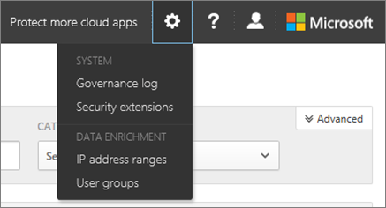

# Group your IP addresses to simplify management in Office 365 Cloud App Security

Office 365 Advanced Security Management is now Office 365 Cloud App Security.
  
|****Evaluation** \>**|****Planning** \>**|****Deployment** \>**|****Utilization****|
|:-----|:-----|:-----|:-----|
|[Start evaluating](office-365-cas-overview.md)   |[Start planning](get-ready-for-office-365-cas.md)   |You are here!    [Next steps](#next-steps)   |[Start utilizing](utilization-activities-for-ocas.md)   |
   
To easily identify sets of IP addresses that you'll use in Office 365 Cloud App Security, such as your physical office IP addresses, you can set up groups of IP address ranges. Defining these ranges lets you tag and categorize them, and then you can use tags and categories to customize how your activity logs and alerts are displayed and investigated.
  
Each group of IP ranges can be tagged with tag names that you choose, and then the tags can be categorized based on a default list of IP categories (such as Corporate, Administrative, Risky, and VPN). Both IPv4 and IPv6 addresses are supported.
  
> [!NOTE]
> You must be a global administrator or security administrator to perform the procedures in this article. To learn more, see [Permissions in the Office 365 Security &amp; Compliance Center](permissions-in-the-security-and-compliance-center.md). 
  
## To set up an IP address range in Office 365 Cloud App Security

1. As a global administrator or security administrator, go to [https://protection.office.com](https://protection.office.com) and sign in using your work or school account. (This takes you to the Security &amp; Compliance Center.) 
    
2. In the Security &amp; Compliance Center, choose **Alerts** \> **Manage advanced alerts**.
    
3. Choose **Go to Office 365 Cloud App Security**.
    
    
  
4. On the upper right of the page, click **Settings** \> **IP address ranges**.
    
    
  
5. Click the new button, which resembles a plus sign ( **+**).
    
6. In the **New IP address range** window, specify the following values: 
    
|**Field or list**|**What to do**|
|:-----|:-----|
|**Name**   |Use this field to manage your IP address range and settings. (You won't see this value in activities logs.)    |
|**IP address ranges**   |Specify a range, using network prefix notation (also known as CIDR notation). For example, 192.168.1.0/27 includes the range of values 192.168.1.0 through 192.168.1.31 (inclusive).    |
|**Location** and **Registered ISP**   |Specify the location and Internet Service Provider (ISP) for the IP address range. This overrides the public fields defined for the addresses, which is helpful for cases, such as an IP address is that is considered publicly to be in Ireland but is actually in the U.S.    |
|**Tags**   |Use tags to name your groups of IP addresses. (Unlike the Name field, you will see Tags in activity logs.) Type a word or phrase that you want to use for a tag. You can add as many tags as you like for each IP address range. And if you've already set up a tag and you want to add this IP address range to it, choose it from the list of current tags that appear as you start typing.    |
|**Category**   | Assign categories to your tags to make it easier to recognize activities that come from certain IP addresses. Choose from the following options:    **Administrative** All of the IP addresses of your admins.    **Cloud provider** The IP address of your proxy in the cloud.    **Corporate** All of the IP addresses in your internal network, your branch offices, and your Wi-Fi roaming addresses.    **Risky** Any IP addresses that you consider to be risky, such as suspicious IP addresses you've seen in the past, IP addresses in your competitors' networks, and so on. By default, the Risky categories includes two IP tags: **Anonymous proxy** and **Tor**   **VPN** Any IP addresses that your remote workers use.    |
   
7. Choose **Save**.
    
After you set up your IP address ranges, keep in mind that only future events are affected by these changes.
  
## Next steps

- [Activity policies and alerts](activity-policies-and-alerts.md)
    
- [Anomaly detection policies](anomaly-detection-policies-in-ocas.md)
    
- [Integrate your SIEM server](integrate-your-siem-server-with-office-365-cas.md)
    
- [Review and take action on alerts in Office 365 Cloud App Security](review-office-365-cas-alerts.md)
    

