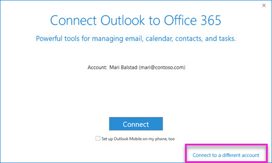

# Install the Supervision add-in for Outlook desktop

To review communications identified by a supervision policy, reviewers use the Supervision add-in for Outlook and Outlook web app. The add-in is installed automatically in Outlook web app for all reviewers you specified in the policy. However, reviewers must run through some steps to install it in the desktop version of Outlook.
  
> [!NOTE]
> Using supervision policies requires an Office 365 E5 subscription for your organization. If you don't have that plan and want to try supervision, you can [sign up for a trial of Office 365 Enterprise E5](https://go.microsoft.com/fwlink/p/?LinkID=698279). 
  
## Step 1: Copy the address for the supervision mailbox

To install the add-in for Outlook desktop, you'll need the address for the supervision mailbox that was created as part of the supervision policy setup. 
  
> [!NOTE]
> If someone else created the policy, you'll need to get this address from them to install the add-in. 
  
 **To find the supervision mailbox address**
  
1. Sign into the [Security &amp; Compliance Center](https://protection.office.com) using credentials for an admin account in your Office 365 organization. 
    
2. Go to **Data governance** \> **Supervision**.
    
3. Click the supervision policy that's gathering the communications you want to review.
    
4. In the policy details flyout, under ** Supervision mailbox **, copy the address. 
    
    
  
## Step 2: Configure the supervision mailbox for Outlook desktop access

Next, reviewers will need to run a couple Exchange Online PowerShell commands so they can connect Outlook to the supervision mailbox.
  
1. Connect to Exchange Online PowerShell. [How do I do this?](https://docs.microsoft.com/powershell/exchange/exchange-online/connect-to-exchange-online-powershell/connect-to-exchange-online-powershell)
    
2. Run the following commands.
    
  ```
  Add-MailboxPermission "SupervisoryReview{GUID}@domain.onmicrosoft.com" -User <alias or email address of the account that has reviewer permissions to the supervision mailbox> -AccessRights FullAccessSet-Mailbox "<SupervisoryReview{GUID}@domain.onmicrosoft.com>" -HiddenFromAddressListsEnabled: $false
  ```

    Where  *SupervisoryReview{GUID}@domain.onmicrosoft.com*  is the address you copied in Step 1 above, and  *User*  is the name of the reviewer who will be connecting to the supervision mailbox in the next step. 
    
3. Wait at least an hour before moving on to Step 3 below.
    
## Step 3: Create an Outlook profile to connect to the supervision mailbox

For the final step, reviewers will need to create an Outlook profile to connect to the supervision mailbox. 
  
> [!NOTE]
> To create a new Outlook profile, you'll use the Mail settings in the Windows Control Panel. The path you take to get to these settings might depend on which Windows operating system (Windows 7, Windows 8, or Windows 10) you're using and which version of Outlook is installed. 
  
1. Open the Control Panel, and in the **Search** box at the top of the window, type **Mail**. 
    
    > [!NOTE]
    > Not sure how to get to the Control Panel? See [Where is Control Panel?](https://support.microsoft.com/help/13764/windows-where-is-control-panel)
  
2. Open the **Mail** app. 
    
3. In **Mail Setup - Outlook**, click **Show Profiles**.
    
    
  
4. In **Mail**, click **Add**. Then, in **New Profile**, enter a name for the supervision mailbox (such as **Supervision**).
    
    
  
5. In **Connect Outlook to Office 365**, click **Connect to a different account**.
    
    
  
6. In **Auto Account Setup**, choose **Manual setup or additional server types**, and then click **Next**.
    
7. In **Choose Your Account Type**, choose **Office 365**. Then, in the **Email Address** box, enter the address of the supervision mailbox you copied previously. 
    
    
  
8. When prompted, enter your Office 365 credentials.
    
9. If successful, you'll see the **Supervision - \<policy name\>** folder listed in the Folder List view in Outlook. 
    

