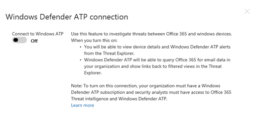

# Integrate Office 365 Advanced Threat Protection with Windows Defender Advanced Threat Protection

If you are part of your organization's security team, you can integrate Office 365 Advanced Threat Protection and related investigation and response features with Windows Defender Advanced Threat Protection. This can help you quickly understand if users' machines are at risk when you are investigating threats in Office 365. For example, once integration is enabled, you will be able to see a list of machines that are used by the recipients of a detected email message, as well as how many recent alerts those machines have in Windows Defender Advanced Threat Protection.
  
The following image shows the **Devices** tab that you'll see when have Windows Defender Advanced Threat Protection integration enabled: 
  

  
In this example, you can see that the recipients of the email message have four devices and one has an alert. Clicking the link for a device opens its page in the Windows Defender Advanced Threat Protection portal.
  
## Requirements

- Your organization must have Office 365 Advanced Threat Protection Plan 2 (or Office 365 E5) and Windows Defender ATP.
    
- You must be an Office 365 Global Administrator or have a security administrator role (such as Security Administrator) assigned in the [Security &amp; Compliance Center](https://protection.office.com). (See [Permissions in the Office 365 Security &amp; Compliance Center](permissions-in-the-security-and-compliance-center.md))
    
- You must have access to both Office 365 Threat Explorer in the Security & Compliance Center and the Windows Defender Advanced Threat Protection portal.
    
## To integrate Office 365 Advanced Threat Protection with Windows Defender ATP

Integrating Office 365 Advanced Threat Protection with Windows Defender Advanced Threat Protection is set up by using both the Security & Compliance Center AND the Windows Defender Advanced Threat Protection portal.
  
1. As an Office 365 global administrator or a security administrator, go to [https://protection.office.com](https://protection.office.com) and sign in with your work or school account for Office 365. 
    
2. Choose **Threat management** \> **Explorer**.  
    
3. In the upper right corner of the screen, choose **WDATP Settings**.
    
4. In the Windows Defender ATP connection dialog box, turn on Connect to Windows ATP.  
    
5. Enable the connection in Windows Defender Advanced Threat Protection. See [Use the Windows Defender Advanced Threat Protection portal](https://go.microsoft.com/fwlink/?linkid=859690).

  
## Related topics

[Office 365 Threat Investigation and Response](office-365-ti.md)
  
[Office 365 Advanced Threat Protection](office-365-atp.md)
  

