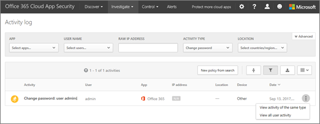

# Investigate an activity in Office 365 Cloud App Security
  
|****Evaluation** \>**|****Planning** \>**|****Deployment** \>**|****Utilization****|
|:-----|:-----|:-----|:-----|
|[Start evaluating](office-365-cas-overview.md)   |[Start planning](get-ready-for-office-365-cas.md)   |[Start deploying](turn-on-office-365-cas.md)   |You are here!    [Next steps](#next-steps)   |
   
Office 365 Cloud App Security works with your [Office 365 audit log](detailed-properties-in-the-office-365-audit-log.md). With Office 365 Cloud App Security, as a global administrator or security administrator, you can use the Activity log page to see potential issues in how your organization is using Office 365.
  
## How to get to the Activity log page

1. Go to the Cloud App Security portal ([https://portal.cloudappsecurity.com](https://portal.cloudappsecurity.com)) and sign in.
  
2. In the navigation bar across the top of the screen, choose **Investigate** \> **Activity log**. 
  
## Review and investigate activities

On the Activity log page, you can see a list of various activities that are taking place within your organization using Office 365. You can use filters across the top of the screen to focus on a specific type of activity or a specific user. For example, the following image shows information about an organization's Office 365 admin account's password change:
  

  
As you look at each item in the Activity log, you can click the ellipses to find other related activities. For example, you can view other activities of the same type, from the same IP address, or from the same country/region.
  
You can view information about many other kinds of activities, too. For example, here are some of the activities you can view in the Activity log:
  
- Members added to or removed from groups
    
- Changes in user licenses
    
- Files or folders shared internally or externally
    
- Created or deleted sites or site collections
    
- Email forwarding rules
    
Use the Activity log page to get acquainted with how people in your organization are using Office 365 and what issues they might be having along the way.
  
## Next steps

- [Review and take action on alerts in Office 365 Cloud App Security](review-office-365-cas-alerts.md)
    
- Review your [utilization activities for Office 365 Cloud App Security](utilization-activities-for-ocas.md)
    

