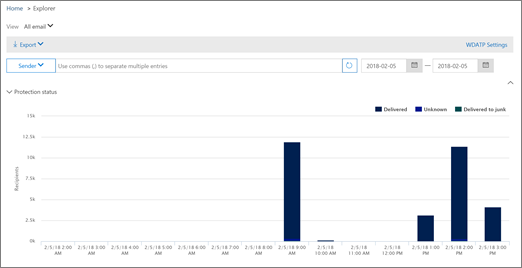
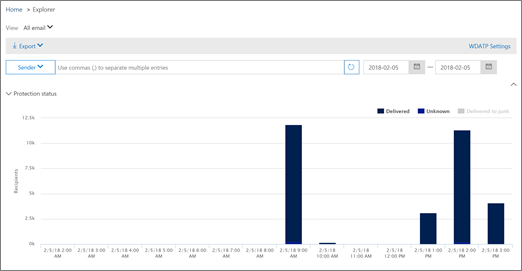
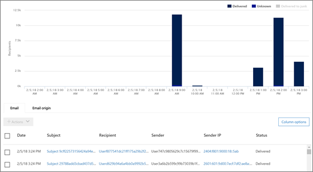
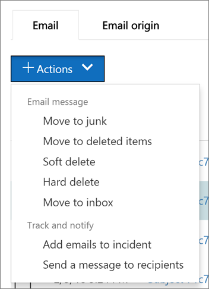

# Find and investigate malicious email that was delivered (Office 365 Threat Intelligence)

[Office 365 Threat Intelligence](office-365-ti.md) enables you to investigate activities that put your users at risk and take action to protect your organization. For example, if you are part of your organization's security team, you can find and investigate suspicious email messages that were delivered to your users. You can do this by using [Explorer in the Security &amp; Compliance Center](use-explorer-in-security-and-compliance.md).

## Before you begin...

Make sure that the following requirements are met:
  
- Your organization has [Office 365 Threat Intelligence](office-365-ti.md) and [Assign licenses to users in Office 365 for business](https://support.office.com/article/997596b5-4173-4627-b915-36abac6786dc).
    
- [Office 365 audit logging](turn-audit-log-search-on-or-off.md) is turned on for your organization. 
    
- Your organization has policies defined for anti-spam, anti-malware, anti-phishing, and so on. See [Threat management in the Office 365 Security &amp; Compliance Center](threat-management.md).
    
- You are an Office 365 global administrator, or you have either the Security Administrator or the Search and Purge role assigned in the Security &amp; Compliance Center. See [Permissions in the Office 365 Security &amp; Compliance Center](permissions-in-the-security-and-compliance-center.md).
    
## Dealing with suspicious emails

Malicious attackers may be sending mail to your users to try and phish their credentials and gain access to your corporate secrets! In order to prevent this, you should use the threat protection services offered by Office 365, including Exchange Online Protection and Advanced Threat Protection. However, there are times when an attacker could send mail to your users containing a URL and only later on make that URL point to malicious content (malware, etc.). Alternatively, you may realize too late that a user in your organization has been compromised, and while that user was compromised, an attacker used that account to send email to other users in your company. As part of cleaning up both of these scenarios, you may want to remove email messages from user inboxes. In situations like these, you can leverage Threat Explorer to find and remove those email messages!
  
## Find and delete suspicious email that was delivered

> [!TIP]
> [Explorer](use-explorer-in-security-and-compliance.md) (also referred to as Threat Explorer), is a powerful report that can serve multiple purposes, such as finding and deleting messages, identifying the IP address of a malicious email sender, or starting an incident for further investigation. The following procedure focuses on using Explorer to find and delete malicious email from recipients mailboxes. 
  
1. Go to [https://protection.office.com](https://protection.office.com) and sign in using your work or school account for Office 365. This takes you to the Security &amp; Compliance Center. 
    
2. In the left navigation, choose **Threat management** \> **Explorer**.
    
3. In the View menu, choose **All email**.
    
    
  
4. Notice the labels that appear in the report, such as **Delivered**, **Unknown**, or **Delivered to junk**.
    
    
  
    (Depending on the actions that were taken on email messages for your organization, you might see additional labels, such as **Blocked** or **Replaced**.)
    
5. In the report, choose **Delivered to junk** to remove that data from view. 
    
    
  
6. Below the chart, review the **Email** list below the chart. 
    
    
  
7. In the list, choose an item to view more details about that email message. For example, you can click the subject line to view information about the sender, recipients, attachments, and other similar email messages.
    
    
  
8. After viewing information about email messages, select one or more items in the list to activate **+ Actions**.
    
9. Use the **+ Actions** list to apply an action, such as **Move to deleted** items. This will delete the selected messages from the recipients' mailboxes. 
    
    
  
## Related topics

[Office 365 Threat Intelligence](office-365-ti.md)
  
[Protect against threats in Office 365](protect-against-threats.md)
  
[View reports for Office 365 Advanced Threat Protection](view-reports-for-atp.md)
  

