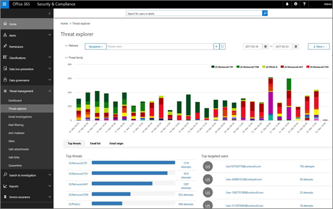
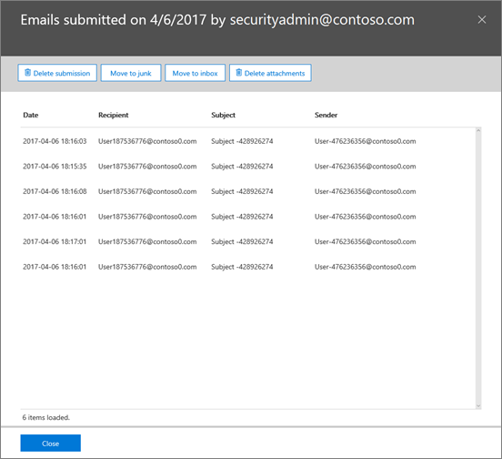

# Keep your Office 365 users safe with Office 365 Threat Intelligence

## Overview

Do you know which of your Office 365 users are under attack, or worse - compromised? Do know how to mitigate and recover from attacks that are targeting your users? Did you know you can do exactly this with security capabilities that are already available to you in Office 365? 
  
[Office 365 Threat Intelligence](office-365-ti.md) is a suite of capabilities included in your Office 365 E5 subscription. Office 365 Threat Intelligence has helped Microsoft IT reduce average time to resolution for social engineering incidents by 80%, and increased case throughput by 37% per month compared to the previous 2 quarters! 

> [!IMPORTANT]
> Beginning in February 2019 and rolling out over the next several months, Office 365 Threat Intelligence is becoming Office 365 Advanced Threat Protection Plan 2, with additional threat protection capabilities. To learn more, see [Office 365 Advanced Threat Protection plans and pricing](https://products.office.com/exchange/advance-threat-protection) and the [Office 365 Advanced Threat Protection Service Description](https://docs.microsoft.com/office365/servicedescriptions/office-365-advanced-threat-protection-service-description).
  
We've recently added new capabilities to help improve how you can detect and recover from threats! Here's a quick walk through of how the updated Threat Intelligence service can make you even more efficient.
  
## Detect intrusions and threats

[Explorer](use-explorer-in-security-and-compliance.md) (also referred to as Threat Explorer) helps security admins and analysts identify and understand threats that are active in your enterprise because even the most complex security settings can be circumvented by seemingly innocuous user configurations like safe sender whitelists. Explorer helps Office 365 global or security admins quickly determine whether users have been compromised by threats such as malware or phish. This helps prioritize which users are most at risk for a threat and the requisite response. 
  
Explorer also helps admins navigate the relationships between users and mail. Know of a particular mail that was bad? Search for it to see what users received the mail, then follow the series of events and see what those users in turn have done.

If you don't already have Threat Intelligence, [try it now](https://aka.ms/tryo365threatintel3)! And [learn more about Office 365 Threat Intelligence](https://aka.ms/readmoreabouto365threatintel).
  

  
## Quickly mitigate and recover from threats

Once security admins have identified something suspicious or malicious happening in their tenant, they can quickly contain and respond to that threat with the **Incident Framework**. Group unwanted messages with one-click and quickly remove the email messages from your user's mailboxes. 
  
 **UPDATE:** We've recently added the ability to delete (soft or hard delete) emails directly from the Incident Framework. Previously administrators could only move mails to a user's junk folder, where users could recover the item. With the newly released Delete capabilities, you can now be sure that a malicious or unwanted mail is removed permanently. 
  
If you don't already have Threat Intelligence, [try it now](https://aka.ms/tryo365threatintel3)! And [learn more about Office 365 Threat Intelligence](https://aka.ms/readmoreabouto365threatintel).
  

  
## Leverage the threat telemetry of Microsoft

Office 365 Threat Intelligence is powered with data from the Microsoft Intelligent Security Graph. The graph acquires the latest threat signal from over 1 billion Windows devices, 450 billion monthly Azure logins, and 400 billion monthly email messages in Office 365. This unrivaled threat signal is what gives the broad visibility into a customer tenant that is crucial for admins and security analysts to have a complete view of the threats impacting their organization. 
  
## More to come

These are just some examples of how Office 365 Threat Intelligence helps you secure your enterprise! In the coming weeks we are adding significant enhancements to the product including:
  
- Providing insight into potentially risky actions taken on Exchange Online email and SharePoint Online documents
    
- Providing insight into malicious phishing email messages that have been sent to users, including some that have may have been received and read by users before they were weaponized
    
- Increasing the set of actions admins can take to respond to incidents
    
## Why Threat Intelligence?

Gartner estimates that in 2017 alone over $90B was spent on cybersecurity. Sid Deshpande, principal research analyst at Gartner, is quoted as saying that "the industry's shift to detection and response … sends a clear message that prevention is futile unless it is tied into a detection and response capability." Threat Intelligence is a critical part of every enterprise's portfolio of services, and can be consumed as standalone service or as part of Office 365 E5.
  
## What's Next

- Learn more about Office 365 Threat Intelligence in this recorded session: [Stay Ahead of the Cyberattacks with Office 365 Threat Intelligence](https://myignite.microsoft.com/videos/53723)
    
- [Try out Office 365 Threat Intelligence now](https://aka.ms/tryo365threatintel3) or begin your Office E5 trial today! 
    

