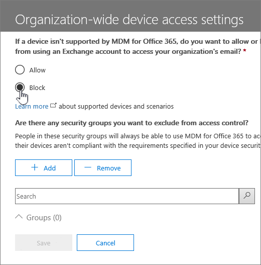

# Manage device access settings

If you're using Mobile Device Management (MDM) in Office 365, there may be devices that you can't manage by using MDM. If so, you should block Exchange ActiveSync app access to Office 365 email for mobile devices that are  *not*  supported by MDM for Office 365. This will help secure your organization's information across more devices. 
  
To do this:
  
1. In the Security &amp; Compliance Center, go to **Data loss prevention\>Device security policies**.
    
2. Select **Manage organization-wide device access settings**.
    
    
  
3. Select **Block**.
    
    
  
4. Select **Save**.
    
    
  
To learn what devices MDM for Office 365 supports, see [Capabilities of Mobile Device Management for Office 365](capabilities-of-mobile-device-management.md).
  

