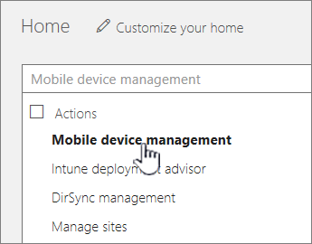

# Manage devices enrolled in Mobile Device Management in Office 365

The built-in Mobile Device Management for Office 365 helps you secure and manage your users' mobile devices like iPhones, iPads, Androids, and Windows phones. The first step is to sign in to Office 365 and [set up MDM for Office 365](set-up-mobile-device-management.md). 
  
After you've set it up, the people in your organization must [enroll their devices](enroll-your-mobile-device.md) in the service. Then you can use MDM for Office 365 to help manage devices in your organization. For example, you can use device security policies to help limit email access or other services, view devices reports, and remotely wipe a device. You'll typically go to the [Go to the Office 365 Security &amp; Compliance Center](https://support.office.com/article/7e696a40-b86b-4a20-afcc-559218b7b1b8) to do these tasks. 
  
## Device management tasks

To get to the device management panel, follow these steps. 
  
1. Go to the Office 365 admin center.
    
2. Type Mobile Device Management into the search field, and select **Mobile Device Management** from the list of results. 
    
    
  
After you've got MDM for Office 365 set up, here's how you can manage the mobile devices in your organization. 
  
|**To do this…**|**Do this**|
|:-----|:-----|
|Wipe a device    |In the Device Management panel, select  *device name*  , then **Full wipe** to delete all information or **Selective wipe** to delete only organizational information on the device.    See [Wipe a device in Office 365](wipe-a-mobile-device.md).    |
|Block unsupported devices from accessing Exchange email using Exchange ActiveSync    |In the Device Management panel, select **Block**.    |
|Set up device policies like password requirements and security settings    |In the Device Management panel, click \> **Device security policies** \> **Add +**.    See [Create and deploy device security policies](create-device-security-policies.md).    |
|View list of blocked devices    |In the Device Management panel, under **Select a view** select **Blocked**.    ||
|Unblock noncompliant or unsupported device for a user or group of users    | You can unblock noncompliant devices several ways depending on your situation. Pick one of the following:     Remove the user or users from the security group the policy has been applied to. Go to **Office 365 admin center** \> **Groups**, and then select  * group name *  . Click **Edit members and admins**.     Remove the security group the users are a member of from the device policy. Go to **Security &amp; Compliance Center**\> **Security policies** \> **Device security policies**. Select  * device policy name *  , then click **Edit**  \> **Deployment**.     Unblock all noncompliant devices for a device policy. Go to **Security &amp; Compliance Center**\> **Security policies** \> **Device security policies**. Select  *device policy name*  and then click **Edit**  \> **Access requirements**. Select **Allow access and report violation**.     To unblock a noncompliant or unsupported device for a user or a group of users, go to Go to **Security &amp; Compliance Center**\> **Security policies** \> **Device management** \> **Manage device access settings**. Add a security group with the members you want to exclude from being blocked access to Office 365. See [Create, edit, or delete a security group in the Office 365 admin center](https://support.office.com/article/55c96b32-e086-4c9e-948b-a018b44510cb).    |
|Get details about the devices in your organization    |To get details such as which devices are enrolled and compliant with device security policies, follow the steps outlined in [Get details about devices managed by MDM](get-details-about-mdm-managed-devices.md).    |
|Remove users so their devices are no longer managed by MDM    |Edit the security group which has device management policies for MDM to remove the user. See [Create, edit, or delete a security group in the Office 365 admin center](https://support.office.com/article/55c96b32-e086-4c9e-948b-a018b44510cb).    To remove MDM from all your Office 365 users, see [Turn off Mobile Device Management in Office 365](turn-off-mdm.md).    |
   

