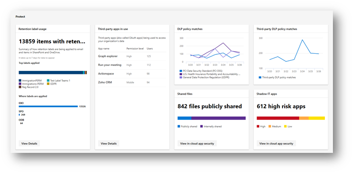
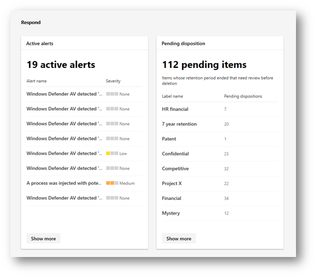
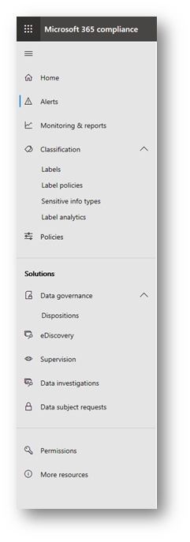

# Overview of the all-new Microsoft 365 compliance center

## Overview

If you're interested in your organization's compliance posture, you're going to love the new [Microsoft 365 compliance center](https://compliance.microsoft.com). The Microsoft 365 compliance center provides easy access to the data and tools you need to manage to your organization's compliance needs. 

Read this article to get acquainted with the Microsoft 365 compliance center, [how to get it](#how-do-i-get-this), [frequently asked questions](#frequently-asked-questions), and your [next steps](#next-steps).

## Welcome to Microsoft 365 compliance

When you go to your Microsoft 365 compliance center for the first time, you'll be greeted with the following welcome message:

The welcome banner gives you some pointers on how to get started, with next steps and an invitation for you to give us feedback.

## The Assess section

The **Assess** section on the home page shows you at a glance how your organization is doing with respect to [data protection and compliance](protect-access-to-data-and-services.md).

From here, you can go to the Microsoft Compliance Score card, which leads you to [Compliance Manager](meet-data-protection-and-regulatory-reqs-using-microsoft-cloud.md), where you can review or edit your configurations and potentially improve your overall compliance score.

You'll see additional cards, such as one showing your organization's cloud app compliance, and another showing data about users with shared files, with links to [Cloud App Security](https://docs.microsoft.com/cloud-app-security/) or other tools where you can explore data.

## The Protect section

The **Protect** section on the home page contains cards that provide you with high-level information about [labels](labels.md), [data loss prevention (DLP)](data-loss-prevention-policies.md), third-party apps in use, shared files, shadow IT apps, and so on. 

Each card has a link to a report or additional information where you can learn more.

## The Respond section

The **Respond** section on the home page surfaces [alerts](alerts.md) and [pending dispositions](disposition-reviews.md) that you'll want to review and potentially act upon.

Cards, such as the [Active alerts](alerts.md) card, include a link to a page where you can view more detailed information, such as Severity, Status, Category, and more.

 

## Easy navigation to more compliance features and capabilities

In addition to links in cards on the home page, you'll find a navigation pane on the left side of the screen that gives you easy access to your [alerts](alerts.md), [reports](reports-in-security-and-compliance.md), [policies](alert-policies.md), compliance solutions, and more. 

|  |  |
|---------|---------|
|  |   Go to **Alerts** to view and resolve [alerts](alerts.md)  Visit **Monitoring & reports** to view data about [label usage and retention](sensitivity-labels.md), [DLP policy matches and overrides](view-the-dlp-reports.md), [shared files](https://docs.microsoft.com/cloud-app-security/file-filters), [third-party apps in use](https://docs.microsoft.com/cloud-app-security/discovered-apps), and more.  Expand the **Classification** section to access your [labels](labels.md), [label policies](sensitivity-labels.md#what-label-policies-can-do), [sensitive information types](what-the-sensitive-information-types-look-for.md), and [label analytics](view-label-activity-for-documents.md).  Go to **Policies** to view [alerts](alerts.md) and to access your [DLP](data-loss-prevention-policies.md) and [retention](retention-policies.md) policies.   Use the links in the **Solutions** section to access your organization's compliance solutions. These include:  [Data governance > Dispositions](disposition-reviews.md) [eDiscovery (preview)](compliance20/overview-ediscovery-20.md) [Supervision](supervision-policies.md) [Data investigations](datainvestigations/overview-data-investigations.md) [Data subject requests](manage-gdpr-data-subject-requests-with-the-dsr-case-tool.md)        |

## How do I get this?

- If you don't have the new Microsoft 365 compliance center already, you will have it soon. The [new Microsoft 365 compliance center](microsoft-security-and-compliance.md#microsoft-365-compliance-center) will be generally available now.

- To visit the Microsoft 365 compliance center, as a global administrator or compliance administrator, go to [https://compliance.microsoft.com](https://compliance.microsoft.com) and sign in. 

- To learn more about requirements, see [Required licenses and permissions](microsoft-security-and-compliance.md#required-licenses-and-permissions).

## Frequently asked questions

### Why am I taken to the Office 365 Security & Compliance Center to perform some tasks, such as defining certain policies?

We are still developing the Microsoft 365 compliance center, and we'll be adding more functionality and solutions over the coming months. In the meantime, there are some tasks that must be performed in the Office 365 Security & Compliance Center ([https://protection.office.com](https://protection.office.com)). In those cases, you'll be directed automatically to the location where you can perform the task at hand, such as creating or editing a supervision policy.

### Why don't I see the new Microsoft 365 compliance center yet?

First, make sure you have the appropriate [licenses and permissions](microsoft-security-and-compliance.md#required-licenses-and-permissions). Then, sign in at [https://compliance.microsoft.com](https://compliance.microsoft.com). If you don't see the new compliance center yet, you will have it soon.

### I can't find some of my compliance settings. What do I do?

We are still adding functionality to the Microsoft 365 compliance center. If you can't find something, such as audit log search, try navigating to the Office 365 Security & Compliance Center ([https://protection.office.com](https://protection.office.com)). Your configurations will be saved in both the existing Office 365 Security & Compliance Center and in the new Microsoft 365 compliance center automatically.

## Next steps

- **Review your Microsoft Compliance Score**, and use Compliance Manager to improve your score. To learn more, see [Use Compliance Manager to help meet data protection and regulatory requirements when using Microsoft cloud services](meet-data-protection-and-regulatory-reqs-using-microsoft-cloud.md).

- **Review your organization's Data Loss Prevention policies** and make required adjustments as necessary. To learn more about, see [Overview of data loss prevention policies](data-loss-prevention-policies.md). 

- **Get acquainted with and set up Microsoft Cloud App Security**. See [Quickstart: Get started with Microsoft Cloud App Security](https://docs.microsoft.com/cloud-app-security/getting-started-with-cloud-app-security).  

- **Visit your Microsoft 365 compliance center often**, and make sure to review any alerts or potential risks that might arise. Go to [https://compliance.microsoft.com](https://compliance.microsoft.com) and sign in.