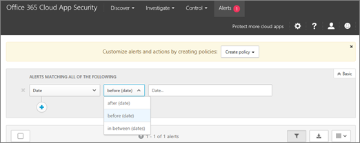
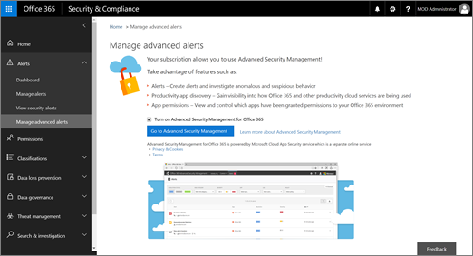
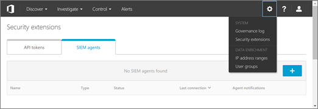

# Office 365 Cloud App Security updates during 2017
    
## Office 365 Cloud App Security release 112

*Released December 24, 2017* 
  
**Following [Microsoft Cloud App Security release 112](https://docs.microsoft.com/cloud-app-security/release-notes#cloud-app-security-release-112)**: 
  
- **Relevant insight drawer**. In the Activity log, you can now access the relevant insight drawer by clicking on a user name or IP address. 
    
    
  
- **Ability to view more activities with a click**. In the relevant insight drawer, you can click the clock icon to view all activities performed within 48 hours of a selected activity. 
    
    
  
- **Log parser improvements for Juniper SRX**. Improvements were made to the Cloud Discovery log parser for Juniper SRX. 
    
## Office 365 Cloud App Security release 111

*Released December 10, 2017* 
  
**Following [Microsoft Cloud App Security release 111](https://docs.microsoft.com/cloud-app-security/release-notes#cloud-app-security-release-111)**: 
  
- **Time filter improvements**. Time filters are now easier to use. To access a time filter, in a view, such as Activity log, Policies, Alerts, using the Advanced view, choose **Date** in the list of filters. Then choose an option, such as before, after, or in between to apply the time filter. 
    
    
  
## Office 365 Cloud App Security release 110

*Released November 26, 2017* 
  
**Following [Microsoft Cloud App Security release 110](https://docs.microsoft.com/cloud-app-security/release-notes#cloud-app-security-release-110)**: 
  
- **SIEM server integration now generally available**. Connect your SIEM server to Office 365 Cloud App Security. You can now send alerts and activities automatically to your SIEM server of choice by configuring SIEM Agents. See [Integrate your SIEM server with Office 365 Cloud App Security](integrate-your-siem-server-with-office-365-cas.md).
    
- **Easier access to help content**. Using the new question mark in the upper right corner, you can now access the help content from within the pages of the Office 365 Cloud App Security portal. Each link is context-sensitive, taking you to the information you need, based on the page you're on. 
    
- **Send us feedback**. Using the smiley face in the upper right corner, you can now send feedback from every page of the Office 365 Cloud App Security portal. This enables you to report bugs, request new features and share your experience directly with the Office 365 Cloud App Security team. 
    
## Office 365 Cloud App Security release 102

*Released August 13, 2017* 
  
**Following [Microsoft Cloud App Security release 102](https://docs.microsoft.com/cloud-app-security/release-notes#cloud-app-security-release-102)**: 
  
- **New user investigation actions** enable an added level of drill-down to user investigations. On an Investigate page, you can hover on an activity, user, or account and apply it as a filter, and from there, you can view related activities or events. 
    
## Office 365 Cloud App Security release 100

*Released July 17, 2017* 
  
**Following [Microsoft Cloud App Security release 100](https://docs.microsoft.com/cloud-app-security/release-notes#cloud-app-security-release-100)**: 
  
- **Security extensions** is a new dashboard where you can centrally manage all your security extensions for Office 365 Cloud App Security, including API tokens and SIEM agents. To view the Security extensions dashboard, follow these steps: 
    
1. Go to [https://protection.office.com](https://protection.office.com) and sign in using your work or school account for Office 365. (This takes you to the Security &amp; Compliance Center.) 
    
2. Go to **Alerts** \> **Manage advanced alerts**.
    
3. Choose **Go to Office 365 Cloud App Security**.
    
    
  
4. Choose **Settings** \> **Security extensions**.
    
    
  
- **Improved parsing**. Improvements were made in the Cloud Discovery log parsing mechanism. Internal errors are significantly less likely to occur. 
    
- **Expected log formats**. The expected log format for Cloud Discovery logs now provides examples for both Syslog format and FTP format. 
    
## Related topics

[Office 365 Cloud App Security help content](office-365-cas-help.md)
  
[Utilization activities after rolling out Office 365 Cloud App Security](utilization-activities-for-ocas.md)
  
[Permissions in the Office 365 Security &amp; Compliance Center](permissions-in-the-security-and-compliance-center.md)
  

