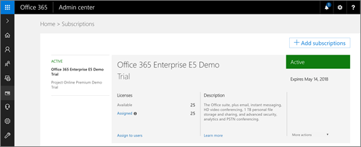

# Office 365 Advanced Threat Protection

Office 365 Advanced Threat Protection (ATP) helps to protect your organization from malicious attacks by:
  
- Scanning email attachments for malware with [ATP Safe Attachments](atp-safe-attachments.md)
    
- Scanning web addresses (URLs) in email messages and Office documents with [ATP Safe Links](atp-safe-links.md)
    
- Identifying and blocking malicious files in online libraries with [ATP for SharePoint, OneDrive, and Microsoft Teams](atp-for-spo-odb-and-teams.md)
    
- Checking email messages for unauthorized spoofing with [spoof intelligence](learn-about-spoof-intelligence.md)
    
- Detecting when someone attempts to impersonate your users and your organization's custom domains with [ATP anti-phishing capabilities in Office 365](atp-anti-phishing.md)
    
**Protection through Office 365 ATP is determined by policies that your organization's security team defines for Safe Links, Safe Attachments, and Anti-Phishing**. It's important to periodically review and revise your policies to keep them up to date and to take advantages of new features that are added to the service. [Reports are available](view-reports-for-atp.md) to show how ATP is working for your organization. These reports can also show you areas where you might need to review and update your policies. And, if you have files that are marked as malware that shouldn't be, or files you'd like Microsoft to examine, you can [submit a file to Microsoft for analysis](#submit-a-suspicious-file-to-microsoft-for-analysis).
      
## Get Office 365 ATP

> [!IMPORTANT]
> Office 365 ATP is included in subscriptions, such as Microsoft 365 Enterprise, Office 365 Enterprise E5, Office 365 Education A5, and [Microsoft 365 Business](https://support.office.com/article/c123694a-1efb-459e-a8d5-2187975373dc). If your organization has an Office 365 subscription that does not include Office 365 ATP, you can potentially purchase ATP as an add-on. For more information, see [Office 365 Advanced Threat Protection Service Description](https://technet.microsoft.com/library/exchange-online-advanced-threat-protection-service-description.aspx). 

1. As a global or security administrator, go to [https://portal.office.com](https://portal.office.com) and sign in with your work or school account for Office 365. 
    
2. Choose **Admin** \> **Billing** to see what your current subscription includes.  
  
3. If you see **Office 365 Enterprise E5**, **Office 365 Education A5**, or **Microsoft 365 Business**, then your organization has ATP.  If you see a different subscription, such as **Office 365 Enterprise E3** or **Office 365 Enterprise E1**, consider adding ATP. To do that, choose **+ Add subscription**.
    
Once you have ATP, the next step is for your security team to define policies. 
  
## Define policies for ATP

- **[Set up ATP anti-phishing policies in Office 365](set-up-anti-phishing-policies.md)** including impersonation-based attacks to protect against attackers who send email messages that appear to be from trusted people or domains 

- **[Set up ATP Safe Links policies in Office 365](set-up-atp-safe-links-policies.md)** including your organization's [custom blocked URLs list](set-up-a-custom-blocked-urls-list-wtih-atp.md) and [custom "Do not rewrite" URLs list](set-up-a-custom-do-not-rewrite-urls-list-with-atp.md)
    
- **[Set up ATP Safe Attachments policies in Office 365](set-up-atp-safe-attachments-policies.md)** that can include [dynamic delivery and previewing](dynamic-delivery-and-previewing.md)
  
## See how ATP is working by viewing reports

After your ATP policies are in place, reports are available to show how the service is working.

  
1. Make sure that you are an Office 365 global administrator, security administrator, or security reader. (See [Permissions in the Office 365 Security &amp; Compliance Center](permissions-in-the-security-and-compliance-center.md).)
    
2. [View reports for Advanced Threat Protection](view-reports-for-atp.md).
    
3. If needed, make adjustments to your security policies. See the following resources:

  - [ATP anti-phishing policies in Office 365](set-up-anti-phishing-policies.md)
    
  - [ATP Safe Links policies in Office 365](set-up-atp-safe-links-policies.md)
    
  - [ATP Safe Attachments policies in Office 365](set-up-atp-safe-attachments-policies.md)
    
    
## Submit a suspicious file to Microsoft for analysis

- If you get a file that you suspect could be malware, you can submit that file to Microsoft for analysis. Visit the [Windows Defender Security Intelligence submission portal](https://go.microsoft.com/fwlink/?linkid=857185).

- If you get an email message (with or without an attachment) that you'd like to submit to Microsoft for analysis, use the [Report Message add-in](enable-the-report-message-add-in.md). 
  
## Related topics

[View the reports for Advanced Threat Protection](view-reports-for-atp.md)
  
[Threat management in the Office 365 Security &amp; Compliance Center](threat-management.md)
  

