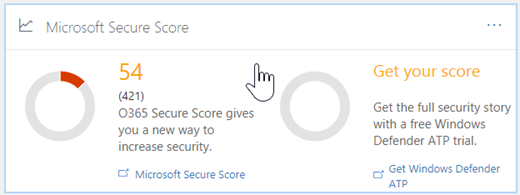
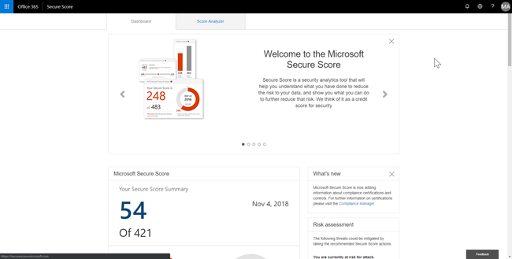
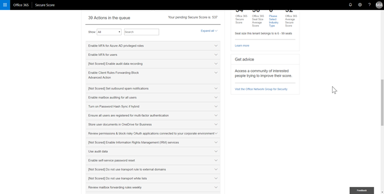
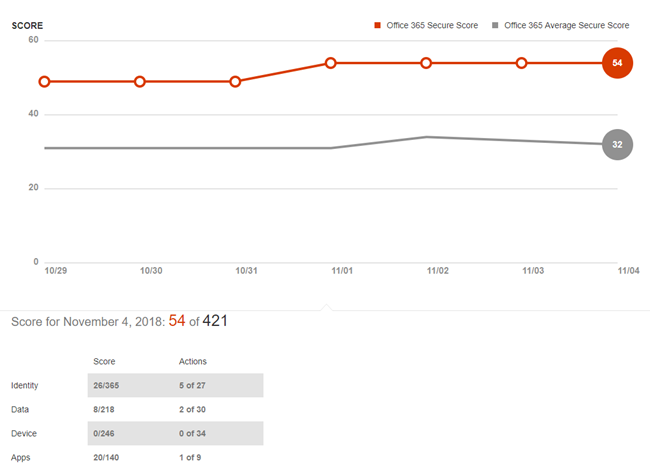

# Office 365 Secure Score

**Summary** Ever wonder how secure your organization really is in Office 365? Secure Score is here to help. Secure Score analyzes your organization's security  based on your regular activities and security settings in Office 365, and assigns a score. Read this article to get an overview of Secure Score and how you can use it.
  
## How to get to Secure Score

If your organization has a subscription that includes [Office 365 Enterprise](https://docs.microsoft.com/office365/enterprise/), [Microsoft 365 Business](https://docs.microsoft.com/microsoft-365/business/), or Office 365 Business Premium, and you have the necessary permissions, you can view your organization's secure score by visiting [https://securescore.office.com](https://securescore.office.com). 

Alternatively, you can visit the Security & Compliance Center ([https://protection.office.com](https://protection.office.com)), where you'll find a Secure Score widget that provides you with your current score.

The widget includes a link to Microsoft Secure Score, which takes you to your Secure Score dashboard for Office 365.

> [!NOTE]
> You must be an Office 365 administrator, such as a global admin or security admin, to access Secure Score.
  
## How it works

Secure Score figures out what Office 365 services you're using (such as OneDrive, SharePoint, and Exchange) then looks at your settings and activities and compares them to a baseline established by Microsoft. You'll get a score based on how aligned you are with best security practices.
  
You'll also get recommendations on steps you can take to improve your organization's score. 
  

  
Expand an action to learn about what steps to take, the threats it'll help protect you from, and how many points your score will increase once you follow the recommendation.
  

  
To see the impact of your actions on your organization's security, select the **Score Analyzer** tab and review your history. 
  

  
Below the chart, you'll see a list of scores and actions by category.
  

  
## How Secure Score helps

Using Secure Score helps increase your organization's security by encouraging you to use the built-in security features in Office 365 (many of which you already purchased but might not be aware of). Learning more about these features as you use the tool will help give you piece of mind that you're taking the right steps to protect your organization from threats.
  
But don't just take our word for it. Customers who are using Secure Score have seen their score increase five times more than customers who aren't using it. (The increase in their score corresponds with the security features being used in their organizations.)
  
Check out our [blog post](https://go.microsoft.com/fwlink/?linkid=836898) to learn more. 
  
> [!NOTE]
> Secure Score does not express an absolute measure of how likely you are to get breached. It expresses the extent to which you have adopted controls which can offset the risk of being breached. No service can guarantee that you will not be breached, and Secure Score should not be interpreted as a guarantee in any way. 
  
## FAQs

### Who can use Secure Score?

Anyone who has admin permissions (global admin or a custom admin role) for an Office 365 Enterprise, Microsoft 365 Business, or Office 365 Business Premium subscription can access Secure Score at [https://securescore.office.com](https://securescore.office.com). Users who aren't assigned an admin role won't be able to access Secure Score . However, admins can use the tool to share their results with other people in their organization. We're looking at including other, non-admin roles in the permissions list in the future. If there are specific roles you'd like us to consider, let us know by posting on the [Office Security, Privacy &amp; Compliance community](https://go.microsoft.com/fwlink/?linkid=836898).
  
### What does [Not Scored] mean?

Actions labeled as **[Not Scored]** are ones you can perform in your organization but won't be scored because they aren't hooked up in the tool (yet!). So, you can still improve your security, but you won't get credit for those actions right now. 
  
### How often is my score updated?

The score is calculated once per day (around 1:00 AM PST). If you make a change to a measured action, the score will automatically update the next day. It takes up to 48 hours for a change to be reflected in your score.
  
### Who can see my results?

Results are filtered to show scores only to people in your organization who are assigned an admin role (global admin or a custom admin role).
  
### My score changed. How do I figure out why?

On the **Score Analyzer** page, click a data point for a specific day, then scroll down to see the completed and incomplete actions for that day to find out what changed. 
  
### Does the Secure Score measure my risk of getting breached?

In short, no. Secure Score does not express an absolute measure of how likely you are to get breached. It expresses the extent to which you have adopted features that can offset the risk of being breached. No service can guarantee that you will not be breached, and the Secure Score should not be interpreted as a guarantee in any way.
  
### How should I interpret my score?

You're given points for configuring recommended security features or performing security-related tasks (such as viewing reports). Some actions are scored for partial completion, like enabling multi-factor authentication (MFA) for your users. Your Secure Score is directly representative of the Microsoft security services you use. Remember that security should always be balanced with usability. All security controls have a user impact component. Controls with low user impact should have little to no effect on your users' day-to-day operations.
  
To see your score history, go to the **Score Analyzer** page. Choose a specific date to see which controls were enabled for that day and what points you earned for each one. 
  
### I have an idea for another control. How do I let you know what it is?

We'd love to hear from you. Please post your ideas on the [Office Security, Privacy &amp; Compliance community](https://go.microsoft.com/fwlink/?linkid=836898). We're listening and want the Secure Score to include all options that are important to you.
  
### Something isn't working right. Who should I contact?

If you have any issues, please let us know by posting on the [Office Security, Privacy &amp; Compliance community](https://go.microsoft.com/fwlink/?linkid=836898). We're monitoring the community and will provide help.
  
### My organization only has certain security features. Does this affect my score?

Secure Score calculates your score based on the services you purchased. For example, if you only purchased an Exchange Online plan, you won't be scored for SharePoint Online security features. The denominator of the score is the sum of all the baselines for the controls that apply to the products you purchased. The numerator is the sum of all the controls for which you completed, or partially completed, the actions to fulfill that control.

## Related topics

[Security dashboard overview](security-dashboard.md)

[What subscription do I have?](https://docs.microsoft.com/office365/admin/admin-overview/what-subscription-do-i-have?view=o365-worldwide)
  

