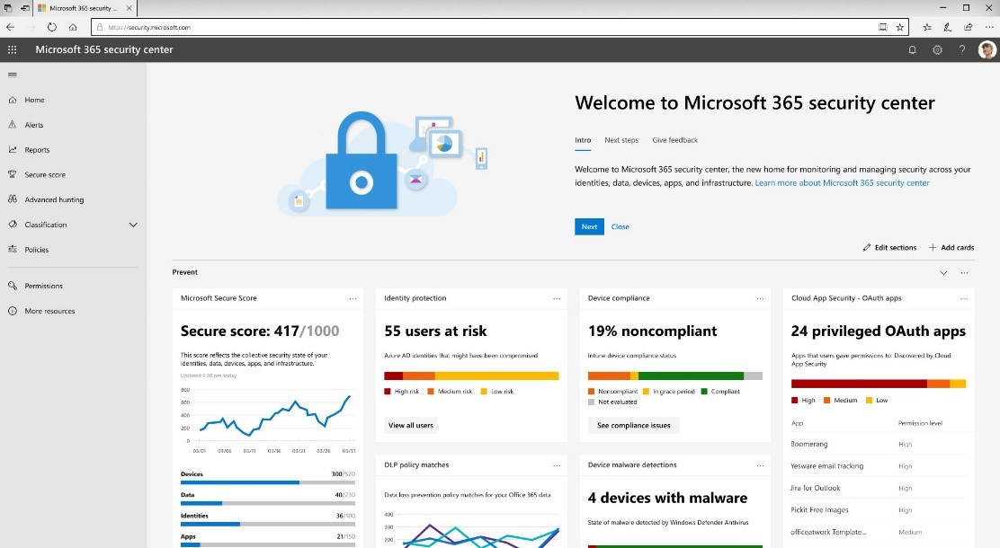

# Overview of the Microsoft 365 security center

Managing the security of your business to protect against an ever-evolving threat landscape brings many challenges. You might have too many security solutions with various places to configure lots of controls and don’t know which controls are the most effective and which will introduce new challenges for your workforce. It can be difficult for security teams to find the right balance of security and productivity.

Enter Microsoft 365 security center-- the new home for monitoring and managing security across your Microsoft identities, data, devices, apps, and infrastructure. Here you can easily view the security health of your organization, act to configure devices, users, and apps, and get alerts for suspicious activity. The Microsoft 365 security center is specifically intended for security admins and security operations teams to better manage and protect their organization.

The new Microsoft 365 security center and Microsoft 365 compliance center are specialized workspaces designed to meet the needs of security teams and compliance teams. These solutions are integrated across Microsoft 365 services and provide actionable insights to help reduce risks and safeguard your digital estate.

[Learn more and get ready](https://docs.microsoft.com/en-us/office365/securitycompliance/microsoft-security-and-compliance) for the new Microsoft 365 security center and the Microsoft 365 compliance center.

Visit the Microsoft 365 security center at security.microsoft.com.  

## Let's take a closer look

The Home page shows many of the common cards that security teams need. The composition of cards and data is dependent on the user role. Because the Microsoft 365 security center uses role-based access control, different roles will see cards that are more meaningful to their day to day jobs.  

This at-a-glance information helps you keep up with the latest activities in your organization. The Microsoft 365 security center brings together signals from a variety of sources to present a holistic view of your Microsoft 365 environment.

The Microsoft 365 security center pages include:

* **Home** – Get at-a-glance view of the overall security health of your organization.
* **Alerts** – Have greater visibility into all the alerts across your Microsoft 356 environment, including alerts from Microsoft Cloud App Security, Office 365 ATP, Azure AD, and Windows Defender ATP. Available to E3 and E5 customers.  
* **Monitoring & reports** – Get the detail and information you need to better protect your users, devices, apps, and more. 
* **Secure score** – Improve your overall security posture with Microsoft Secure Score. This page provides an all up summary of the different security features and capabilities you’ve enabled and includes recommendations for areas to improve.
* **Hunting** – Proactively search for malware, suspicious files, and activities in your Microsoft 365 organization.
* **Classification** – Help protect data loss by adding labels to classify documents, email messages, documents, sites, and more. When a label is applied (automatically or by the user), the content or site is protected based on the settings you choose. For example, you can create labels that encrypt files, add content marking, and control user access to specific sites. Learn more about sensitivity labels.
* **Policies** - Set up policies to manage devices, protect against threats, and receive alerts about various activities in your org. Learn more about these policies.
* **Permissions** - Manage who in your organization has access to Microsoft 365 security center to view content and perform tasks. You can also assign Microsoft 365 permissions in the Azure AD Portal.

## Learn more

Explore these new and improved tools for monitoring, reviewing, and responding to your security needs.

* Review and improve your security posture holistically with Microsoft Secure Score
* Monitor and report the status of your identities, data, devices, apps, and infrastructure
* Proactively hunt for intrusion attempts and breach activity affecting your email, data, devices, and accounts
* Classification
* Policies