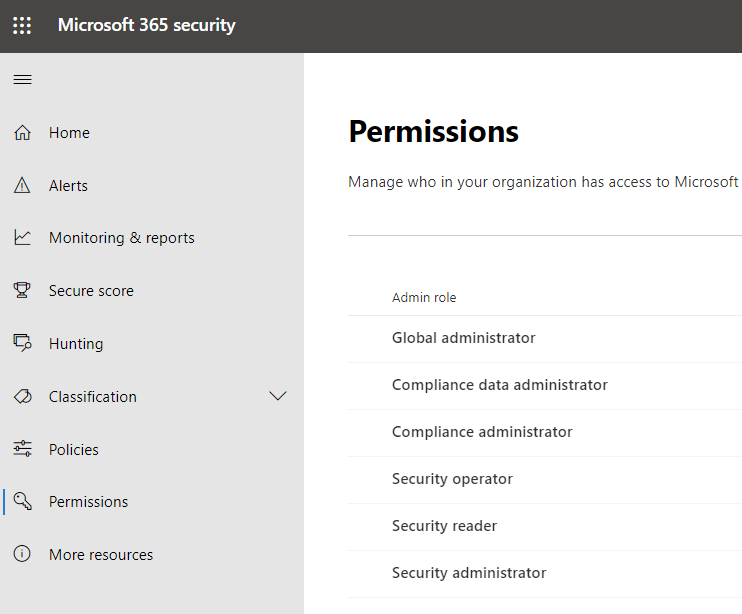
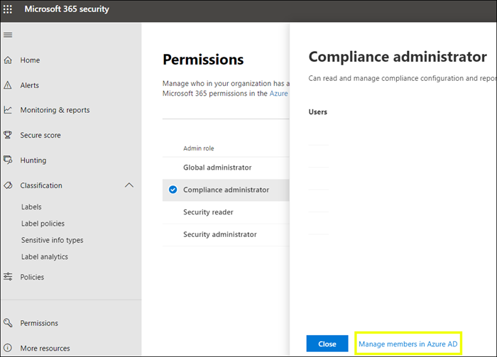
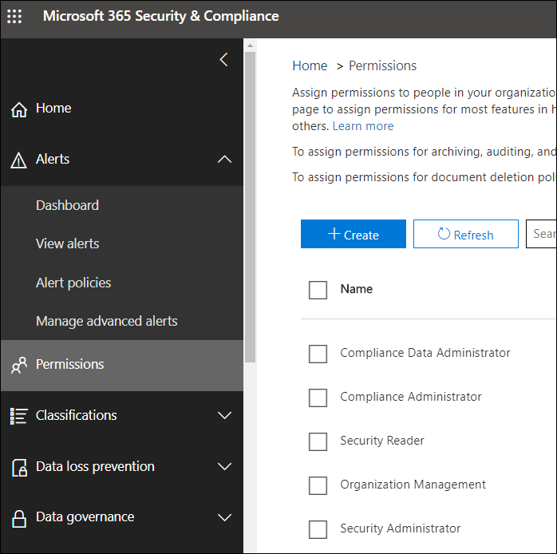

# Permissions in the Microsoft 365 compliance center and Microsoft 365 security center

Your organization needs to manage security and compliance scenarios that span all the Microsoft 365 services. And you need the flexibility to give the right admin permissions to the right people in your organization’s IT group. By using the Microsoft 365 security center or Microsoft 365 compliance center, you can manage permissions centrally for all tasks related to security or compliance.

After the global administrator assigns these admin roles, the admins have access to features and data that span all services in Microsoft 365, such as the Microsoft 365 security center, Microsoft 365 compliance center, Azure, Office 365, and Enterprise Mobility + Security.

## What the Microsoft 365 roles are

The roles that appear in the Microsoft 365 compliance center and Microsoft 365 security center are Azure Active Directory roles. These roles are designed to align with job functions in your organization’s IT group, making it easy to give a person all the permissions necessary to get their job done.

|**Role**|**Description**|
|:-----|:-----|
|**Global administrator**   |Users with this role have access to all administrative features in all Microsoft 365 services. Only global administrators can assign other administrator roles.    |
|**Compliance data administrator**   |Users with this role can keep track of your organization’s data across Microsoft 365, make sure it’s protected, and get insights into any issues to help mitigate risks.    |
|**Compliance administrator**   |Users with this role can help your organization stay compliant with any regulatory requirements, manage eDiscovery cases, and maintain data governance policies across Microsoft 365 locations, identities, and apps.    |
|**Security operator**   |Users with this role can view, investigate, and respond to active threats to your Microsoft 365 users, devices, and content.    |
|**Security reader**   |Users with this role can view and investigate active threats to your Microsoft 365 users, devices, and content, but (unlike the Security operator) they do not have permissions to respond by taking action.    |
|**Security administrator**   |Users with this role can control your organization’s overall security by managing security policies, reviewing security analytics and reports across Microsoft 365 products, and staying up-to-speed on the threat landscape.    |

## What the Microsoft 365 roles have access to

Here are the available roles and what people assigned to them can do.

### Global administrator

Users with this role have access to all administrative features in Azure Active Directory, as well as services that use Azure Active Directory identities like Microsoft 365 security center, Microsoft 365 compliance center, Exchange Online, SharePoint Online, and Skype for Business Online. The person who signs up for the Azure Active Directory tenant becomes a global administrator. Only global administrators can assign other administrator roles. There can be more than one global administrator at your company. Global admins can reset the password for any user and all other administrators.

### Compliance administrator

Users with this role have permissions to manage compliance-related features in the Microsoft 365 compliance center, Microsoft 365 admin center, Azure, and Office 365 Security & Compliance Center. Users can also manage all features within the Exchange admin center and Teams & Skype for Business admin center and create support tickets for Azure and Microsoft 365.

|**In this service…**|**The compliance administrator can...**|
|:-----|:-----|
|[**Microsoft 365 compliance center**](https://compliance.microsoft.com/)   |Protect and manage your organization’s data across Microsoft 365 services.  Manage compliance alerts.    |
|[**Compliance Manager**](https://docs.microsoft.com/office365/securitycompliance/meet-data-protection-and-regulatory-reqs-using-microsoft-cloud)   |Track, assign, and verify your organization's regulatory compliance activities.    |
|[**Office 365 Security & Compliance Center**](https://support.office.com/article/About-Office-365-admin-roles-da585eea-f576-4f55-a1e0-87090b6aaa9d)   |Manage data governance.  Perform legal and data investigation.   Manage Data Subject Request.
    |
|[**Intune**](https://docs.microsoft.com/intune/role-based-access-control)   |View all Intune audit data.    |
|[**Cloud App Security**](https://docs.microsoft.com/cloud-app-security/manage-admins)   |Has read-only permissions and can manage alerts.   Can create and modify file policies and allow file governance actions.   Can view all the built-in reports under Data Management.    |

### Compliance data administrator

Users with this role have permissions to protect and track data in the Microsoft 365 compliance center, Microsoft 365 admin center, and Azure. Users can also manage all features within the Exchange admin center, Compliance Manager, and Teams & Skype for Business admin center and create support tickets for Azure and Microsoft 365.

|**In this service…**|**The compliance administrator can...**|
|:-----|:-----|
|[**Microsoft 365 compliance center**](https://compliance.microsoft.com/)   |Protect and manage your organization’s data across Microsoft 365 services.  Manage compliance alerts.   Manage sensitivity labels   |
|[**Compliance Manager**](https://docs.microsoft.com/office365/securitycompliance/meet-data-protection-and-regulatory-reqs-using-microsoft-cloud)   |Track, assign, and verify your organization's regulatory compliance activities.    |
|[**Office 365 Security & Compliance Center**](https://support.office.com/article/About-Office-365-admin-roles-da585eea-f576-4f55-a1e0-87090b6aaa9d)   |Manage data governance.  Perform legal and data investigation.   Manage Data Subject Request.  Manage sensitivity labels   |
|[**Intune**](https://docs.microsoft.com/intune/role-based-access-control) (coming soon)   |View all Intune audit data.    |
|[**Cloud App Security**](https://docs.microsoft.com/cloud-app-security/manage-admins)   |Has read-only permissions and can manage alerts.   Can create and modify file policies and allow file governance actions.   Can view all the built-in reports under Data Management.    |

### Security administrator

Users with this role have permissions to manage security-related features in the Microsoft 365 security center, Azure Active Directory Identity Protection, Azure Information Protection, and Office 365 Security & Compliance Center.

|**In this service…**|**The compliance administrator can...**|
|:-----|:-----|
|[**Microsoft 365 security center**](https://security.microsoft.com/)   |Monitor security-related policies across Microsoft 365 services.   Manage security threats and alerts.   View reports.   Manage sensitivity labels.    |
|**Identity Protection Center**   |Do everything the Security Reader role can, plus  perform all Identity Protection Center operations, except for reset passwords.    |
|[**Privileged Identity Management**](https://docs.microsoft.com/azure/active-directory/privileged-identity-management/pim-configure)   |Do everything the Security Reader role can.   **Cannot** manage Azure AD role assignments or settings.   |
|[**Office 365 Security & Compliance Center**](https://support.office.com/article/About-Office-365-admin-roles-da585eea-f576-4f55-a1e0-87090b6aaa9d)   |Manage security policies.  View, investigate, and respond to security threats   View reports.  Manage sensitivity labels.   |
|**Azure Advanced Threat Protection**   |Monitor and respond to suspicious security activity.    |
|**Windows Defender ATP and EDR**   |Assign roles.  Manage machine groups.  Configure endpoint threat detection and automated remediation.  View, investigate, and respond to alerts.    |
|[**Intune**](https://docs.microsoft.com/intune/role-based-access-control)   |Views user, device, enrollment, configuration, and application information.  **Cannot** make changes to Intune.   |
|[**Cloud App Security**](https://docs.microsoft.com/cloud-app-security/manage-admins)   |Add admins, add policies and settings, upload logs and perform governance actions.   |
|[**Azure Security Center**](https://docs.microsoft.com/azure/role-based-access-control/built-in-roles) (coming soon)   |View security policies, view security states, edit security policies, view alerts and recommendations, dismiss alerts and recommendations.    |
|[**Office 365 service health**](https://docs.microsoft.com/office365/enterprise/view-service-health)   |View the health of Office 365 services.    |

### Security operator

Users with this role can manage alerts and have global read-only access on security-related feature, including all information in Microsoft 365 security center, Azure Active Directory, Identity Protection, Privileged Identity Management, as well as the ability to read Azure Active Directory sign-in reports and audit logs, and in Office 365 Security & Compliance Center.

|**In this service…**|**The compliance administrator can...**|
|:-----|:-----|
|[**Microsoft 365 security center**](https://security.microsoft.com/)   |Do everything the Security Reader role can.  View, investigate, and respond to security alerts.   |
|**Identity Protection Center** (coming soon)  |Do everything the Security Reader role can.    |
|[**Privileged Identity Management**](https://docs.microsoft.com/azure/active-directory/privileged-identity-management/pim-configure)   |Do everything the Security Reader role can.   |
|[**Office 365 Security & Compliance Center**](https://support.office.com/article/About-Office-365-admin-roles-da585eea-f576-4f55-a1e0-87090b6aaa9d)   |Do everything the Security Reader role can.  View, investigate, and respond to security threats    |
|**Windows Defender ATP and EDR**   |Assign roles.  Manage machine groups.  Configure endpoint threat detection and automated remediation.  View, investigate, and respond to alerts.    |
|[**Intune**](https://docs.microsoft.com/intune/role-based-access-control)   |Views user, device, enrollment, configuration, and application information.  **Cannot** make changes to Intune.   |
|[**Cloud App Security**](https://docs.microsoft.com/cloud-app-security/manage-admins)   |Do everything the Security Reader role can, plus view and dismiss alerts.   |
|[**Office 365 service health**](https://docs.microsoft.com/office365/enterprise/view-service-health)   |View the health of Office 365 services.    |

### Security reader

Users with this role have global read-only access on security-related feature, including all information in Microsoft 365 security center, Azure Active Directory, Identity Protection, Privileged Identity Management, as well as the ability to read Azure Active Directory sign-in reports and audit logs, and in Office 365 Security & Compliance Center.

|**In this service…**|**The compliance administrator can...**|
|:-----|:-----|
|[**Microsoft 365 security center**](https://security.microsoft.com/)   |Monitor security-related policies across Microsoft 365 services.   Manage security threats and alerts.   View reports.    |
|**Identity Protection Center**   |Read all security reports and settings information for security features: Anti-spam, Encryption, Data loss prevention, Anti-malware, Advanced threat protection, Anti-phishing, Mailflow rules.  |
|[**Privileged Identity Management**](https://docs.microsoft.com/azure/active-directory/privileged-identity-management/pim-configure)   |Use read-only access to view all information surfaced in Azure AD PIM: Policies and reports for Azure AD role assignments, security reviews, and (in the future) policy data and reports for scenarios other than Azure AD role assignment.  **Cannot** sign up for Azure AD PIM or make any changes to it. In the PIM portal or via PowerShell, someone in this role can activate additional roles (for example, Global Admin or Privileged Role Administrator), if the user is a eligible for them.   |
|[**Office 365 Security & Compliance Center**](https://support.office.com/article/About-Office-365-admin-roles-da585eea-f576-4f55-a1e0-87090b6aaa9d)   |View security policies.  View and investigate security threats   View reports.   |
|**Windows Defender ATP and EDR**   |View and investigate alerts.    |
|[**Intune**](https://docs.microsoft.com/intune/role-based-access-control)   |Views user, device, enrollment, configuration, and application information.  **Cannot** make changes to Intune.   |
|[**Cloud App Security**](https://docs.microsoft.com/cloud-app-security/manage-admins)   |Use read-only permissions to view information.  Manage alerts.   |
|[**Azure Security Center**](https://docs.microsoft.com/azure/role-based-access-control/built-in-roles)   |View recommendations and alerts.  View security policies.  View security states, but cannot make changes.    |
|[**Office 365 service health**](https://docs.microsoft.com/office365/enterprise/view-service-health)   |View the health of Office 365 services.    |

## Global administrators can manage roles in Azure Active Directory

In the Microsoft 365 compliance center and Microsoft 365 security center, when you select a role, you can view its assignments. But to manage those assignments, you need to go to the Azure Active Directory.

For more information, see [View and assign administrator roles in Azure Active Directory](https://docs.microsoft.com/en-us/azure/active-directory/users-groups-roles/directory-manage-roles-portal).

## Managing roles in a service instead of Azure Active Directory

The roles that appear in the Microsoft 365 compliance center and Microsoft 365 security center also appear in the services where they have permissions. For example, you can see these roles in the Office 365 Security & Compliance Center.

### Breaking inheritance

It’s important to understand that you when you manage these roles in Azure Active Directory, you’re doing so centrally for **all** Microsoft 365 services. However, when you manage a role in a specific service, such as the Office 365 Security & Compliance Center, you’re managing the role for **only** that specific service. The assignments and permissions for a role in a service override any permissions granted to the Azure Active Directory role.

This can be useful – for example, if a person is assigned to the Security administrator role, they don’t have permissions to manage incidents. But you can use the permissions in Windows Defender Advanced Threat Protection to give them the specific permission for incident management in that service.

## Where to find role information for each Microsoft 365 service

By assigning a user to one of the Microsoft 365 compliance or security admin roles, you give that user permissions to a range of Microsoft 365 services. Use the links below to find more specific information about the permissions for a role in each service.

|**Microsoft 365 service**|**Role info**|
|:-----|:-----|
|Admin roles in Office 365 and Microsoft 365 business plans   |[Office 365 admin roles](https://docs.microsoft.com/office365/admin/add-users/about-admin-roles?view=o365-worldwide)    |
|Azure Active Directory (Azure AD) and Azure AD Identity Protection   |[Azure AD admin roles](https://docs.microsoft.com/en-us/azure/active-directory/users-groups-roles/directory-assign-admin-roles)    |
|Azure Advanced Threat Protection   |[Azure ATP role groups](https://docs.microsoft.com/azure-advanced-threat-protection/atp-role-groups)    |
|Azure Information Protection   |[Azure AD admin roles](https://docs.microsoft.com/en-us/azure/active-directory/users-groups-roles/directory-assign-admin-roles)    |
|Compliance Manager   |[Compliance Manager roles](https://docs.microsoft.com/office365/securitycompliance/meet-data-protection-and-regulatory-reqs-using-microsoft-cloud#permissions-and-role-based-access-control)    |
|Exchange Online   |[Exchange role-based access control](https://docs.microsoft.com/exchange/understanding-role-based-access-control-exchange-2013-help)    |
|Intune   |[Intune role-based access control](https://docs.microsoft.com/intune/role-based-access-control)    |
|Managed Desktop   |[Azure AD admin roles](https://docs.microsoft.com/en-us/azure/active-directory/users-groups-roles/directory-assign-admin-roles)    |
|Microsoft Cloud App Security   |[Role-based access control](https://docs.microsoft.com/cloud-app-security/manage-admins)    |
|Office 365 Security & Compliance Center   |[Office 365 admin roles](https://docs.microsoft.com/office365/SecurityCompliance/permissions-in-the-security-and-compliance-center)    |
|Privileged Identity Management   |[Azure AD admin roles](https://docs.microsoft.com/en-us/azure/active-directory/users-groups-roles/directory-assign-admin-roles)    |
|Secure Score   |[Azure AD admin roles](https://docs.microsoft.com/en-us/azure/active-directory/users-groups-roles/directory-assign-admin-roles)    |
|SharePoint Online   |[Azure AD admin roles](https://docs.microsoft.com/en-us/azure/active-directory/users-groups-roles/directory-assign-admin-roles)  [About the SharePoint admin role in Office 365](https://docs.microsoft.com/sharepoint/sharepoint-admin-role)    |
|Teams/Skype for Business   |[Azure AD admin roles](https://docs.microsoft.com/en-us/azure/active-directory/users-groups-roles/directory-assign-admin-roles)    |
|Windows Defender Advanced Threat Protection   |[Windows Defender ATP role-based access control](https://docs.microsoft.com/windows/security/threat-protection/windows-defender-atp/rbac-windows-defender-advanced-threat-protection)    |

## What is coming soon

We’re still working on permissions in the Microsoft 365 compliance center and Microsoft 365 security center. For example, we’re currently working on support for the ability to:

- Manage roles in the Microsoft 365 compliance center and Microsoft 365 security center, instead of going to Azure Active Directory.
- Customize roles by adding or removing specific permissions.
- Create custom roles with permissions that you choose.
