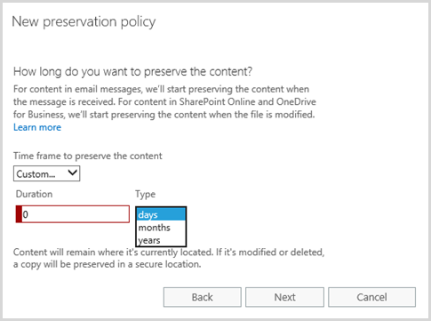
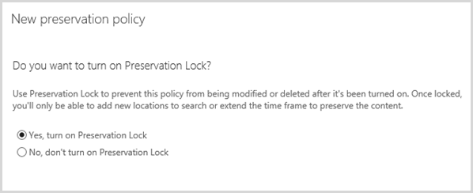
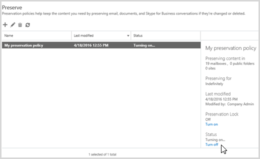

# Overview of preservation policies

> [!IMPORTANT]
> If you were using a preservation policy, that policy has been automatically converted to a retention policy, which is a new feature that does everything a preservation policy does and more. The preservation policy will continue to work and preserve your content without requiring any changes from you. You can find these policies on the **Retention** page in the Security &amp; Compliance Center. For more information, see [What happened to preservation policies?](retention-policies.md#preservation)
  
To comply with industry regulations or internal policies, organizations want to preserve content for a certain period of time. With a preservation policy in Office 365, you can preserve content in sites, mailboxes, and public folders indefinitely or for a specific duration. You can also filter the content that will be preserved by supplying keywords or a date range to narrow the results.
  
For example, you can preserve the content in specific mailboxes and sites belonging to the Sales Department for seven years, and further narrow the scope of the policy by saying that you want to preserve only content from the last two years that contains a specific client's name.
  
When content is subject to a preservation policy, people can continue to edit and work with the content as if nothing's changed because the content's preserved in place, in its original location. But if someone edits or deletes content that's subject to the policy, a copy is saved to a secure location where it's preserved while the policy is in effect.
  
Finally, some organizations may need to comply with rules defined by regulatory bodies such as the Securities and Exchange Commission (SEC) Rule 17a-4, which requires that after a preservation policy is turned on, it cannot be turned off or made less restrictive. To meet this requirement, you can use Preservation Lock. After a policy's been locked, no one—including the administrator—can turn off the policy or make it less restrictive.
  
You create and manage preservation policies on the Retention page in the Office 365 Security &amp; Compliance Center.
  

  
> [!NOTE]
> To include an Exchange Online mailbox in a preservation policy, the mailbox must be assigned an Exchange Online Plan 2 license. If a mailbox is assigned an Exchange Online Plan 1 license, you would have to assign it a separate Exchange Online Archiving license to include it in a preservation policy. 
  
## How a preservation policy works with content in place

When you include a site, mailbox, or public folder in a preservation policy, the content remains in its original location. People can continue to work with their documents or mail, but a copy of the content as it existed when you initiated the policy is preserved. For sites, content's preserved in the Preservation Hold library; for mailboxes and public folders, content's preserved in the Recoverable Items folder. These secure locations and the preserved content are not visible to most people. With a preservation policy, people do not even need to know their content is subject to the policy.
  

  
### Site content

A preservation policy is applied at the level of a site. When you include a site in a preservation policy, a Preservation Hold library is created, if one doesn't already exist. Most users can't view the Preservation Hold library because it's visible only to site collection owners.
  
If a person attempts to change or delete content in a site that's subject to a preservation policy, first the policy checks whether the content's been changed since the policy was applied. If this is the first change since the preservation policy was applied, the policy copies the content to the Preservation Hold library, and then allows the person to change or delete the original content. Note that any content in the site can be copied to the Preservation Hold library, even if the content does not match the filter of the query used by the preservation policy.
  
Then a timer job cleans up the Preservation Hold library. The timer job runs periodically and compares all content in the Preservation Hold library to the filters used by the preservation policies on the site. Unless content matches at least one of the filters, the timer job permanently deletes the content from the Preservation Hold library.
  
The previous applies to content that exists when the preservation policy is applied. In addition, any new content that's created or added to the site after it was included in the policy will be preserved after deletion. However, new content isn't copied to the Preservation Hold library the first time it's edited, only when it's deleted. To preserve versions for all files, you need to turn on versioning—see the later section on versioning.
  
### Mailbox and public folder content

For a user's mail and other items, a preservation policy is applied at the level of a mailbox. For a public folder, a preservation policy is applied at the folder level, not the mailbox level. Both a mailbox and a public folder use the Recoverable Items folder to preserve items. Only people that have been assigned eDiscovery permissions can view another user's Recoverable Items folder. 
  
By default, when a person deletes a message from a folder other than the Deleted Items folder, the message is moved to the Deleted Items folder. When a person deletes an item from the Deleted Items folder, the message is moved to the Recoverable Items folder and disappears from the user's view. In addition, a person can soft delete an item (SHIFT+DELETE) in any folder, which bypasses the Deleted Items folder and places the item directly in the Recoverable Items folder.
  
When a mailbox is included in a preservation policy, deleted items are moved to the DiscoveryHold folder inside the Recoverable Items folder. When the mailbox assistant periodically processes the mailbox, it evaluates messages in this folder. Unless content matches at least one of the filters used by a preservation policy, the mailbox assistant permanently deletes the content from the Recoverable Items folder.
  
The Recoverable Items folder also contains a Versions folder. When a person attempts to change certain properties of a mailbox item—such as the subject, body, attachments, senders and recipients, or date sent or received for a message—a copy of the original item is saved to the Versions folder before the change is committed. This happens for each subsequent change. After the preservation policy is removed, copies in the Versions folder are removed by the mailbox assistant.
  
### Where a preservation policy is stored

When you create a preservation policy, it's stored centrally in the Security &amp; Compliance Center and then deployed to the different content sources that the policy includes, such as sites, mailboxes, and public folders.
  
After a preservation policy is deployed to those content sources, the policy works exactly the same as an eDiscovery in-place hold. For more information on in-place holds, see:
  
- [Overview of eDiscovery and in-place holds](https://go.microsoft.com/fwlink/p/?LinkID=404352) (SharePoint Online) 
    
- [In-Place Hold and Litigation Hold](https://go.microsoft.com/fwlink/p/?LinkID=404353) (Exchange Online) 
    
- [Recoverable Items Folder](https://go.microsoft.com/fwlink/p/?LinkID=404354) (Exchange Online) 
    
### Preservation policy vs. eDiscovery hold

While it's true that both of these features hold content, these features should not be confused because they serve different purposes:
  
- **If you need to preserve content as part of a retention requirement, use a preservation policy.** For example, if you need to retain content for seven years as part of your retention plan, use a preservation policy. A preservation policy can preserve content for a specific time period, and at the end of that time period, the content's automatically released from the policy. The policy can also be locked so that no one can turn off the policy or make it less restrictive. An eDiscovery hold cannot be locked or specify a time period. Also, a preservation policy commonly has a duration of years, while an eDiscovery hold is temporary and commonly lasts only the duration of a legal case. 
    
    In addition, you can create a preservation policy without the additional steps that eDiscovery may require, such as creating cases, adding members, or doing content searches.
    
- **If you need to hold content as part of a legal or eDiscovery requirement, use an eDiscovery hold.** For example, if you need to hold content in specific locations as part of a legal request, use an eDiscovery hold. In eDiscovery, the content relevant to a case is typically sensitive or privileged, so different cases can be restricted to different members. In addition, eDiscovery supports content searches that can be saved, previewed, analyzed with Advanced eDiscovery, or have the results exported. 
    
    Unlike a preservation policy, an eDiscovery hold cannot specify a time period - an eDiscovery hold is in effect until you turn it off or delete it. Also, an eDiscovery hold cannot be locked.
    
## How a preservation policy works with document versions in a site

A preservation policy doesn't automatically preserve all versions of a document in a site. To do so, you need to turn on versioning for the document libraries in the site. For more information, see [Enable and configure versioning for a list or library](https://go.microsoft.com/fwlink/p/?LinkID=404350).
  
If a document is deleted from a site that's being preserved and document versioning is turned on for the library, all versions of the deleted document are preserved. 
  
If document versioning isn't turned on and an item is subject to several preservation policies, the version that's preserved is the one that's current when each preservation policy takes effect. For example, if version 27 of an item is the most recent when the site is preserved the first time, and version 51 is the most recent when the site is preserved the second time, versions 27 and 51 are preserved.
  
## Filtering a preservation policy

You can narrow down the content subject to a preservation policy by adding keywords or a date range to the policy. 
  

  
### Filter by using keywords

A preservation policy supports Keyword Query Language (KQL). For example, you can use basic operators like AND and OR, and you can do a proximity search where "wingtip NEAR(30) marketing" identifies results where "wingtip" is within 30 characters of "marketing". A keyword query helps you to identify and preserve just the relevant content.
  
### Filter by using a date range

You can also filter the policy so that it preserves only content within a specific date range. For messages, the date is relative to the received date, and for documents and sites, the date is relative to the modified date. This means you can preserve content that includes mail received and documents modified within a specific date range or before or after a start or end date.
  
## Preserving content for a specific period of time

With a preservation policy, you can preserve content indefinitely or for a specific number of days, months, or years. Note that the duration for how long content is preserved is calculated from the age of the content, not from when the preservation policy is created. 
  
For example, if you want to preserve content in a site for seven years, and a document in that site hasn't been modified in six years, the document will be preserved for only another year if it's not modified. If the document is edited again, the age of the document is calculated from the new last modified date, and it will be preserved for another seven years.
  
Similarly, if you want to preserve content in a mailbox for seven years, and a message was sent six years ago, the message will be preserved for only one year unless the date received is modified. In this case, a new version of the message as it existed before it was edited is preserved in the Recoverable Items folder, and the age of the message is calculated from the new date received, and it will be preserved for another seven years.
  

  
## Locking a preservation policy

Some organizations may need to comply with rules defined by regulatory bodies such as the Securities and Exchange Commission (SEC) Rule 17a-4, which requires that after a preservation policy is turned on, it cannot be turned off or made less restrictive. With Preservation Lock, you can lock the policy so that no one—including the administrator—can turn off the policy or make it less restrictive.
  
After a policy's been locked, no one can turn it off or remove content from the policy. And it's not possible to modify or delete content that's subject to the policy during the preservation period. After the policy's been locked, the only ways you can modify the preservation policy are by adding content to it or extending its duration. A locked policy can be increased or extended, but it can't be reduced or turned off.
  
Therefore, before you lock a preservation policy, it's critical that you understand your organization's compliance requirements, and that you do not lock a policy until you are certain that it's what you need.
  

  
## Turning off a preservation policy

If you choose not to lock the preservation policy, you can release it at any time, including before the end of the time period specified by the policy. To do so, just turn off the policy.
  

  
However, you can't delete a preservation policy while the policy's still active. To delete a preservation policy, first turn off and then delete the policy.
  
After you turn off a preservation policy, all items subject to that policy in the Preservation Hold library or Recoverable Items folder are eligible for the standard cleanup process described earlier. Note that this means that items released from a policy are not immediately deleted; instead, they remain in the Preservation Hold library or Recoverable Items folder until the process periodically cleans up the library or folder.
  
## Using preservation policies with retention policies and document deletion policies

A preservation policy ensures that content is preserved indefinitely or for a specific period of time, while a retention policy for a mailbox and a document deletion policy for a site ensures that content is deleted after a specific period of time. If you need to retain content for a fixed period of time, you can use a preservation policy in conjunction with a retention or deletion policy. 
  
### Site content

For a site, you can use a preservation policy in conjunction with a document deletion policy. For example, you could preserve documents for five years after they are modified, and then set up a deletion policy to delete them five years after they were last modified.
  
If a document deletion policy deletes content that's subject to a preservation policy, the content will still be preserved in the Preservation Hold library. For example, if a preservation policy preserves content for two years, but a document deletion policy deletes content after one year, any content that's deleted will still be preserved. For more information, see [Overview of document deletion policies](https://support.office.com/article/55e8d858-f278-482b-a198-2e62d6a2e6e5).
  
### Mailbox content

For a mailbox, you can combine a preservation policy with a retention policy that has a single default policy tag. For example, you could preserve mailbox items for seven years, and then set up a retention policy to delete them seven years after they were received (for messages) or created (for items that aren't sent, like notes). The preservation policy ensures that items that get deleted are preserved for at least the specified duration, while the retention policy ensures that mailbox items are deleted at the end of that period. For more information, see [Retention tags and retention policies](https://go.microsoft.com/fwlink/p/?LinkID=404351).
  
## Permissions

Members of your compliance team who will use the Security &amp; Compliance Center to create preservation policies need permissions to the:
  
-  Office 365 Security &amp; Compliance Center 
    
- Sites with content that needs to be preserved
    
- Mailboxes with content that needs to be preserved
    
### Office 365 Security &amp; Compliance Center

As a tenant admin, you want to be able to give compliance officers and other people access to the Security &amp; Compliance Center, without giving them all of the permissions of a tenant admin. For more information, see [Permissions in the Office 365 Security &amp; Compliance Center](permissions-in-the-security-and-compliance-center.md).
  
### Sites

Members of your compliance team who create preservation policies need permissions to the site collections to which policies will be applied. In addition, if compliance officers also create document deletion policies, they need permissions to the Compliance Policy Center site collection where document deletion policies are created and stored. We recommend that you:
  
1. Create a security group that contains all users of the Compliance Policy Center — most likely your compliance policy-management team. See [Manage Mail-Enabled Security Groups](https://go.microsoft.com/fwlink/p/?LinkID=404345) for more information. 
    
2. In the Compliance Policy Center, add the security group to the site collection Owners group. See [Permissions for site collection administrators](https://go.microsoft.com/fwlink/p/?LinkID=404346) for more information. 
    
3. In each site collection to which you need to assign preservation policies, add the security group to the site collection Visitors group (read permissions).
    
### Mailboxes and public folders

To apply a preservation policy to a mailbox, compliance officers need at least read permissions for that mailbox. 
  
To apply a preservation policy to a public folder, compliance officers need at least read permissions for all of the public folders.
  

