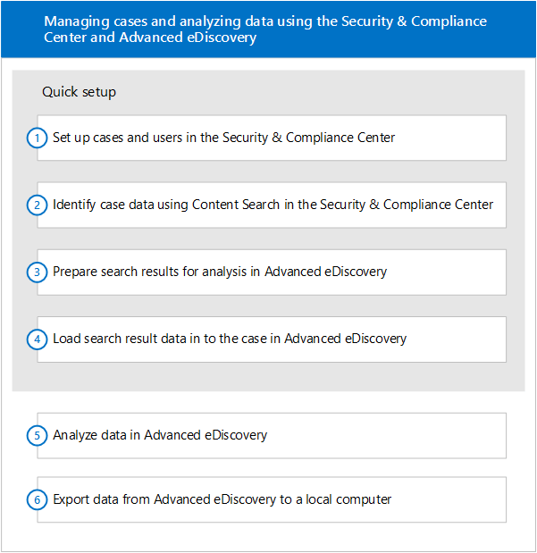

# Quick setup for Office 365 Advanced eDiscovery

This setup section shows an Office 365 Security &amp; Compliance Center eDiscovery manager how to get started with Advanced eDiscovery. A working knowledge of both is assumed.
  
> [!NOTE]
> Advanced eDiscovery requires an Office 365 E3 with the Advanced Compliance add-on or E5 subscription for your organization. If you don't have that plan and want to try Advanced eDiscovery, you can [sign up for a trial of Office 365 Enterprise E5](https://go.microsoft.com/fwlink/p/?LinkID=698279). 
  
## Accessing a case in Advanced eDiscovery

You access Advanced eDiscovery from the Security &amp; Compliance Center. You have to be a member of an eDiscovery case in the Security &amp; Compliance Center to access the case in Advanced eDiscovery. For instructions about assigning eDiscovery case permissions and adding users to an eDiscovery case, see [Manage eDiscovery cases in Office 365](manage-ediscovery-cases.md). 
  
To go to a case in Advanced eDiscovery: 
  
1. [Go to the Office 365 Security &amp; Compliance Center](go-to-the-securitycompliance-center.md) . 
    
2. In the Security &amp; Compliance Center, click **Search &amp; investigation** \> **eDiscovery** to display the list of cases in your organization. 
    
3. On the **eDiscovery** page, click **Open** next to the case that you want to go to in Advanced eDiscovery. 
    
4. On the **Home** page for the case, click **Advanced eDiscovery**.
    
    The **Connecting to Advanced eDiscovery** progress bar is displayed. When you're connected, the case is opened in Advanced eDiscovery. 
    
## Workflow

The following diagram illustrates the common workflow for managing and using eDiscovery cases in the Security &amp; Compliance Center and Advanced eDiscovery. 
  

  
This setup section describes the first four steps in the workflow. For a description of the other steps in the workflow, see the following.
  
## Analyze

[Analyzing case data](analyze-case-data-with-advanced-ediscovery.md) Identifies and organizes the files by various parameters, enables the use of Themes, and displays the results. Analyze functionality can be customized by the user in order to achieve enhanced results. 
  
## Relevance Setup and Relevance

[Relevance Setup](manage-relevance-setup-in-advanced-ediscovery.md) and [Using the Relevance module](use-relevance-in-advanced-ediscovery.md) Enables assessment and relevance training based on a random sample of files and uses them to apply decisions to the predictive coding process. Calculates and displays interim results while monitoring statistical validity of the process. Displays the results to facilitate in making review decisions. 
  
## Export

[Exporting case data](export-case-data-in-advanced-ediscovery.md) Enables the exporting of Advanced eDiscovery content and results for external review. 
  
## Report

[Running reports](run-reports-in-advanced-ediscovery.md) Enables the generation of selected reports related to Advanced eDiscovery processing. 
  
## See also

[Office 365 Advanced eDiscovery](office-365-advanced-ediscovery.md)
  
[Setting up users and cases](set-up-users-and-cases-in-advanced-ediscovery.md)
  
[Preparing data](prepare-data-for-advanced-ediscovery.md)

