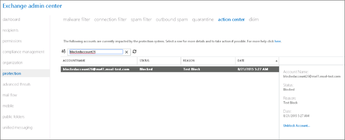
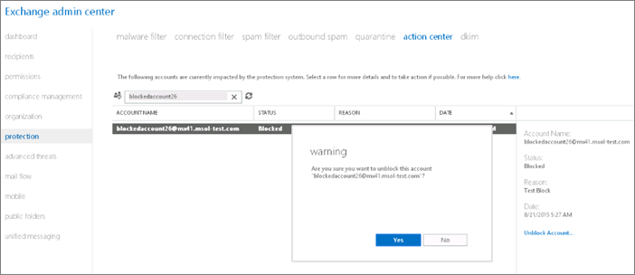

# Removing a user, domain, or IP address from a block list after sending spam email

If a user continuously sends email messages from Office 365 that is classified as spam, they will be blocked from sending any more messages. 
  
When a sender is blocked from sending emails messages, they receive a Non-Delivery Report (NDR or email failed to send message) that provides specific information about the steps that they have to take to unblock themselves.
  
Not only can individual users be blocked by the service, but specific websites, domains, and IP addresses can also be blocked. In some cases, domains or websites can be added to a block list just because they appear in a spam message. As the Office 365 admin, you can try to get users, websites, domains, and IP addresses removed from third-party block lists. Use the links in the table at the bottom of this topic to contact each third party, and then follow the instructions. If someone outside Office 365 cannot send messages to your Office 365 account, their account may have ended up on the external blocked senders list. Users outside Office 365 can try to remove themselves from the blocked senders list by using the [self-service delisting portal](https://technet.microsoft.com/library/mt661881%28v=exchg.150%29.aspx).
  
You can configure outbound spam settings so that you get anotification when an Office 365 user is blocked from sending email that's classified as spam. After the problem with the user's mailbox is resolved, you can remove the block on that sender.
  
## Unblock a blocked Office 365 email account

You complete this task in the Exchange admin center (EAC). Check out [Exchange admin center in Exchange Online Protection](exchange-admin-center-in-exchange-online-protection-eop.md) for details about the EAC. 
  
> [!NOTE]
> You won't see the action center unless you're in the EAC for Exchange Online. 
  
1. In the EAC, navigate to **protection** \> **action center**.
    
    
  
2. Select the **Search** icon, and then enter the SMTP address of the blocked user. 
    
    
  
3. Click **Unblock Account** in the description pane. 
    
    
  
4. Click **Yes** to confirm the change. 
    
> [!NOTE]
> There's a limit to the number of times that an account can be unblocked by the tenant admin. If the limit for a user has been exceeded, an error message appears. Contact Support to unblock the user. 
  
## Third-party block lists

|**List Name**|**Delisting Portal**|**For more information**|
|:-----|:-----|:-----|
|URIBL    |[https://admin.uribl.com/?section=lookup](https://admin.uribl.com/?section=lookup)   |[ URIBL website ](https://uribl.com/)   |
|SURBL    |[http://www.surbl.org/surbl-analysis](http://www.surbl.org/surbl-analysis)   |[Introducing SURBL URI reputation data](http://www.surbl.org/)   |
|Spamhaus    |[https://www.spamhaus.org/lookup/](https://www.spamhaus.org/lookup/)   |[Understanding DNSBL Filtering](https://www.spamhaus.org/whitepapers/dnsbl_function/)   |
|invaluement    |[http://dnsbl.invaluement.com/lookup/](http://dnsbl.invaluement.com/lookup/)   |[invaluement anti-spam list](http://dnsbl.invaluement.com/)   |
|Phishtank    |[https://www.phishtank.com/](https://www.phishtank.com/)   |[PhishTank FAQ](https://www.phishtank.com/faq.php)   |
   
> [!NOTE]
> Exchange Online Protection also uses third-party block lists for spam filtering. 
   
## For more information

[Configure the outbound spam policy](configure-the-outbound-spam-policy.md)
  
[High-risk delivery pool for outbound messages](high-risk-delivery-pool-for-outbound-messages.md)

[Use the delist portal to remove yourself from the Office 365 blocked senders list](use-the-delist-portal-to-remove-yourself-from-the-office-365-blocked-senders-lis.md)
  

  

