# Overview of retention policies

For most organizations, the volume and complexity of their data is increasing daily - email, documents, instant messages, and more. Effectively managing or governing this information is important because you need to:
  
- **Comply proactively with industry regulations and internal policies** that require you to retain content for a minimum period of time - for example, the Sarbanes-Oxley Act might require you to retain certain types of content for seven years. 
    
- **Reduce your risk in the event of litigation or a security breach** by permanently deleting old content that you're no longer required to keep. 
    
- **Help your organization to share knowledge effectively and be more agile** by ensuring that your users work only with content that's current and relevant to them. 
    
A retention policy in Office 365 can help you achieve all of these goals. Managing content commonly requires two actions:
  
- **Retaining** content so that it can't be permanently deleted before the end of the retention period. 
    
- **Deleting** content permanently at the end of the retention period. 
    
With a retention policy, you can:
  
- Decide proactively whether to retain content, delete content, or both - retain and then delete the content.
    
- Apply a single policy to the entire organization or just specific locations or users.
    
- Apply a policy to all content or just content meeting certain conditions, such as content containing specific keywords or [specific types of sensitive information](what-the-sensitive-information-types-look-for.md).
    
When content is subject to a retention policy, people can continue to edit and work with the content as if nothing's changed because the content is retained in place, in its original location. But if someone edits or deletes content that's subject to the policy, a copy is saved to a secure location where it's retained while the policy is in effect.
  
Finally, some organizations might need to comply with regulations such as Securities and Exchange Commission (SEC) Rule 17a-4, which requires that after a retention policy is turned on, it cannot be turned off or made less restrictive. To meet this requirement, you can use Preservation Lock. After a policy's been locked, no one—including the administrator—can turn off the policy or make it less restrictive.
  
You create and manage retention policies on the **Retention** page in the Office 365 Security &amp; Compliance Center. 
  
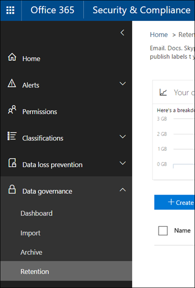
  
  
## How a retention policy works with content in place

When you include a location such as a site or mailbox in a retention policy, the content remains in its original location. People can continue to work with their documents or mail as if nothing's changed. But if they edit or delete content that's included in the policy, a copy of the content as it existed when you applied the policy is retained.
  
For Sharepoint site collections, a copy of the original content is retained in the Preservation Hold library when users edit or delete it; for email and public folders, the copy is retained in the Recoverable Items folder. These secure locations and the retained content are not visible to most people. With a retention policy, people do not even need to know that their content is subject to the policy.
  
Notes:
  
- Skype content is stored in Exchange, where the policy is applied based on message type (email or conversation).
    
- A retention policy applied to an Office 365 group includes both the group mailbox and site.
    
### Content in OneDrive accounts and SharePoint sites

A retention policy is applied at the level of a site collection. When you include a SharePoint site collection or OneDrive account in a retention policy, a Preservation Hold library will be created, if one doesn't already exist. You can view this library on the **Site contents** page in the top-level site of the site collection. Most users can't view the Preservation Hold library because it's visible only to site collection administrators.
  
If a person attempts to change or delete content in a site that's subject to a retention policy, first the policy checks whether the content's been changed since the policy was applied. If this is the first change since the policy was applied, the retention policy copies the content to the Preservation Hold library, and then allows the person to change or delete the original content. Note that any content in the site collection can be copied to the Preservation Hold library, even if the content does not match the query used by the retention policy.
  
Then a timer job cleans up the Preservation Hold library. The timer job runs periodically and compares all content in the Preservation Hold library to all of the queries used by the retention policies on the site. Unless content matches at least one of the queries, the timer job permanently deletes the content from the Preservation Hold library.
  
The previous applies to content that exists when the retention policy is applied. In addition, any new content that's created or added to the site collection after it was included in the policy will be retained after deletion. However, new content isn't copied to the Preservation Hold library the first time it's edited, only when it's deleted. To retain all versions of a file, you need to turn on versioning — see the below section on versioning.
  
Note that a user will receive an error if they try to delete a library, list, folder, or site that's subject to a retention policy. A user can delete a folder if they first move or delete any files in the folder that are subject to the policy. Also note that the Preservation Hold library is created only when the first item needs to be copied to the library - not when you create the retention policy. Therefore, to test your policy, you first need to edit or delete a document in a site subject to the policy, and then browse to the Preservation Hold library to view the retained copy.
  

  
After a retention policy is assigned to a OneDrive account or SharePoint site, content can follow one of two paths:
  
1. **If the content is modified or deleted** during the retention period, a copy of the original content as it existed when the retention policy was assigned is created in the Preservation Hold library. There, a timer job runs periodically and identifies items whose retention period has expired, and these items are permanently deleted within seven days of the end of the retention period. 
    
2. **If the content is not modified or deleted** during the retention period, it's moved to the first-stage Recycle Bin at the end of the retention period. If a user deletes the content from there or empties this Recycle Bin (also known as purging), the document is moved to the second-stage Recycle Bin. A 93-day retention period spans both the first- and second-stage recycle bins. At the end of 93 days, the document is permanently deleted from wherever it resides, in either the first- or second-stage Recycle Bin. Note that the Recycle Bin is not indexed and therefore searches do not find content there. This means that an eDiscovery hold can't locate any content in the Recycle Bin in order to hold it. 
    
### Content in mailboxes and public folders

For a user's mail, calendar, and other items, a retention policy is applied at the level of a mailbox. For a public folder, a retention policy is applied at the folder level, not the mailbox level. Both a mailbox and a public folder use the Recoverable Items folder to retain items. Only people whom have been assigned eDiscovery permissions can view items in another user's Recoverable Items folder.
  
By default, when a person deletes a message in a folder other than the Deleted Items folder, the message is moved to the Deleted Items folder. When a person deletes an item in the Deleted Items folder, the message is moved to the Recoverable Items folder. In addition, a person can soft delete an item (SHIFT+DELETE) in any folder, which bypasses the Deleted Items folder and moves the item directly to the Recoverable Items folder.
  
A process periodically evaluates items in the Recoverable Items folder. If an item doesn't match the rules of at least one retention policy, the item is permanently deleted (also called hard deleted) from the Recoverable Items folder.
  
When a person attempts to change certain properties of a mailbox item — such as the subject, body, attachments, senders and recipients, or date sent or received for a message — a copy of the original item is saved to the Recoverable Items folder before the change is committed. This happens for each subsequent change. At the end of the retention period, copies in the Recoverable Items folder are permanently deleted.
  
If a user leaves your organization, and their mailbox is included in a retention policy, the mailbox becomes an inactive mailbox when the user's Office 365 account is deleted. The contents of an inactive mailbox are still subject to any retention policy that was placed on the mailbox before it was made inactive, and the contents are available to an eDiscovery search. For more information, see [Inactive mailboxes in Exchange Online](https://go.microsoft.com/fwlink/?linkid=846909).
  
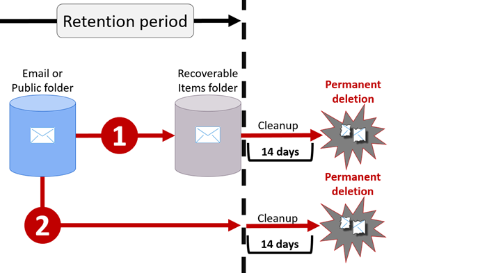
  
After a retention policy is assigned to a mailbox or public folder, content can follow one of two paths:
  
1. **If the item is modified or permanently deleted** by the user (either SHIFT+DELETE or deleted from Deleted Items) during the retention period, the item is moved (or copied, in the case of edit) to the Recoverable Items folder. There, a process runs periodically and identifies items whose retention period has expired, and these items are permanently deleted within 14 days of the end of the retention period. Note that 14 days is the default setting, but it can be configured up to 30 days. 
    
2. **If the item is not modified or deleted** during the retention period, the same process runs periodically on all folders in the mailbox and identifies items whose retention period has expired, and these items are permanently deleted within 14 days of the end of the retention period. Note that 14 days is the default setting but it can be configured up to 30 days. 
    
## How a retention policy works with document versions in a site collection

Versioning is a feature of all document libraries in SharePoint Online and OneDrive for Business. By default, versioning retains a minimum of five hundred major versions, though you can increase this limit. For more information, see [Enable and configure versioning for a list or library](https://support.office.com/article/1555d642-23ee-446a-990a-bcab618c7a37).
  
A retention policy retains all versions of a document in a SharePoint site collection or OneDrive account. Each time a document subject to a retention policy is edited or deleted, a version is copied to the Preservation Hold library. Each version of a document in the Preservation Hold library exists as a separate item with its own retention period:
  
- If the retention policy is based on when the content was created, each version has the same expiration date as the original document. The original document and its versions all expire at the same time.
    
- If the retention policy is based on when the content was last modified, each version has its own expiration date based on when the original document was modified to create that version. The original documents and its versions expire independently of each other.
    
## Retaining content for a specific period of time

With a retention policy, you can retain content indefinitely or for a specific number of days, months, or years. Note that the duration for how long content is retained is calculated from the age of the content, not from when the retention policy is applied. You can choose whether the age is based on when the content was created or (for OneDrive and SharePoint) when it was last modified.
  
For example, if you want to retain content in a site collection for seven years since it was last modified, and a document in that site collection hasn't been modified in six years, the document will be retained for only another year if it's not modified. If the document is edited again, the age of the document is calculated from the new last modified date, and it will be retained for another seven years.
  
Similarly, if you want to retain content in a mailbox for seven years, and a message was sent six years ago, the message will be retained for only one year. For Exchange content, the age is always based on the date received or sent (they are the same). Retaining content based on when it was last modified applies only to site content in OneDrive and SharePoint.
  
You can choose whether you want the content to be permanently deleted at the end of the retention period. A retention policy can also simply delete old content without retaining it - see the next section.
  
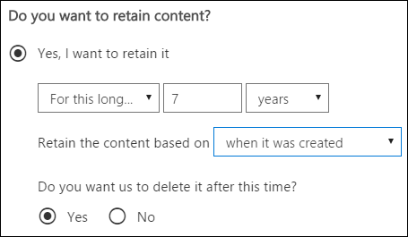
  
## Deleting content that's older than a specific age

A retention policy can both retain and then delete content, or simply delete old content without retaining it.
  
If your retention policy deletes content, it's important to understand that the time period specified for a retention policy is calculated from the time when the content was created or modified, not the time since the policy was assigned.
  
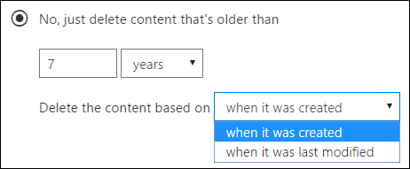
  
For example, suppose that you create a retention policy that deletes content after three years, and then assign that policy to all OneDrive accounts, which contain a lot of content that was created four or five years ago. In this case, a lot of content will be deleted soon after assigning the retention policy for the first time. For this reason, **a retention policy that deletes content can have a considerable impact on your content**. 
  
Therefore, before you assign a retention policy to a site collection for the first time, you should first consider the age of the existing content and how the policy may impact that content. You may also want to communicate the new policy to your users before assigning it, to give them time to assess the possible impact. Note this warning that appears when you review the settings for your retention policy just before creating it.
  

  
## Advanced settings that apply a policy only to content that meets certain conditions

A retention policy can apply to all content in the locations that it includes, or you can choose to apply a retention policy only to content that contains specific keywords or [specific types of sensitive information](what-the-sensitive-information-types-look-for.md).
  

  
### Retain content that contains specific keywords

You can apply a retention policy only to content that satisfies certain conditions, and then take retention actions on just that content. The conditions available now support applying a retention policy to content that contains specific words or phrases. You can refine your query by using search operators like AND, OR, and NOT. For more information on these operators, see [Keyword queries and search conditions for Content Search](keyword-queries-and-search-conditions.md).
  
Support for adding searchable properties (for example, **subject:**) is coming soon.
  
Note that query-based retention uses the search index to identify content.
  
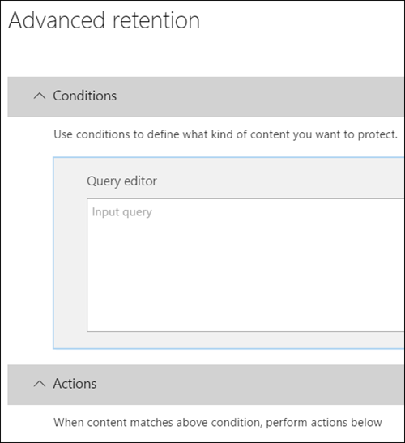
  
### Retain content that contains sensitive information

You can also apply a retention policy only to content that contains [specific types of sensitive information](what-the-sensitive-information-types-look-for.md). For example, you can choose to apply unique retention requirements only to content that contains personally identifiable information (PII) such as taxpayer identification numbers, social security numbers, or passport numbers.
  
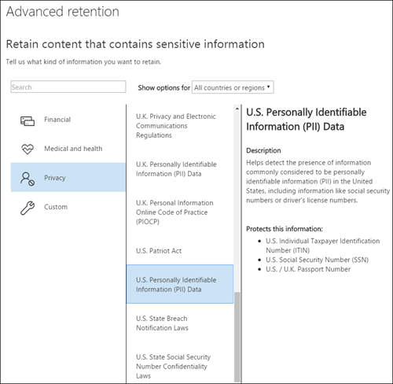
  
Notes:
  
- Advanced retention for sensitive information doesn't apply to Exchange public folders or Skype for Business because those locations don't support sensitive information types.
    
- You should understand that Exchange Online uses transport rules to identify sensitive information, so this works only on messages in transit — not on all items already stored in a mailbox. For Exchange Online, this means that a retention policy can identify sensitive information and take retention actions only on messages that are received **after** the policy is applied to the mailbox. (Note that query-based retention described in the previous section doesn't have this limitation because it uses the search index to identify content.) 
    
## Applying a retention policy to an entire organization or specific locations

You can easily apply a retention policy to an entire organization, entire locations, or only to specific locations or users.
  
### Org-wide policy

One of the most powerful features of a retention policy is that by default it applies to locations across Office 365, including:
  
- Exchange email
    
- SharePoint site collections
    
- OneDrive accounts
    
- Office 365 groups (applies to content in the group's mailbox, site, and documents. Support for content in Planner, Yammer, and CRM is coming soon.)
    
- Exchange public folders
    
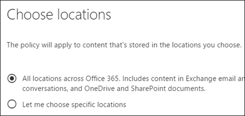
  
Other important features of an org-wide retention policy include:
  
- There is no limit to the number of mailboxes or sites the policy can include.
    
- For Exchange, any new mailbox created after the policy is applied will automatically inherit the policy.
  
### A policy that applies to entire locations

When you choose locations, you can easily include or exclude an entire location, such as Exchange email or OneDrive accounts. To do so, simply toggle the **Status** of that location on or off. 
  
Like an org-wide policy, if a policy applies to any combination of entire locations, there is no limit to the number of mailboxes or sites the policy can include. For example, if a policy includes all Exchange email and all SharePoint sites, all sites and mailboxes will be included, no matter how many. And for Exchange, any new mailbox created after the policy is applied will automatically inherit the policy.
 
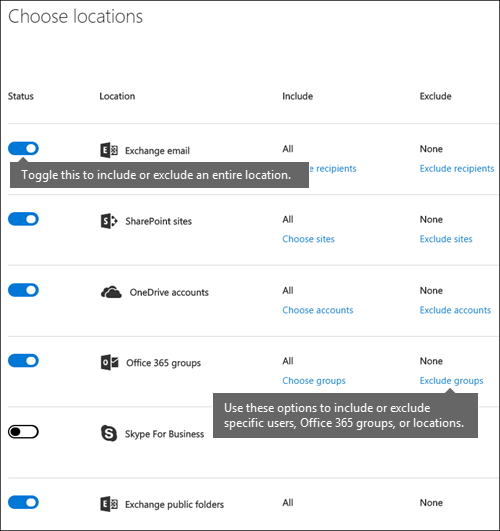
  
### A policy with specific inclusions or exclusions

You can also apply a retention policy to specific users. To do so, toggle the **Status** of that location on, and then use the links to include or exclude specific users, Office 365 groups, or locations. 
  
However, note that the following limits exist for a retention policy that includes or excludes over 1,000 specific users:
  
- Such a retention policy can contain no more than 1,000 mailboxes and 100 site collections.
    
- A tenant can contain no more than 10,000 retention policies.
    
Although these limits exist, understand that you can get over these limits by applying either an org-wide policy or a policy that applies to entire locations.
  
### Skype locations

Unlike Exchange email, you can't simply toggle the status of the Skype location on to include all users, but you can turn on that location and then manually choose the users whose conversations you want to retain.
  
When you choose Skype for Business users, you can quickly include all users by selecting the **Name** box in the column header - however, it's important to understand that each user counts as a specific inclusion in the policy. Therefore, if you include over 1,000 users, the limits noted in the previous section apply. Selecting all Skype users here is not the same as if an org-wide policy were able to include all Skype users by default. 
  
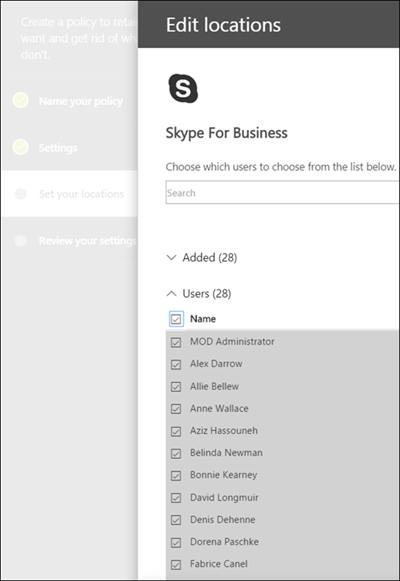
  
Note that **Conversation History**, a folder in Outlook, is a feature that has nothing to do with Skype archiving. **Conversation History** can be turned off by the end user, but archiving for Skype is done by storing a copy of Skype conversations in a hidden folder that is inaccessible to the user but available to eDiscovery.

### Office 365 groups locations

To retain content for an Office 365 group, you need to use the Office 365 groups location. Even though an Office 365 group has an Exchange mailbox, a retention policy that includes the entire Exchange location won't include content in Office 365 group mailboxes. A retention policy applied to an Office 365 group includes both the group mailbox and site.

In addition, it's not possible to use the Exchange location to include or exclude a specific group mailbox. Although the Exchange location initially allows a group mailbox to be selected, when you try to save the retention policy, you'll receive an error that "RemoteGroupMailbox" is not a valid selection for the Exchange location. 
  
### Teams locations

You can use a retention policy to retain chats and channel messages in Teams. Teams chats are stored in a hidden folder in the mailbox of each user included in the chat, and Teams channel messages are stored in a similar hidden folder in the group mailbox for the team. However, it's important to understand that Teams uses an Azure-powered chat service that also stores this data, and by default this service stores the data forever. For this reason, we strongly recommend that you use the Teams location to retain and delete Teams data. Using the Teams location will permanently delete data from both the Exchange mailboxes and the underlying Azure-powered chat service. For more information, see [Overview of security and compliance in Microsoft Teams](https://go.microsoft.com/fwlink/?linkid=871258).
  
Note that Teams chats and channel messages are not affected by retention policies applied to user or group mailboxes in the Exchange or Office 365 groups locations. Even though Teams chats and channel messages are stored in Exchange, they're affected only by a retention policy that's applied to the Teams location.
  
We're still working on retention in Teams, and additional features are coming. In the meantime, here are a few limitations to be aware of:
  
- **Teams require a separate retention policy** When you create a retention policy and toggle on the Teams location, all other locations toggle off. A retention policy that includes Teams can include only Teams and no other locations. 
    
- **Teams are not included in an org-wide policy** If you create an org-wide policy, Teams are not included because they require a separate retention policy. 
    
- **Teams doesn't support advanced retention** When you create a retention policy, if you choose the [Advanced settings that apply a policy only to content that meets certain conditions](retention-policies.md#advanced), the Teams location is not available. At this time, retention in Teams applies to all of the chat and channel message content.
    
- **Teams content must be at least 30 days old to be deleted** At this time, creating a policy to delete Teams content that's less than 30 days old is not supported. If you want this policy to apply to Teams content, specify a retention period that's equal to or greater than 30 days. 
    
- **Teams may take up to 30 days to clean up retained content** A retention policy applied to Teams will delete the content from all relevant storage locations. However, immediately after launch, it may take up to 30 days for Teams clients to clean up content based on the retention policy. But even though content still appears in the Teams clients, that content will not appear in content search or eDiscovery after the end of the retention period. 
    
In a Team, files that are shared in chat are stored in the OneDrive account of the user who shared the file. Files that are uploaded into channels are stored in the SharePoint site for the Team. Therefore, to retain or delete files in a Team, you need to create a retention policy that applies to the SharePoint and OneDrive locations. If you want to apply a policy to the files of just a specific team, you can choose the SharePoint site for the Team and the OneDrive accounts of users in the Team.
  
A retention policy that applies to Teams can use [Preservation Lock](retention-policies.md#locking).
  
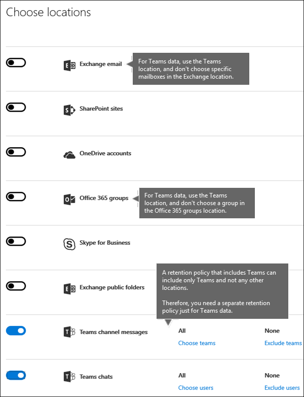
  
## Excluding specific types of Exchange items from a retention policy
By using PowerShell, you can exclude specific types of Exchange items from a retention policy. For example, you can exclude voicemail messages, IM conversations, and other Skype for Business Online content in mailboxes. You can also exclude calendar, note, and task items. This capability is available only by using PowerShell; it's not available in the UI when you create a retention policy.
  
To do this, use the  `ExcludedItemClasses` parameter of the  `New-RetentionComplianceRule` and  `Set-RetentionComplianceRule` cmdlets. For more information about PowerShell, see the below section [Find the PowerShell cmdlets for retention policies](#find-the-powershell-cmdlets-for-retention-policies).
  
## Locking a retention policy
Some organizations may need to comply with rules defined by regulatory bodies such as the Securities and Exchange Commission (SEC) Rule 17a-4, which requires that after a retention policy is turned on, it cannot be turned off or made less restrictive. With Preservation Lock, you can lock the policy so that no one — including the administrator — can turn off the policy or make it less restrictive.
  
After a policy's been locked, no one can turn it off or remove locations from the policy. And it's not possible to modify or delete content that's subject to the policy during the retention period. After the policy's been locked, the only ways you can modify the retention policy are by adding locations to it or extending its duration. A locked policy can be increased or extended, but it can't be reduced or turned off.
  
Therefore, before you lock a retention policy, it's **critical** that you understand your organization's compliance requirements, and that **you do not lock a policy** until you're certain that's what you need.

### Lock a retention policy by using PowerShell
  
You can lock a retention policy only by using PowerShell.

First, [connect to Office 365 Security & Compliance Center PowerShell](http://go.microsoft.com/fwlink/p/?LinkID=799771).

Second, to view a list of your retention policies and find the name of the policy that you want to lock, run `Get-RetentionCompliancePolicy`.

Third, to place a Preservation Lock on the retention policy, run `Set-RetentionCompliancePolicy` with the `RestrictiveRetention` parameter set to true -- for example:

`Set-RetentionCompliancePolicy -Identity “<Name of Policy>” – RestrictiveRetention $true`

After you run that cmdlet, you see a confirmation prompt. Choose **Yes to All**.

A Preservation Lock is now placed on the retention policy. If you run `Get-RetentionCompliancePolicy`, the `RestrictiveRetention` parameter is set to true -- for example:

`Get-RetentionCompliancePolicy -Identity “<Name of Policy>” |Fl`

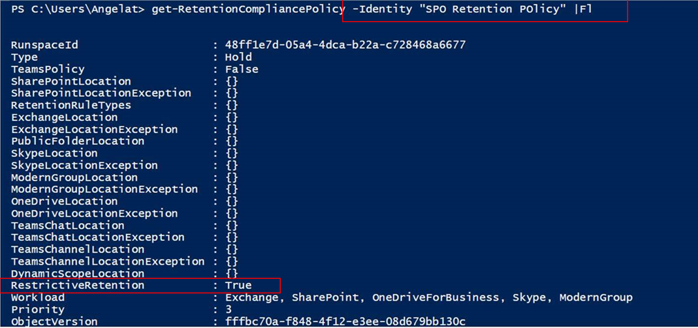
  
## The principles of retention, or what takes precedence?

It's possible or even likely that content might have several retention policies applied to it, each with a different action (retain, delete, or both) and retention period. What takes precedence? At the highest level, rest assured that content being retained by one policy can't be permanently deleted by another policy.
  

  
To understand how different retention policies are applied to content, keep these principles of retention in mind:
  
1. **Retention wins over deletion.** Suppose that one retention policy says to delete Exchange email after three years, but another retention policy says to retain Exchange email for five years and then delete it. Any content that reaches three years old will be deleted and hidden from the users' view, but still retained in the Recoverable Items folder until the content reaches five years old, when it will be permanently deleted. 
    
2. **The longest retention period wins.** If content's subject to multiple policies that retain content, it will be retained until the end of the longest retention period. 
    
3. **Explicit inclusion wins over implicit inclusion.** This means: 
    
    1. If a label with retention settings is manually assigned by a user to an item, such as an Exchange email or OneDrive document, that label takes precedence over both a policy assigned at the site or mailbox level and a default label assigned by the document library. For example, if the explicit label says to retain for ten years, but the policy assigned to the site says to retain for only five years, the label takes precedence. Note that auto-apply labels are considered implicit, not explicit, because they're applied automatically by Office 365.
    
    2. If a retention policy includes a specific location, such as a specific user's mailbox or OneDrive for Business account, that policy takes precedence over another retention policy that applies to all users' mailboxes or OneDrive for Business accounts but doesn't specifically include that user's mailbox.
    
4. **The shortest deletion period wins.** Similarly, if content's subject to multiple policies that delete content (with no retention), it will be deleted at the end of the shortest retention period. 
    
Understand that the principles of retention work as a tie-breaking flow from top to bottom: If the rules applied by all policies or labels are the same at one level, the flow moves down to the next level to determine precedence for which rule is applied.
  
Finally, a retention policy or label cannot permanently delete any content that's on hold for eDiscovery. When the hold is released, the content again becomes eligible for the cleanup process described above.
  
## Use a retention policy instead of these features

A single retention policy can easily apply to an entire organization and locations across Office 365, including Exchange Online, SharePoint Online, OneDrive for Business, and Office 365 groups. If you need to retain or delete content anywhere in Office 365, we recommend that you use a retention policy. (You can also use labels with retention settings - for more information, see [Overview of labels](labels.md).)
  
There are several other features that have previously been used to retain or delete content in Office 365. These are listed below. These features will continue to work side by side with retention policies and labels created in the Security &amp; Compliance Center. But moving forward, for data governance, we recommend that you use a retention policy or labels instead of all of these features. A retention policy is the only feature that can both retain and delete content across Office 365.
  
### Exchange Online

- [Manage eDiscovery cases in the Office 365 Security &amp; Compliance Center](https://support.office.com/article/edea80d6-20a7-40fb-b8c4-5e8c8395f6da) (eDiscovery hold) 
    
- [In-Place Hold and Litigation Hold](https://go.microsoft.com/fwlink/?linkid=846124) (eDiscovery hold) 
    
- [Retention tags and retention policies](https://go.microsoft.com/fwlink/?linkid=846125), also known as [messaging records management (MRM)](https://go.microsoft.com/fwlink/?linkid=846126) (Deletion only) 
    
### SharePoint Online and OneDrive for Business

- [Manage eDiscovery cases in the Office 365 Security &amp; Compliance Center](https://support.office.com/article/edea80d6-20a7-40fb-b8c4-5e8c8395f6da) (eDiscovery hold) 
    
- [Add content to a case and place sources on hold in the eDiscovery Center](https://support.office.com/article/54d70de9-1ec2-4325-84f3-aeb588554479) (eDiscovery hold) 
    
- [Overview of document deletion policies](https://support.office.com/article/55e8d858-f278-482b-a198-2e62d6a2e6e5) (Deletion only) 
    
- [Configuring in place records management](https://support.office.com/article/7707a878-780c-4be6-9cb0-9718ecde050a) (Retention) 
    
- [Use policies for site closure and deletion](https://support.office.com/article/a8280d82-27fd-48c5-9adf-8a5431208ba5) (Deletion only) 
    
- [Information management policies](intro-to-info-mgmt-policies.md) (Deletion only) 
    
Note that if you've previously used any of the eDiscovery holds for the purpose of data governance, you should instead use a retention policy for proactive compliance. You should use a hold created in the Security &amp; Compliance Center only for eDiscovery.
  
### Retention policies override information management policies

In SharePoint sites, you may be using [information management policies](intro-to-info-mgmt-policies.md) to retain content. If you apply a retention policy created in the Security and Compliance Center to a site that already uses content type policies or information management policies for a list or library, those policies are ignored while the retention policy is in effect. 
  
## What happened to preservation policies?

If you were using a preservation policy, that policy has been automatically converted to a retention policy that uses only the retain action - the policy won't delete content. The preservation policy will continue to work and preserve your content without requiring any changes from you. You can find these policies on the **Retention** page in the Security &amp; Compliance Center. You can edit a preservation policy to change the retention period, but you can't make other changes, such as adding or removing locations. 
  
## Permissions

Members of your compliance team who will create retention policies need permissions to the Security &amp; Compliance Center. By default, your tenant admin will have access to this location and can give compliance officers and other people access to the Security &amp; Compliance Center, without giving them all of the permissions of a tenant admin. To do this, we recommend that you go to the **Permissions** page of the Security &amp; Compliance Center, edit the **Compliance Administrator** role group, and add members to that role group. 
  
For more information, see [Give users access to the Office 365 Security &amp; Compliance Center](grant-access-to-the-security-and-compliance-center.md).
  
These permissions are required only to create and apply a retention policy. Policy enforcement does not require access to the content.
  
## Find the PowerShell cmdlets for retention policies

To use the retention policy cmdlets, you need to:
  
1. [Connect to the Office 365 Security &amp; Compliance Center using remote PowerShell](http://go.microsoft.com/fwlink/?LinkID=799771&amp;clcid=0x409)
    
2. Use these [Office 365 Security &amp; Compliance Center cmdlets](http://go.microsoft.com/fwlink/?LinkID=799772&amp;clcid=0x409)
    
## More information

- [Overview of labels](labels.md)
    

