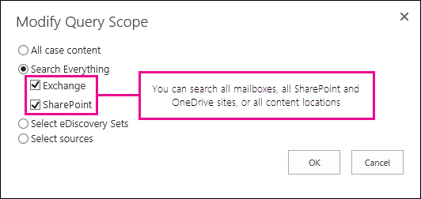
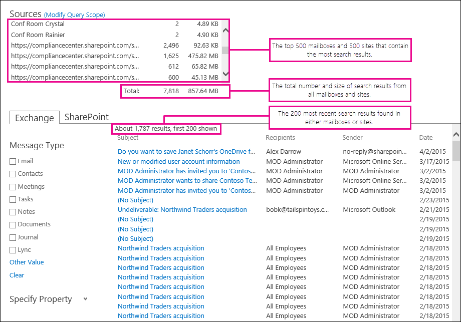

# Search all mailboxes and sites using the eDiscovery Center

In the eDiscovery Center in Office 365, you can search all Exchange Online mailboxes, SharePoint Online sites, and OneDrive for Business sites in a single eDiscovery search. To search all content sources in the organization, an eDiscovery manager must be assigned the appropriate eDiscovery permissions for each content source. 
  
## Before you begin

- An eDiscovery manager must be assigned the appropriate permissions to search a content source. For more information about assigning eDiscovery permissions to mailboxes and sites, see the following: 
    
  - [Assign eDiscovery permissions in Exchange](https://go.microsoft.com/fwlink/p/?LinkId=526886)
    
  - [Assign eDiscovery permissions in SharePoint Online](https://go.microsoft.com/fwlink/p/?LinkId=526885)
    
  - [Assign eDiscovery permissions to OneDrive for Business sites](assign-permissions-to-onedrive-for-business-sites.md)
    
- You can search a maximum of 10,000 mailboxes and an unlimited number of SharePoint Online and OneDrive for Business sites in a single eDiscovery search query. However, if you specify the specific sites to search, the limit is 100 sites.
    
- See the [More information](search-all-mailboxes-and-sites-with-ediscovery.md#moreinfo) section for a description of the limits when viewing the results when searching all mailboxes and sites. 
    
- For more information about creating search queries in the eDiscovery Center, see [Create and run eDiscovery queries](https://go.microsoft.com/fwlink/p/?LinkID=404032).
    
## Search all locations

1. In the eDiscovery Center, open the eDiscovery case that you want to run the search query for.
    
2. Under **Search and Export**, click an existing query or click **New item** to create a new search query. 
    
3. On the search query page, in the **Sources** section, click **Modify Query Scope**.
    
4. On the **Modify Query Scope** page, click **Search everything**, and select the content locations to search.
    
  - Select **Exchange** to search all mailboxes. 
    
  - Select **SharePoint** to search all SharePoint Online and OneDrive for Business sites. 
    
  - Select both **Exchange** and **SharePoint** to search all content locations in your organization. 
    

  
5. Click **OK** to save the changes. 
    
6. Complete or revise other information on the search query page, such as the keyword query, the date range, or narrowing the specific types of content to search for. When you're ready to run the query, click **Search**. 
    
## More information

- The top 500 mailboxes and the top 500 sites with the most results are listed under **Sources** on the **Query** page. 
    
- The total number of items found in all content sources and their combined total size are displayed under **Sources** on the **Query** page. 
    
- You can preview the 200 most recent search results located in Exchange mailboxes or SharePoint sites on the **Query** page. 
    
    The following screenshot shows an example of the search results displayed on the **Query** page when you search all mailboxes and sites. 
    
    
  

