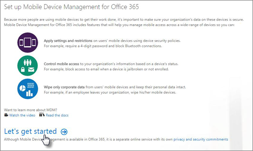
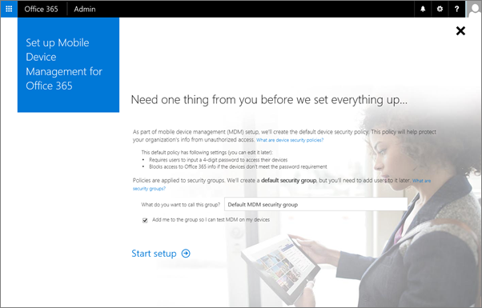
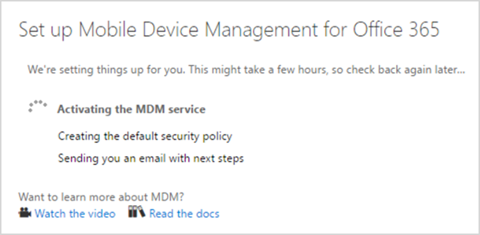
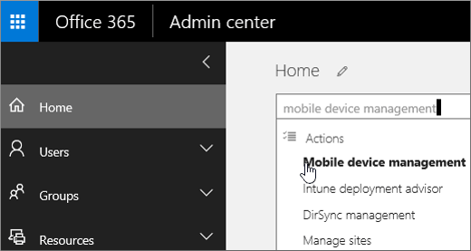
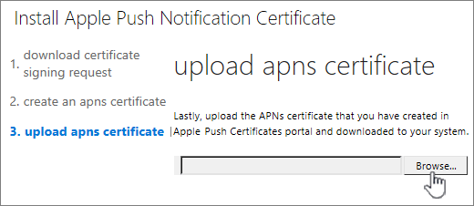
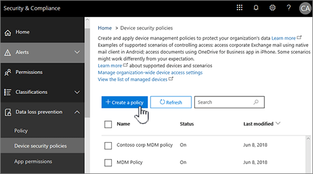

# Set up Mobile Device Management (MDM) in Office 365

The built-in Mobile Device Management (MDM) for Office 365 helps you secure and manage your users' mobile devices like iPhones, iPads, Androids, and Windows phones. You can create and manage device security policies, remotely wipe a device, and view detailed device reports.
  
Have questions? We've put together [a FAQ to help address common questions](frequently-asked-questions-about-mdm.md). Be aware that you cannot use a [Partners: Offer delegated administration](https://support.office.com/article/26530dc0-ebba-415b-86b1-b55bc06b073e) to manage Mobile Device Management for Office 365. 
  
Device management is part of the Security &amp; Compliance Center so you'll need to go there to kick off MDM setup.
  
To set up Mobile Device Management for Office 365 you'll need to:
  
1. [Activate the Mobile Device Management service](#activate-the-mobile-device-management-service)  
2. [Set up Mobile Device Management](#set-up-mobile-device-management)
3. [Make sure users enroll their devices](#step-4-recommended-manage-device-security-policies)
  
## Activate the Mobile Device Management service

1. Sign in to Office 365 with your work or school account. 
    
2. Go to [Security &amp; Compliance Center](https://protection.office.com).
    
3. Navigate to **Data loss prevention** \> **Device management** and click **Let's get started** to kick off the activation process. 
    
    
  
4. We created a default security policy for you to help you get started. Update the name of the security policy on this page, and then click **Start setup**.
    
    
  
5. You'll see the setup screen that shows progress on setting up the service.
    
    
  
> [!TIP]
> You can also locate **MDM Setup** through Search. In the Office 365 admin center \> **Home** page, type mobile device management in the **Search** box. > 
  
It can take some time to activate Mobile Device Management for Office 365, but when it finishes, you'll receive an email that explains the next steps to take.
  
## Set up Mobile Device Management

When the service is ready, complete the following four steps to finish setup. You may need to click [Manage settings](https://portal.office.com/EAdmin/Device/IntuneInventory.aspx) on the **Device management** page in the Security &amp; Compliance Center to see the following settings. 
  

  
### Step 1: (Required) Configure domains for MDM

If you don't have a custom domain associated with Office 365 or if you're not managing Windows devices, you can skip this section. Otherwise, you'll need to add DNS records for the domain at your DNS host. If you've added the records already, as part of setting up your domain with Office 365, you're all set. After you add the records, Office 365 users in your organization who sign in on their Windows device with an email address that uses your custom domain are redirected to enroll in MDM for Office 365.
  
Need help setting up the records? Find your domain registrar in the list provided in [Create DNS records for Office 365 when you manage your DNS records](https://support.office.com/article/b0f3fdca-8a80-4e8e-9ef3-61e8a2a9ab23) and select the registrar name to go to step-by-step help for creating DNS records. Use those instructions to add the following two records: 
  
|**Host name**|**Record type**|**Address**|**TTL**|
|:-----|:-----|:-----|:-----|
|EnterpriseEnrollment    |CNAME    |EnterpriseEnrollment.manage.microsoft.com    |3600    |
|EnterpriseRegistration    |CNAME    |EnterpriseRegistration.windows.net    |3600    |
   
After you add the two records, go back to the Security &amp; Compliance Center and navigate to **Device management** \> **Manage settings** to complete the next step. 
  
### Step 2: (Required) Configure an APNs Certificate for iOS devices

To manage iOS devices like iPad and iPhones, you need to create an APNs certificate.
  
To do this, follow the steps from the **Set up** links on the **Setup mobile device management page**.
  
1. Next to **Configure a APNs Certificate for iOS devices**, select **Set up**.
    
2. Select **Download your CSR file** and save the Certificate signing request to a somewhere on your computer that you'll remember. 
    
    
  
3. Select **Next**.
    
4. Create an APN certificate.
    
  - Select **Apple APNS Portal** to open the Apple Push Certificates Portal. 
    
    
  
  - Sign in with an Apple ID.
    
    > [!IMPORTANT]
    > Use a company Apple ID associated with an email account that will remain with your organization even if the user who manages the account leaves. Save this ID because you'll need to use the same ID when it's time to renew the certificate. 
  
  - Select **Create a Certificate** and accept the **Terms of Use**.
    
  - **Browse** to the Certificate signing request you downloaded to your computer from Office 365 and select **Upload**.
    
  - **Download** the APN certificate created by the Apple Push Certificate Portal to your computer. 
    
    > [!TIP]
    > If you're having trouble downloading the certificate, refresh your browser. 
  
5. Go back to Office 365 and select **Next** to get to the **Upload APNS certificate** page. 
    
6. Browse to the APN certificate you downloaded from the Apple Push Certificates Portal.
    
    
  
7. Select **Finish**.
    
After you add APN Certificate, go back to the Security &amp; Compliance Center and navigate to **Device management** \> **Manage settings** to complete the next step. 
  
### Step 3: (Recommended) Set up multi-factor authentication

If you don't see multi-factor authentication (MFA) under **Recommended steps**, you can skip this section. If this option is listed, we recommend you turn on MFA in the Azure AD portal to increase the security of the Mobile Device Management for Office 365 enrollment process. It is turned off by default.
  
MFA helps secure the sign in to Office 365 for mobile device enrollment by requiring a second form of authentication. Users are required to acknowledge a phone call, text message, or app notification on their mobile device after correctly entering their work account password. They can only enroll their device after this second form of authentication is completed. After users' devices are enrolled in Mobile Device Management for Office 365, users can access Office 365 resources with just their work account.
  
Next to **Set up multi-factor authentication**, select **Set up**. To learn how to turn on MFA in the Azure AD portal, see [Set up multi-factor authentication](https://go.microsoft.com/fwlink/p/?LinkId=519255).
  
After you set up MFA, go back to the Security &amp; Compliance Center and navigate to **Device management** \> **Manage settings** to complete the next step. 
  
### Step 4: (Recommended) Manage device security policies

The next step is to create and deploy device security policies to help protect your Office 365 organization's data. For example, you can help prevent data loss if a user loses their device by creating a policy to lock devices after 5 minutes of inactivity and have devices wiped after 3 sign-in failures.
  
In the **Security &amp; Compliance Center**, go to **Security policies** \> **Device security policies** to create device security policies and access rules. 
  

  
For step by step instructions on how to create a new policy, see [Create and deploy device security policies](create-device-security-policies.md).
  
> [!TIP]
>  When you create a new policy, you might want to set the policy to allow access and report policy violation where a user's device isn't compliant with the policy. This lets you see how many mobile devices would be impacted by the policy without blocking access to Office 365. >  Before you deploy a new policy to everyone in your organization, we recommend you test it on the devices used by a small number of users. >  Also, before you deploy policies, let your organization know the potential impacts of enrolling a device in MDM for Office 365. Depending on how you set up the policies, devices that don't comply with them (non-compliant devices) could be blocked from accessing Office 365. Non-compliant devices might also have apps installed, photos, and other personal information which, on an enrolled device, could be deleted if the device is wiped. More info: [Wipe a mobile device in Office 365](wipe-a-mobile-device.md). 
  
## Make sure users enroll their devices

After you've created and deployed a mobile device management policy, each licensed Office 365 user in your organization that the device policy applies to will receive an enrollment message the next time they sign into Office 365 from their mobile device. They must complete the enrollment and activation steps before they can access Office 365 email and documents. See [Enroll your mobile device for work or school](enroll-your-mobile-device.md).
  
> [!IMPORTANT]
> If a user's preferred language isn't supported by the enrollment process, users may receive enrollment notification and steps on their mobile devices in another language. Not all languages supported in Office 365 are currently supported for the enrollment process on mobile devices. 
  
Users with Android or iOS devices are required to install the Company Portal app as part of the enrollment process.
  
## Related Topics

[Capabilities of Mobile Device Management](capabilities-of-mobile-device-management.md)
  
[Create and deploy device security policies](create-device-security-policies.md)
  

