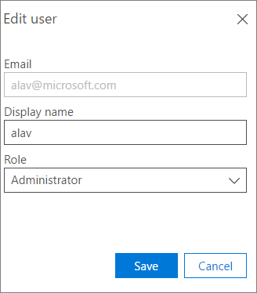

# User roles and access in Office 365 Advanced eDiscovery

The following table lists the Advanced eDiscovery user roles and their access.
  
> [!NOTE]
> Advanced eDiscovery requires an Office 365 E3 with the Advanced Compliance add-on or an E5 subscription for your organization. If you don't have that plan and want to try Advanced eDiscovery, you can [sign up for a trial of Office 365 Enterprise E5](https://go.microsoft.com/fwlink/p/?LinkID=698279). 
  
## User roles and access

The user roles and access are defined in **Settings and utilities \> Tenant settings \> User administration**.
  
|**Module**|**Task**|**Administrator**|**Manager**|**Reviewer**|
|:-----|:-----|:-----|:-----|:-----|
|Cases    | View cases assigned to this user    |X    |X    |X    |
|| Add / modify cases assigned to this use    |X    |X    ||
|| Assign users to a case    |X    |X    ||
|| Assign self to a case    |X    |||
||Delete a case    |X    |||
|Prepare    |Process    |X    |X    ||
||Analyze    |X    |X    ||
|Relevance    |Relevance setup    |X    |X    ||
||Relevance - Track. Tag, Decide, and Test    |X    |X    |X    |
|Export    |Export    |X    |X    ||
|Reports    |Reports    |X    |X    ||
|Setting &amp; utilities    |User administration    |X    |||
||Tenant settings    |X    |||
||Case settings    |X    |X    ||
||Utilities: Transparency analysis; Modify relevance    |X    |X    |X    |
||Utilities: Other    |X    |X    ||
   
- To edit a user, select a user in the list, and then click **Edit**.
    
    In the ** Edit user ** panel you can change the display name, or the Role. 
    
    
  
- To add a user, click **Add**
  
    In the **Add user** panel enter **Email**, **Display name** and **Role** for the user. 
    
- To delete a user, select a user in the list, and then click **Delete**.
    
## See also

[Office 365 Advanced eDiscovery](office-365-advanced-ediscovery.md)
  
[Setting up users and cases](set-up-users-and-cases-in-advanced-ediscovery.md)

