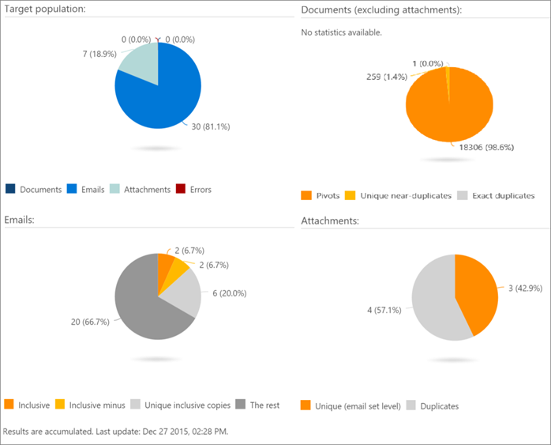

# View Analyze results in Office 365 Advanced eDiscovery

> [!NOTE]
> Advanced eDiscovery requires an Office 365 E3 with the Advanced Compliance add-on or an E5 subscription for your organization. If you don't have that plan and want to try Advanced eDiscovery, you can [sign up for a trial of Office 365 Enterprise E5](https://go.microsoft.com/fwlink/p/?LinkID=698279). 
  
In Advanced eDiscovery, progress and results for the Analyze process can be viewed in a variety of displays as described below.
  
## View Analyze task status

In **Prepare \> Analyze \> Results \> Task status**, the status is displayed during and after Analyze process execution. 
  

  
The tasks displayed may vary depending on the options selected. 
  
- **ND/ET: setup**: Prepares for the run, for example, sets run and case parameters.
    
- **ND/ET: ND calculation**: Processes Near-duplicate analysis of files.
    
- **ND/ET: ET calculation**: Performs Email Thread analysis on the entire email set.
    
- **ND/ET: pivots and similarities**: Performs pivot and file similarity processing.
    
- **ND/ET: metadata update**: Finalizes the new data collected on the files in the database.
    
- **Themes: themes calculation**: Runs themes analysis. (Displayed only if selected.)
    
- **Task status**: This line is displayed after task completion. While tasks are running, run duration is displayed.
    
> [!NOTE]
> The Analyze results of Near-duplicates and Email Threads (ND and ED) applies to the number of documents to be processed. It does not include Exact duplicate files. 
  
## View Near-duplicates and Email Threads status

The **Target** population results display the number of documents, emails, attachments, and errors in the target population. 
  
The **Documents** results display the number of pivots, unique near-duplicates, and exact duplicate files. 
  
The **Emails** results display the number of inclusive, inclusive minus, unique inclusive copies, and the rest of the email messages. The different types of email results are: 
  
- **Inclusive**: An inclusive email is the terminating node in an email thread and contains all the previous history of that thread. As a result, the reviewer can safely focus on the inclusive email, without the need to read the previous messages in the thread. 
    
- **Inclusive minus**: An inclusive email is designated as inclusive minus if there are one or more different attachments associated with the parents of the inclusive message. In this context, the term Parent is used for messages located upwards on the email thread or conversations included in that specific inclusive email. A reviewer can use the inclusive minus indication as a signal that although it might not be necessary to review the content of the inclusive email parents, it may be useful to review the attachments associated with the inclusive path parents. 
    
- **Inclusive copy**: An inclusive email is designated as inclusive copy if it's the copy of another message marked as inclusive or inclusive minus. In other words, this message has the same subject and body as another inclusive message and, as such, co-resides in the same node. Because inclusive copy messages contain the same content, they can usually be skipped in the review process. 
    
- **The rest**: This indicates email that doesn't contain any unique content, and therefore doesn't fall into any of the previous three categories. These email messages don't need to be reviewed. If a message contains an attachment that isn't on a later inclusive email, then the attachment might need to be reviewed. This is indicated by the existence of an inclusive minus email within the thread.
    
The **Attachments** results display the number of attachments, according to such type as unique and duplicates. 
  

  
## See also

[Office 365 Advanced eDiscovery](office-365-advanced-ediscovery.md)
  
[Understanding document similarity](understand-document-similarity-in-advanced-ediscovery.md)
  
[Setting Analyze options](set-analyze-options-in-advanced-ediscovery.md)
  
[Setting ignore text](set-ignore-text-in-advanced-ediscovery.md)
  
[Setting Analyze advanced settings](view-analyze-results-in-advanced-ediscovery.md)

