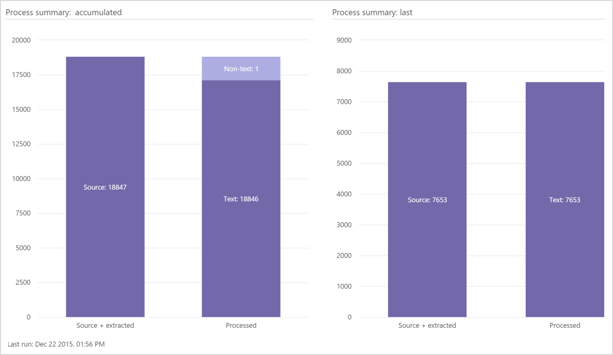

# View Process module results in Office 365 Advanced eDiscovery

After **Prepare** \> **Process** is initiated, you can view progress and results. 
  
> [!NOTE]
> Advanced eDiscovery requires an Office 365 E3 with the Advanced Compliance add-on or an E5 subscription for your organization. If you don't have that plan and want to try Advanced eDiscovery, you can [sign up for a trial of Office 365 Enterprise E5](https://go.microsoft.com/fwlink/p/?LinkID=698279). 
  
## Process task status

In **Prepare** \> **Process** \> **Results**, the page shows the current status (if Process is currently running) or the last Process status task status as shown in the following example.
  

  
The displayed tasks may vary depending on the Process options selected. 
  
- **Inventory**: Advanced eDiscovery iterates through all files selected for Process and performs basic data collection.
    
- **Calculate signatures**: Calculates the MD5 digital signatures.
    
- **Compounds extraction**: Extracts inner or contained files recursively from compound files (for example, PST, ZIP, MSG). Extracted files are stored in the case folder of the case.
    
- **Synchronizing database**: Internal database process.
    
- **File copy**: Copies Process files. This task is always displayed, even when the advanced Copy files option is selected.
    
- **Text extraction**: When there are native files, Advanced eDiscovery extracts text from these files using DTSearch. The extracted text of these files is stored as text files in the case folder.
    
- **Updating metadata**: Processes the loaded metadata. 
    
- **Finalizing**: Internal processing that finalizes data of loaded case files (for example, identify error and success files). 
    
Task status: Displayed after task completion. While tasks are running, run duration is displayed.
  
> [!NOTE]
> Completed tasks may also include totals for files that completed processing or files with errors. 
  
> [!TIP]
> "Cancel" provides a rollback option to stop Process execution and then roll back to the previous data population or saved processed data. Rollback clears all processed data. If you do not want the processed data to be lost (for example, you plan to reload these files), select the "Cancel" option in this window to choose not to roll back. 
  
## Process summary

In Prepare \> Process \> Results \> Process summary, a breakdown of loaded file results is displayed according to successful file processing and error results.
  
The panes present a graphical display of imported file statistics, as follows:
  
- **Process summary accumulate**d: All files in the case.
    
- **Process summary last**: Files loaded from the last session or action. 
    
- **Families last**: Family information in the case (if any).
    
- If **Seed** files were added, the number of seed files is listed per issue that was defined for the files. 
    
    If the marking of **Seed** files failed, that is also noted. 
    
- If **Pre-tagged** files were added, the number of pre-tagged files is listed per issue that was defined for the files. 
    
    If the marking of **Pre-tagged** files failed, that is also noted. 
    

  
## Process summary accumulated and last charts

The left bar includes Source + extracted files: which is all files found. 
  
The right bar, Processed, includes:
  
- Files with load errors
    
- Successfully loaded files, which may include: 
    
  - **Existing**: Files that were loaded before and are now loaded again (including duplicates).
    
  - **Text**: Unique files with text.
    
  - **Non-text**: Empty text files, empty native text files, native non-text files. 
    
  - **Duplicate**s: Duplicate files with text.
    
## Last process errors

In Prepare \> Process \> Results \> Last process errors, details of the errors in the last session or action performed are displayed.
  

  
## See also

[Office 365 Advanced eDiscovery](office-365-advanced-ediscovery.md)
  
[Running the Process module and loading data](run-the-process-module-and-load-data-in-advanced-ediscovery.md)

