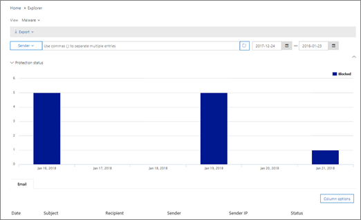
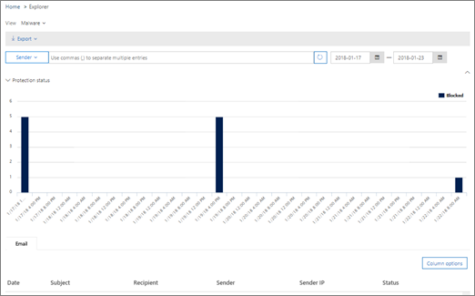
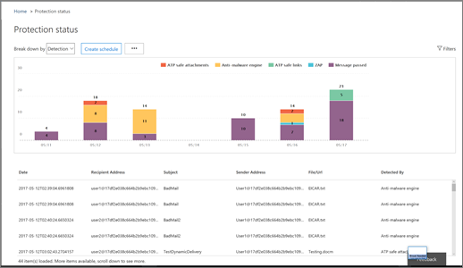
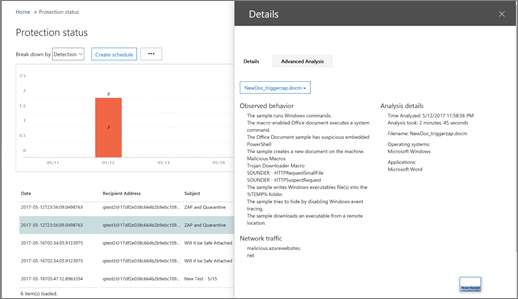
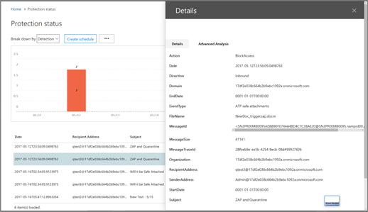
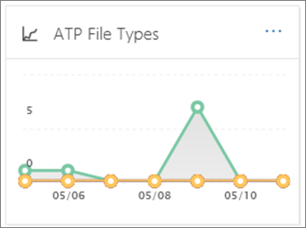
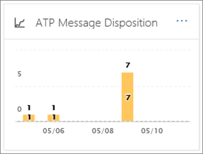

# View reports for Office 365 Advanced Threat Protection

If your organization has [Office 365 Advanced Threat Protection](office-365-atp.md) (ATP), several reports are available in the Security &amp; Compliance Center. (Go to **Reports** \> **Dashboard**.)
  

  
ATP reports include [(New!) Real-time reports](view-reports-for-atp.md#newrealatime), the [Threat protection status report](view-reports-for-atp.md#advancedthreats), the [ATP Message Disposition report](view-reports-for-atp.md#atpmessagedisp), and the [ATP File Types report](view-reports-for-atp.md#atpfiletypes).
  
> [!NOTE]
> Office 365 ATP is included in subscriptions, such as Office 365 Enterprise E5 and Office 365 Education A5, and, as of April 30, 2018, also [Microsoft 365 Business security features](https://support.office.com/article/c123694a-1efb-459e-a8d5-2187975373dc). If your organization has an Office 365 subscription that does not include Office 365 ATP, you can potentially purchase ATP as an add-on. For more information, see [Office 365 Advanced Threat Protection Service Description](https://technet.microsoft.com/library/exchange-online-advanced-threat-protection-service-description.aspx). 
  
In addition to the ATP reports described in this article, email security reports are available. Email security reports include a top senders and receivers report, a spoof mail report, a spam detections report, and more. See [View email security reports in the Security &amp; Compliance Center](view-email-security-reports.md).
  
## (New!) Real-time reports

Real-time reports are available in the Security &amp; Compliance Center. The real-time reports include a [Malware report for email](view-reports-for-atp.md#malwareemail), a [User-reported messages report](view-reports-for-atp.md#userreported), a [Phish report for email](view-reports-for-atp.md#phishreport), and a [Malware report for files](view-reports-for-atp.md#malwaarefiles).
  
> [!IMPORTANT]
> The new ATP real-time reports are pivoted by recipient counts with message times displayed in local time zones. This differs from the Threat protection status report, which aggregates the number of email messages displayed in UTC. 
  
### Malware report for email

The malware report for email shows you incoming and outgoing email that has been classified as malware.
  

  
#### To view and use the malware report for email

1. Go to [https://protection.office.com](https://protection.office.com) and sign in with your work or school account. This takes you to the Security &amp; Compliance Center. 
    
2. Go to **Threat management** \> **Explorer**.
    
3. In the **View** menu to choose **Email** \> **Malware**.
    
    
  
4. By default, the report shows data for the past seven days.
    
    
  
    This enables you to take action quickly. However, you can use the date filters to change the date range.
    
5. Below the chart, in the **Email** list, choose an item to view more information. For example, you can see the details, attachments, similar email messages, and advanced analysis information for each message listed in the report. 
    
    
  
### User-reported messages report

The user-reported messages report is one of the [email security reports in the Security &amp; Compliance Center](view-email-security-reports.md). This report shows information about email messages that people reported as junk or malware, and junk mail that people reported as good mail (not junk).
  

  
To learn more, see [User-reported messages report (new!)](view-email-security-reports.md#userreported).
  
### Phish report for email

The phish report for email shows information about email messages that were identified as phishing attempts sent to people in your organization.
  

  
#### View and use the phish report for email

1. Go to [https://protection.office.com](https://protection.office.com) and sign in with your work or school account. This takes you to the Security &amp; Compliance Center. 
    
2. Go to **Threat management** \> **Explorer**.
    
3. In the **View** menu to choose **Email** \> **Phish**.
    
    
  
4. By default, the report shows data for the past seven days.
    
    This enables you to take action quickly. However, you can use the date filters to change the date range.
    
5. Below the chart, in the **Email** list, choose an item to view more information. 
    
### Malware report for files

The malware report for files shows you files that were identified as malware in SharePoint Online, OneDrive for Business, or Microsoft Teams.
  

  
#### View and use the malware report for files

1. Go to [https://protection.office.com](https://protection.office.com) and sign in with your work or school account. This takes you to the Security &amp; Compliance Center. 
    
2. Go to **Threat management** \> **Explorer**.
    
3. In the **View** menu to choose **Content** \> **Malware**.
    
    
  
4. By default, the report shows data for the past seven days.
    
    
  
    This enables you to take action quickly. However, you can use the date filters to change the date range.
    
5. Below the chart, in the **Document** list, choose an item to view more information. For example, you can see the date, file name, library (SharePoint Online, OneDrive for Business, or Microsoft Teams) where the malicious file was found, how the file was detected, and its file size. 
    
## Threat protection status report

The Threat protection status report is a single view that brings together information about malicious content found and blocked by Exchange Online and Advanced Threat Protection.
  
To view the Threat protection status report, the Security &amp; Compliance Center, go to **Reports** \> **Dashboard** \> **Threat protection status**.
  

  
To get detailed status for a day, hover over the graph. The report provides an aggregated count of unique email messages with malicious content (files or URLs) blocked by the anti-malware engine, [zero-hour auto purge (ZAP)](zero-hour-auto-purge.md), and Advanced Threat Protection features, such as [ATP Safe Links](atp-safe-links.md) and [ATP Safe Attachments](atp-safe-attachments.md).
  
Underneath the chart, you'll see a detailed list of the detections, including subject lines and how each item was detected. Select an item to view additional details, including the item's file name, whether the item was inbound or outbound, and how it was detected.
  

  
For malware caught ATP Safe Attachments, on the **Details** page, choose **Advanced Analysis** to view more information, including the observed behavior and analysis details for a selected item. 
  

  
## ATP File Types report

The ATP File Types report shows you the type of files detected as malicious by [ATP Safe Attachments](atp-safe-attachments.md).
  
To view this report, in the Security &amp; Compliance Center, go to **Reports** \> **Dashboard** \> **ATP File Types**.
  

  
When you hover over a particular day, you can see the breakdown of types of malicious files that were detected by [ATP Safe Attachments](atp-safe-attachments.md). Click (or tap) the **ATP File Types** report to open it in a new browser window, where you can get a more detailed view of the report. 
  

  
Below the chart, you'll see details about the malicious email messages that were detected, including the recipient's email address, the sender's email address, and the file name. Select an item in the list to view additional details about that item, including what actions were taken for the malicious URL or file.
  
## ATP Message Disposition report

The ATP Message Disposition report shows you the actions that were taken for email messages that were found to have malicious files.
  
To view this report, in the Security &amp; Compliance Center, go to **Reports** \> **Dashboard** \> **ATP Message Disposition**.
  

  
Click (or tap) the report to open it in a new browser window, where you can get a more detailed view of the report.
  

  
Below the chart, you'll see a list of detected email messages and what actions were taken, according to the policies that are defined for your organization.
  
## What if the reports aren't showing data?

If you are not seeing data in your reports, double-check that your policies are set up correctly. Your organization must have [ATP Safe Links policies](set-up-atp-safe-links-policies.md) and [ATP Safe Attachments policies](set-up-atp-safe-attachments-policies.md) defined in order for ATP protection to be in place. Also see [Anti-spam and anti-malware protection in Office 365](anti-spam-and-anti-malware-protection.md).
  
## Related topics

[View email security reports in Office 365 Enterprise](view-email-security-reports.md)
  
[Overview of the Office 365 Security &amp; Compliance Center](https://support.office.com/article/a5f2fd18-b029-4257-b5a8-ae83e7768c85)
  
[Office 365 Threat Intelligence overview](office-365-ti.md)
  

